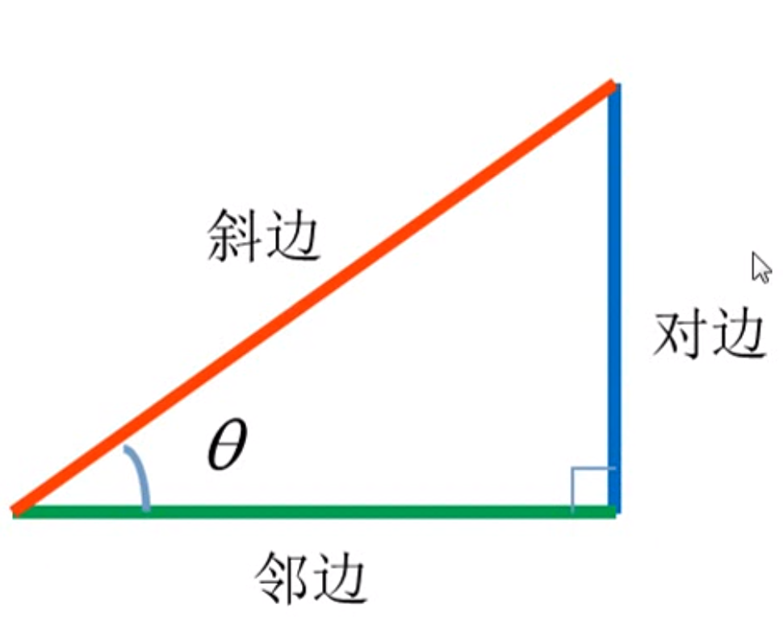
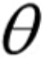
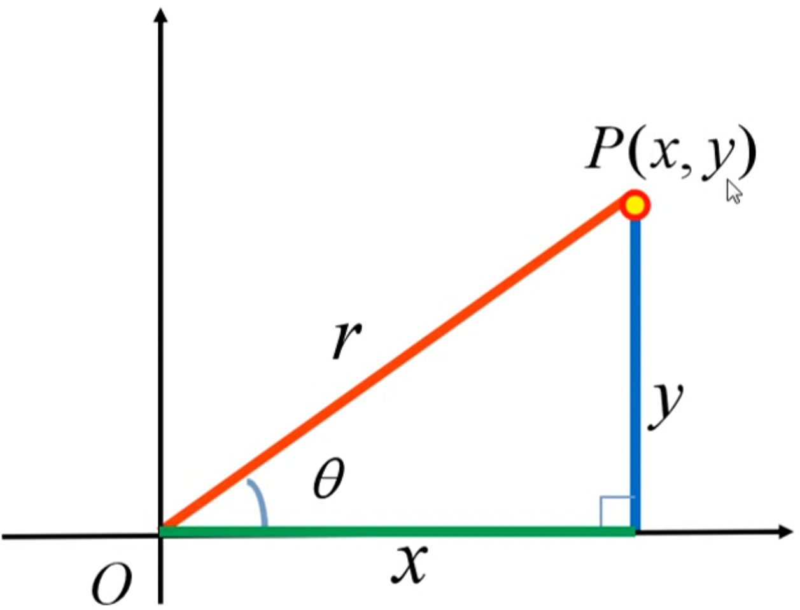
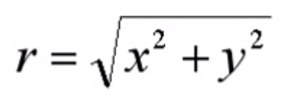

# 三角函数



sin=对边/斜边			

cos=邻边/斜边	

tan=对边/邻边							 				


高中原始定义:

在初中定义是角度的定义都限制在了90 度当中，到了高中有了新的原始定义 有可能是正角有可能是负角，反正是可以是任意角度。



p点是坐标 x 和 y		

r= √(x * x+y * y)



sin=对边/斜边		     sin=y/r		   


 Math.sin()

​                它的参数值并不是角度数，而是弧度，那么角度就需要换算为弧度

​                半圆的弧长是Math.PI，度数是180度，算出每度的弧长。程序处理浮点数时都是近似值，如果要很精确需要配合其他方法

​                角度数×Math.PI/180，30度角的弧度就是30*Math.PI/180

​                一个半圆的弧度为Math.PI，也可以利用比例来计算弧度

​               


## 反三角函数

> 解决的问题：在直角三角形中，已知两条边可求出未知的角度或弧度


在一个直角三角形中 如果已知a,b,c三边中的两条边 怎么求角 � 或 � 呢

那么就可以用反三角函数来求角度或弧度值。

反三角函数在js中的写法

> Math.asin( a/b )
> Math.acos( b/c )
> Math.atan( a/b )

**在反三角函数中求出来的值都是弧度**

假如 a=1 c=2 套入公式

```js
Math.asin(1/2)  //0.5弧度
```

怎么转换为角度呢

前面已经讲了 弧度度度1弧度=360度2π=180度π

那么

```js
Math.asin(1/2)*180/Math.PI  //30度
```

我们来看一个谷歌的眼睛 案例


已知a和b可根据反三角函数Math.atan(a/b)求出角 �

已知斜边r(半径)和角 � 可根据三角函数 Math.sin() ,Math.cos() 求出c边和d边

即而可以求出 E点的left和top值

为什么要划分四个区域呢？

因为直角三角形最大的角度为90度，并且没有负值


//Math.atan2用法及应用场景
https://zhuanlan.zhihu.com/p/306534228
https://juejin.cn/post/6844903640537235470