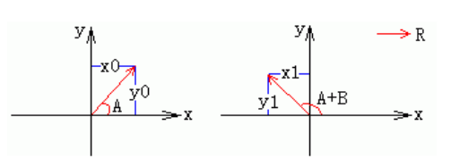
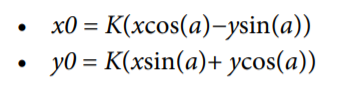
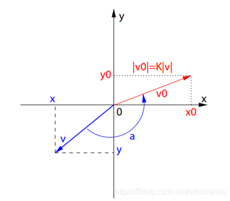

# 三角函数


sin=对边/斜边			

cos=邻边/斜边	

tan=对边/邻边							 				


高中原始定义:

在初中定义是角度的定义都限制在了90 度当中，到了高中有了新的原始定义 有可能是正角有可能是负角，反正是可以是任意角度。


p点是坐标 x 和 y		

r= √(x * x+y * y)


sin=对边/斜边		     sin=y/r		   


 Math.sin()

​                它的参数值并不是角度数，而是弧度，那么角度就需要换算为弧度

​                半圆的弧长是Math.PI，度数是180度，算出每度的弧长。程序处理浮点数时都是近似值，如果要很精确需要配合其他方法

​                角度数×Math.PI/180，30度角的弧度就是30*Math.PI/180

​                一个半圆的弧度为Math.PI，也可以利用比例来计算弧度

​               


## 反三角函数

> 解决的问题：在直角三角形中，已知两条边可求出未知的角度或弧度


在一个直角三角形中 如果已知a,b,c三边中的两条边 怎么求角 � 或 � 呢

那么就可以用反三角函数来求角度或弧度值。

反三角函数在js中的写法

> Math.asin( a/b )
> Math.acos( b/c )
> Math.atan( a/b )

**在反三角函数中求出来的值都是弧度**

假如 a=1 c=2 套入公式

```js
Math.asin(1/2)  //0.5弧度
```

怎么转换为角度呢

前面已经讲了 弧度度度1弧度=360度2π=180度π

那么

```js
Math.asin(1/2)*180/Math.PI  //30度
```

我们来看一个谷歌的眼睛 案例


已知a和b可根据反三角函数Math.atan(a/b)求出角 �

已知斜边r(半径)和角 � 可根据三角函数 Math.sin() ,Math.cos() 求出c边和d边

即而可以求出 E点的left和top值

为什么要划分四个区域呢？

因为直角三角形最大的角度为90度，并且没有负值


# 二维坐标系中的向量旋转公式


 

1、在二维坐标系中，一个向量可以使用三角函数来表示，左图中的向量用三角函数表示为：

x0 = |R| * cosA

y0 = |R| * sinA

2、右图是将左图中向量逆时针旋转B之后得到的向量，它的向量可表示为：

x1 = |R| * cos(A + B) = |R| * cosA * cosB - |R|* sinA * sinB

y1 = |R| * sin(A + B) = |R| * sinA * cosB + |R| *cosA * sinB

将1中的式子带到2中可以化简成下面这样：

x1 = x0*cosB - y0*sinB

y1 = y0*cosB + x0*sinB

当旋转方向是逆时针时，B取负值，如果旋转方向是顺时针方向，则B取正值

3、下图是一个例子，它是将向量v逆时针旋转a，得到向量v0，v0的向量表示为如下，这里不用管K，他是一个比例系数



 




//Math.atan2用法及应用场景
https://zhuanlan.zhihu.com/p/306534228
https://juejin.cn/post/6844903640537235470


# 动画

偏移，缩放，旋转


### 几种插值算法简介

#### 最近邻点插值

最近邻点插值又称为零阶插值。它输出的像素值等于距离它映射到的位置最近的输入像素值。对于二维图像，该算法是“取带采样点周围四个相邻像素点中距离最近的一个邻点的灰度值作为该点的灰度值”。最近邻点插值算法是最简单的一种算法，这种算法是当图片放大时，缺少的像素通过直接使用与之最接近的原有像素的颜色生成，也就是照搬旁边的像素。虽然这种方法简单，因此处理的速度很快，但结果通常会产生明显可见的锯齿，效果往往不佳。

#### 双线性插值

双线性插值又称一阶插值。它先对水平方向上进行一阶线性插值，然后再对垂直方向进行一阶线性插值，而不是同时在两个方向上呈线性，或者反过来，最后将两者合并。这种算法是利用周围四个相邻点的灰度值在两个方向上作线性内插以得到待采样点的灰度值，即根据待采样点与相邻点的距离确定相应的权值计算出待采样点的灰度值，由于它是从原图中四个像素中运算的，因此这种算法很大程度上消除了锯齿想想。双线性插值计算量大，但缩放后图像质量高，不会出现像素值不连续的情况。由于双线性插值具有低通滤波器的性质，使高频分量受损，所以可能使图像轮廓在一定程度上变得模糊。

#### 双三次插值

双三次插值又称为卷积插值。它是一种更加复杂的插值方式，不仅考虑到四个直接邻点灰度值的影响，还考虑到各邻点间灰度值变化率的影响。利用待采样点周围更大邻域内像素的灰度值作三次插值。双三次插值能够克服以上两种算法的不足，计算精度高，但计算量大。
在图像处理工具箱中的函数imrotate可用来对图像进行插值旋转，默认的旋转方法最近邻插值法。
图像缩放函数imresize也可能实现图像的插值,imresize的语法格式：


https://www.cnblogs.com/stu-zhouqian/p/13252031.html


# 数学中的各种变换（Transformation）

注：以下分类不完全合理，待整理。后续计划补充每个词条对应的定义、含义和常用领域，不定期填坑。

函数中的变换：

1. 恒等变换
2. Fourier变换
3. Laplace变换
4. Z变换
5. 小波变换
6. Hough变换
7. Radon变换
8. Darboux变换（Bäcklund）
9. Miura变换
10. Hankel变换
11. Gegenbauer变换
12. 自相似变换

线性空间中的变换：

1. 正交变换
2. 酉变换（幺正变换）
3. 相似变换

几何中的变换：

1. 保角变换
2. 仿射变换
3. 射影变换
4. 拓扑变换

物理中常用的变换：

1. Galileo变换
2. Lorentz变换
3. Bogoliubov变换