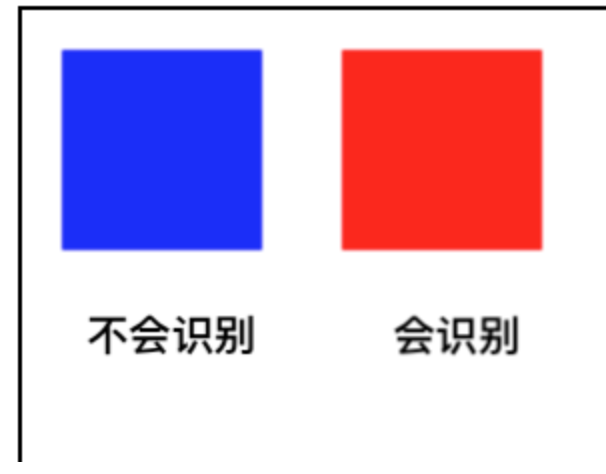

### canvas中isPointInPath和isPointInStroke

canvas中的isPointIsPath用来判断一个点，是否在一个路径上；isPointInStroke用来判断一个点，是否在边框上。

```
booleanctx.isPointInPath(x, y);
booleanctx.isPointInPath(x, y, fillRule);
booleanctx.isPointInPath(path, x, y);
booleanctx.isPointInPath(path, x, y, fillRule);
```


x,y表示点的位置，fillRue是判断点在内还是在外的方法，path是一个path2D对象；它的返回值为true/false，表示点是否在路径内。

isPointInPath(x, y)

需要注意的是，isPointInPath(x,y)这种，只能识别一个path，例如canvas上只有一个path，是可以识别的：

```
context.beginPath();
context.rect(10, 10, 50, 50);
context.fillStyle = 'blue';
context.fill();
document.addEventListener('click', function(e) {  
const canvasInfo = canvas.getBoundingClientRect();    console.log(context.isPointInPath(e.clientX - canvasInfo.left, e.clientY - canvasInfo.top))})
```


但是如果一旦再次执行使用了context.beginPath();  canvas上有多个path，只有最后一个path可以被识别：

```
//第一个不会被识别
context.beginPath();
context.rect(10, 10, 50, 50);
context.fillStyle = 'blue';
context.fill();
//第二个才会识别
context.beginPath();
context.rect(80, 10, 50, 50);
context.fillStyle = 'red';
context.fill();
document.addEventListener('click', function(e) {
    const canvasInfo = canvas.getBoundingClientRect();
    console.log(context.isPointInPath(e.clientX - canvasInfo.left, e.clientY - canvasInfo.top))
})
```


isPointInPath(path, x, y)

这里的path是path2D对象：

```
var path=new Path2D();
path.rect(10,10,50,50);
context.fill(path);
//判断x,y是否在path里
context.isPointInPath(path,x,y);
```

canvas中移动的矩形

现在我们要用isPointInPath制作一个canvas中移动的矩形效果：

因为多个 节点中  isPointInPath 会被beginPath覆盖，所以我们可以 每个节点中创建一个canvas，只要不插入body中就行

这个实现的主要思路，就是在将每个矩形放在一个子canvas中，因为isPointInPath只能在canvas的一个矩形中起作用：

```
var createCanvas = function() {
    var c = document.createElement('canvas');
    c.width = c.style.width = 400;
    c.height = c.style.height = 400;
    var ctx=c.getContext('2d');
    return {
        c:c,
        ctx:ctx,
        x:0,
        y:0
    };
}
```

然后将这写canvas，当作img，绘制在主canvas中：

```
document.addEventListener('mousedown', function(e) {
    const canvasInfo = canvas.getBoundingClientRect();
    startX=e.clientX;
    startY=e.clientY;
    for(var i=0;i<array.length;i++){
        var obj=array[i];
        if(obj.ctx.isPointInPath(e.clientX - canvasInfo.left-obj.x, e.clientY - canvasInfo.top-obj.y)){
            currentObj=array[i];
            break;
        }
    }
})

```

然后移动的时候，我们控制子canvas的绘制的x/y坐标，然后将所有的子canvas重新绘制：

```
document.addEventListener('mousemove', function(e) {
    if(currentObj){
        var deltaX=e.clientX-startX;
        var deltaY=e.clientY-startY;
        currentObj.x+=deltaX;
        currentObj.y+=deltaY;
        drawCanvas();
        startX=e.clientX;
        startY=e.clientY;
    }
})

```

isPoingInStroke
它有两种表达方式：

```
booleanctx.isPointInStroke(x, y);
booleanctx.isPointInStroke(path, x, y);
```

