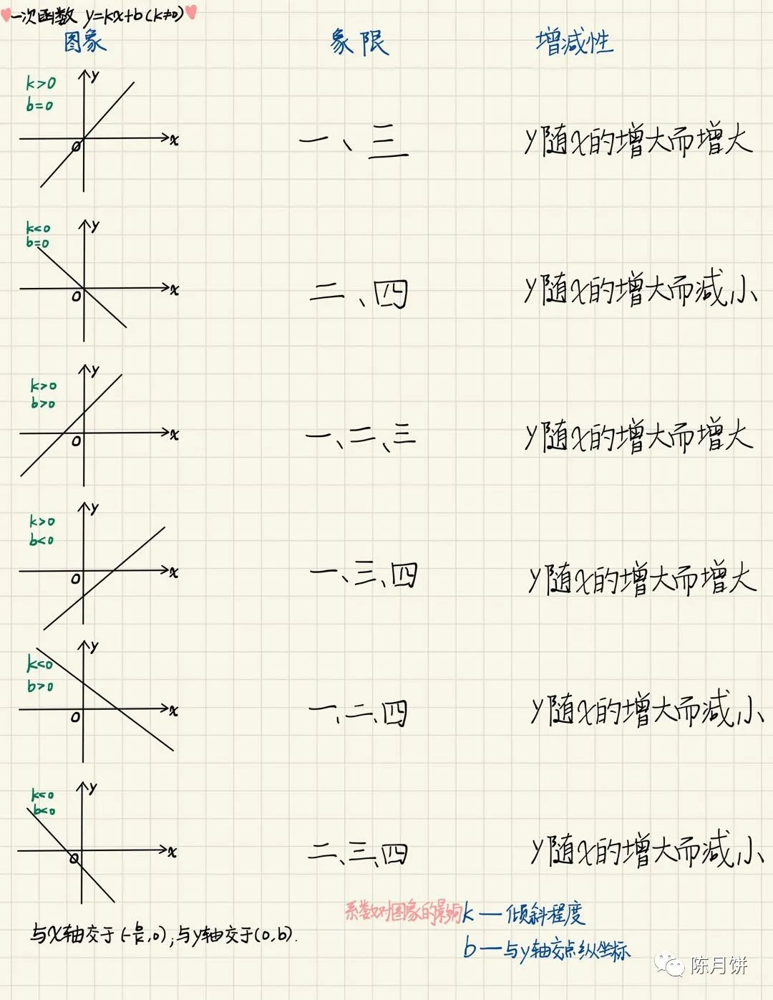

# 一次函数



用计算机 语言 来描述数学图像

下面我们来先用 创建一个 canvas class 然后去创建一个class

```
        createCanvas() {
                        this.canvas = document.createElement('canvas');
                        this.canvas.width = document.body.clientWidth;
                        this.canvas.height = document.body.clientHeight;
                        this.ctx = this.canvas.getContext('2d');
                        document.body.appendChild(this.canvas);
                    }
```

然后我们分两个函数 一个 是 静态 渲染， 一个是动态渲染。

静态渲染方法是画 x 和 y轴的基本辅助线

动态渲染方法是描述 x 和 y 轴线的一个关系


静态渲染方法描述 x 和 y 轴线的一个关系

```
  static() {
                        this.ctx.beginPath();
                        this.ctx.strokeStyle = 'red';
                        this.ctx.moveTo(this.canvas.width / 2, 0);
                        this.ctx.lineTo(
                            this.canvas.width / 2,
                            this.canvas.height
                        );
                        this.ctx.stroke();

                        this.ctx.beginPath();
                        this.ctx.fillStyle = 'red';
                        this.ctx.font = '32px serif';

                        this.ctx.fillText(
                            'y',
                            this.canvas.width / 2,
                            this.canvas.height / 4
                        );
                        this.ctx.stroke();

                        this.ctx.beginPath();
                        this.ctx.strokeStyle = 'green';
                        this.ctx.moveTo(0, this.canvas.height / 2);
                        this.ctx.lineTo(
                            this.canvas.width,
                            this.canvas.height / 2
                        );
                        this.ctx.stroke();

                        this.ctx.beginPath();
                        this.ctx.fillStyle = 'green';
                        this.ctx.font = '32px serif';

                        this.ctx.fillText(
                            'x',
                            this.canvas.width / 2 + this.canvas.width / 4,
                            this.canvas.height / 2 + 16
                        );
                        this.ctx.stroke();

                        this.ctx.beginPath();
                        this.ctx.fillStyle = 'blue';
                        this.ctx.font = '32px serif';

                        this.ctx.fillText(
                            '0',
                            this.canvas.width / 2 - 8,
                            this.canvas.height / 2 + 10
                        );
                        this.ctx.stroke();

                        this.ctx.beginPath();
                        this.ctx.fillStyle = 'blue';
                        this.ctx.arc(
                            this.canvas.width / 2,
                            this.canvas.height / 2,
                            2,
                            0,
                            2 * Math.PI
                            //  anticlockwise
                        );
                        this.ctx.fill();
                    }
              
```


动态渲染是渲染x和y轴关系

```
  dynamic() {
                        //  y=kx+b
                        let k = 1;
                        // 数学的y坐标 和 计算机y坐标刚好相反所以要乘以-1
                        let b = 100 * -1;
                        let y = this.y * k + b;
                        this.ctx.beginPath();
                        this.ctx.fillStyle = 'blue';
                        this.ctx.arc(
                            this.tx + this.canvas.width / 2,
                            y + this.canvas.height / 2,
                            2,
                            0,
                            2 * Math.PI
                        );
                        this.ctx.fill();
                        console.log(['x=', this.tx, 'y=', y]);
                    }
                  
```


渲染方法

 用定时器不断的绘制点变成线，声明 动态 偏移量 tx 和 ty

可以表示x轴和y轴，

有一个差一点就是在数学中y轴 越大 是越往上，而计算机刚好是相反 y 轴越大 越往下，所以我们要在偏移量和常量中乘以一个-1；然后y的动态偏移量是 --，x轴动态偏移量是 ++

```
       render() {
                        this.static();
                        this.dynamic();

                        this.tx = -200;
                        this.y = this.tx * -1;
                        setInterval(() => {
                            this.tx += 0.5;
                            this.y -= 0.5;
                            this.dynamic();
                        }, 30);
                    }
```


整个代码demo

```
<!DOCTYPE html>
<html lang="en">
    <head>
        <meta charset="UTF-8" />
        <meta http-equiv="X-UA-Compatible" content="IE=edge" />
        <meta name="viewport" content="width=device-width, initial-scale=1.0" />
        <title>Document</title>
    </head>
    <style>
        * {
            margin: 0;
            padding: 0;
        }
        body {
            width: 100vw;
            height: 100vh;
            overflow: hidden;
        }
        canvas {
            background: #efefef;
        }
    </style>
    <body>
        <script>
            /*
            
            y=kx+b
            
            */
            window.onload = () => {
                class Canvas {
                    constructor() {
                        this.init();
                    }
                    init() {
                        // 动态偏移量
                        this.tx = -200;
                        // 数学的y坐标 和 计算机y坐标刚好相反所以要乘以-1
                        this.ty = this.tx * -1;
                        this.createCanvas();
                        this.render();
                    }
                    createCanvas() {
                        this.canvas = document.createElement('canvas');
                        this.canvas.width = document.body.clientWidth;
                        this.canvas.height = document.body.clientHeight;
                        this.ctx = this.canvas.getContext('2d');
                        document.body.appendChild(this.canvas);
                    }
                    render() {
                        this.static();
                        this.dynamic();

                        setInterval(() => {
                            // x 动态加加
                            this.tx += 0.5;
                            // 数学的y坐标 和 计算机y坐标刚好相反所以要取相反值
                            this.ty -= 0.5;
                            this.dynamic();
                        }, 30);
                    }

                    dynamic() {
                        //  y=kx+b
                        // 数学中k
                        let k = 1;
                        // 数学的y坐标 和 计算机y坐标刚好相反所以要乘以-1
                        let b = 100 * -1;
                        // 数学中 x
                        let x = this.tx;
                        // 数学中 y
                        let y = this.ty * k + b;

                        this.ctx.beginPath();
                        this.ctx.fillStyle = 'blue';
                        this.ctx.arc(
                            x + this.canvas.width / 2,
                            y + this.canvas.height / 2,
                            1.5,
                            0,
                            2 * Math.PI
                        );
                        this.ctx.fill();
                        console.log(['x=', x, 'y=', y]);
                    }
                    static() {
                        // 画一条线 y 轴
                        this.ctx.beginPath();
                        this.ctx.strokeStyle = 'red';
                        this.ctx.moveTo(this.canvas.width / 2, 0);
                        this.ctx.lineTo(
                            this.canvas.width / 2,
                            this.canvas.height
                        );
                        this.ctx.stroke();

                        // 写一个字体y
                        this.ctx.beginPath();
                        this.ctx.fillStyle = 'red';
                        this.ctx.font = '32px serif';
                        this.ctx.fillText(
                            'y',
                            this.canvas.width / 2,
                            this.canvas.height / 4
                        );
                        this.ctx.stroke();

                        // 画一条线 x 轴
                        this.ctx.beginPath();
                        this.ctx.strokeStyle = 'green';
                        this.ctx.moveTo(0, this.canvas.height / 2);
                        this.ctx.lineTo(
                            this.canvas.width,
                            this.canvas.height / 2
                        );
                        this.ctx.stroke();

                        // 写一个字体x
                        this.ctx.beginPath();
                        this.ctx.fillStyle = 'green';
                        this.ctx.font = '32px serif';

                        this.ctx.fillText(
                            'x',
                            this.canvas.width / 2 + this.canvas.width / 4,
                            this.canvas.height / 2 + 16
                        );
                        this.ctx.stroke();

                        // 写一个坐标0
                        this.ctx.beginPath();
                        this.ctx.fillStyle = 'blue';
                        this.ctx.font = '32px serif';
                        this.ctx.fillText(
                            '0',
                            this.canvas.width / 2 - 8,
                            this.canvas.height / 2 + 10
                        );
                        this.ctx.stroke();

                        // 写一个坐标圆点
                        this.ctx.beginPath();
                        this.ctx.fillStyle = 'blue';
                        this.ctx.arc(
                            this.canvas.width / 2,
                            this.canvas.height / 2,
                            2,
                            0,
                            2 * Math.PI
                            //  anticlockwise
                        );
                        this.ctx.fill();
                    }
                }
                new Canvas();
            };
        </script>
    </body>
</html>

```


