从初中-高中总结了一次函数，二次函数，正比例反比例函数，指数函数，对数函数，绝对值函数，幂函数等大致图像


# 一次函数


# 三角函数

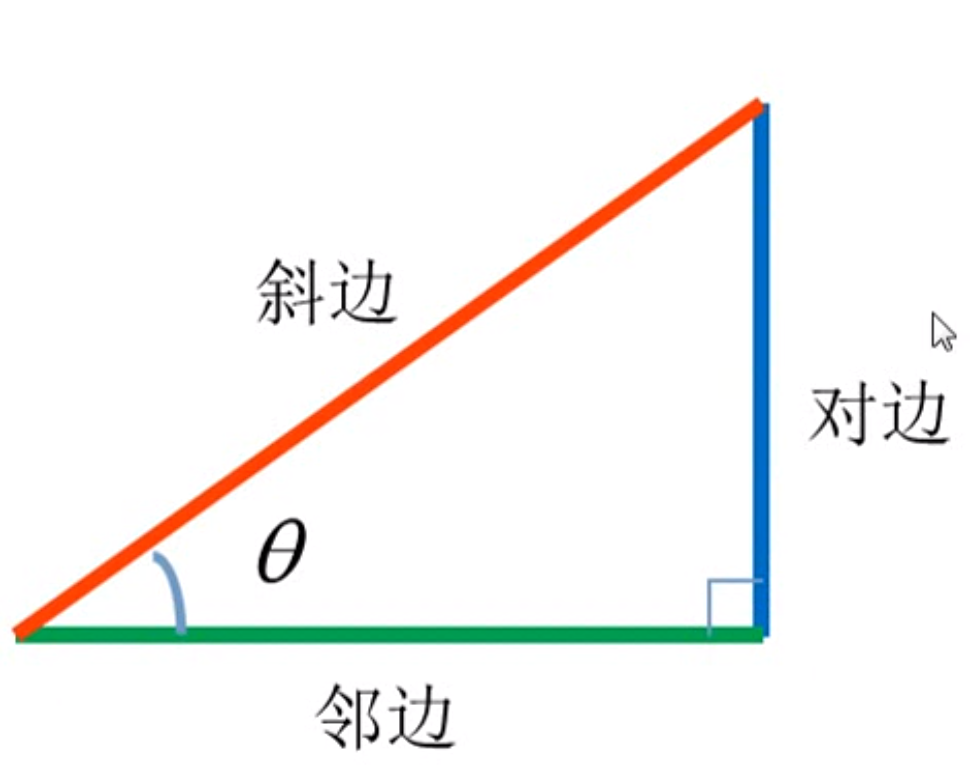

sin=对边/斜边			

cos=邻边/斜边	

tan=对边/邻边							 				


高中原始定义:

在初中定义是角度的定义都限制在了90 度当中，到了高中有了新的原始定义 有可能是正角有可能是负角，反正是可以是任意角度。


p点是坐标 x 和 y		

r= √(x * x+y * y)


sin=对边/斜边		     sin=y/r	


​	   

## 极坐标变成直角坐标：


简单地说，[极坐标](https://www.zhihu.com/search?q=%E6%9E%81%E5%9D%90%E6%A0%87&search_source=Entity&hybrid_search_source=Entity&hybrid_search_extra=%7B%22sourceType%22%3A%22answer%22%2C%22sourceId%22%3A%221445134404%22%7D)就是：**用角度和长度描述位置的坐标系**。结合上图明确这三点：

- 以原点 O为起点的射线作为[参考系](https://www.zhihu.com/search?q=%E5%8F%82%E8%80%83%E7%B3%BB&search_source=Entity&hybrid_search_source=Entity&hybrid_search_extra=%7B%22sourceType%22%3A%22answer%22%2C%22sourceId%22%3A%221445134404%22%7D)
- 点 PP 到原点的距离记为 OP¯ =   


- 从参考系射线出发逆时针旋转到OPOP 所经过的角度记为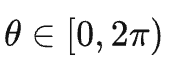  

## 一般来说研究极坐标就要研究这个问题

极坐标和[直角坐标](https://www.zhihu.com/search?q=%E7%9B%B4%E8%A7%92%E5%9D%90%E6%A0%87&search_source=Entity&hybrid_search_source=Entity&hybrid_search_extra=%7B%22sourceType%22%3A%22answer%22%2C%22sourceId%22%3A%221445134404%22%7D)之间的转换

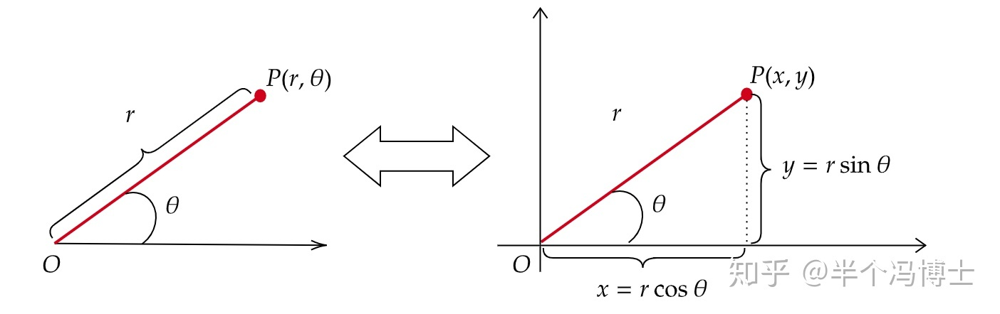

用这组公式就可以搞定上图：


 直角坐标变成极坐标要麻烦一点

主要是要考虑点所在的象限，比如图中的情况：

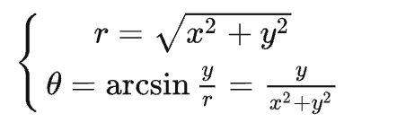

 

但如果不在[第一象限](https://www.zhihu.com/search?q=%E7%AC%AC%E4%B8%80%E8%B1%A1%E9%99%90&search_source=Entity&hybrid_search_source=Entity&hybrid_search_extra=%7B%22sourceType%22%3A%22answer%22%2C%22sourceId%22%3A1445407366%7D)，就要用[诱导公式](https://www.zhihu.com/search?q=%E8%AF%B1%E5%AF%BC%E5%85%AC%E5%BC%8F&search_source=Entity&hybrid_search_source=Entity&hybrid_search_extra=%7B%22sourceType%22%3A%22answer%22%2C%22sourceId%22%3A1445407366%7D)把角处理一下。

主要原因是反三角函数的值域都只有半个周期：


数学函数图像


## 一般来说：

一、[四象限](https://www.zhihu.com/search?q=%E5%9B%9B%E8%B1%A1%E9%99%90&search_source=Entity&hybrid_search_source=Entity&hybrid_search_extra=%7B%22sourceType%22%3A%22answer%22%2C%22sourceId%22%3A1445407366%7D)用arcsin,  arctan 都可以

二象限一般就用 arccos

三象限就比较麻烦，一般可以用，Math.PI-arcsin


## 极坐标主要是可以简化许多计算

比如：

- **圆心在原点，半径为 a的圆：**

r = a ，(a>0)

过圆点的直线 

- **对称中心在原点的圆锥曲线**

 


## 一些在[直角坐标系](https://www.zhihu.com/search?q=%E7%9B%B4%E8%A7%92%E5%9D%90%E6%A0%87%E7%B3%BB&search_source=Entity&hybrid_search_source=Entity&hybrid_search_extra=%7B%22sourceType%22%3A%22answer%22%2C%22sourceId%22%3A%221445134404%22%7D)下不好表示的曲线

- **玫瑰花曲线**


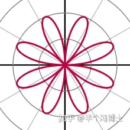


# 圆：

比如下面是一个圆 

### 圆的周长:

### 周长

圆的周长：C=2 * π * r= π * d(r为半径，d为直径)。

### 弧长：

   推导出弧长

​    以一个圆一周是360度。 所以 可以上面公式为  C= 2 * 180  * π * r / 180 

​    如果我们把 2*180 设置为 一个角度 n 把 C 变成 弧长 L 

​    那么弧长公式为：  L = n * π *  r / 180


### 弧度：

 什么是弧度呢？ 弧度是表示角度大小的另一种方式。即角度的大小除了可以直接用90°,180°这样的数字描述之外，还可以用弧度(rad)来表示。

定义：弧长等于圆半径长的弧所对的圆心角为1弧度。

弧度是角的量度单位。  弧度制，顾名思义，就是用弧的长度来度量角的大小的方法。
**由于圆弧长短与圆半径之比，不因为圆的大小而改变，所以弧度**。

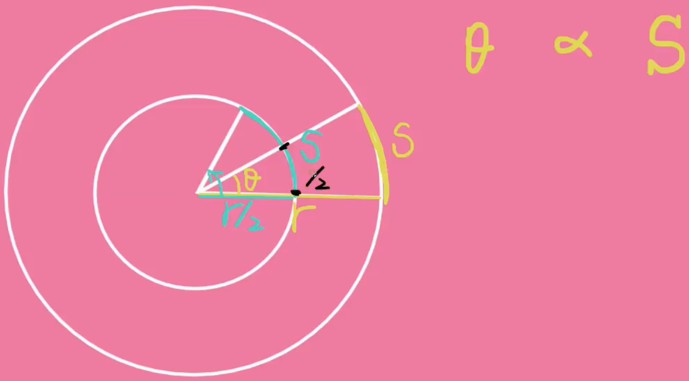

所以公式 为 L/R    L是弧长， R是半径

因为 弧长  L = n * π *  r / 180

   所以弧度 rad  = n * π *  r / 180 / r

​           弧度 rad  = n * π *  / 180     

​           因为周长 = 2 * π * r

​           弧长 等于  周长 / r

​           所以 一个 360 度角 弧度 等于  2 * π

​           所以 一个 180 度角 弧度 等于  π          

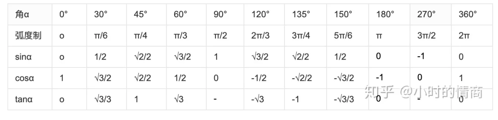           

​           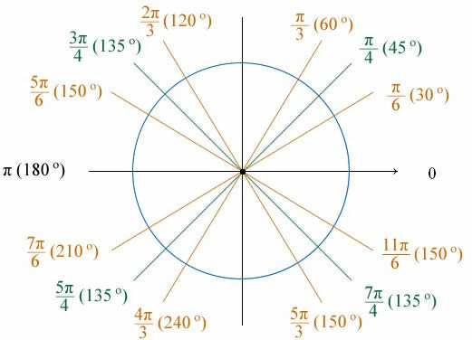

 根据定义，圆一周的弧度数为 2πr/r = 2π，360° = 2πrad，平角（即 180° 角）为 πrad，直角为 π/2rad

js 描述

```
弧度转角度     角度 = 弧度 * 180 / Math.PI 

角度转弧度     弧度 =  角度数 * Math.PI / 180
```


###  圆面积：

S=πr²（r—半径，d—直径，π—圆周率）。

如果整个圆角度为n=360度 ：S= n *  πr² / 360    

那么可以推导 

   S（扇形面积）=nπr²/360

圆弧用符号“⌒”表示。例如，以A、B为端点的圆弧读做圆弧AB或弧AB。大于半圆的弧叫优弧，小于半圆的弧叫劣弧。圆弧的度数是指这段圆弧所对圆心角的度数。

半圆也是弧，连接AB两点的直线是弦AB，半圆既不是劣弧也不是优弧，它是区分劣弧和优弧的一个界限。


#  Js 中的三角函数

# 次幂Math.pow()

**Math.pow()** 函数返回基数（`base`）的指数（`exponent`）次幂，即 `base^exponent`。

```
console.log(Math.pow(2, 4));   // 4
console.log(Math.pow(2, 3));   // 8
```


# 平方根Math.sqrt()

**Math.sqrt()** 函数返回一个数的平方根，即：


```
console.log(Math.sqrt(9));   // 3
```


勾股定理

​    c²  =  a²+b²

​    c  =  √(a²+b²) 

```
     let c = Math.pow(Math.pow(3, 2)+Math.pow(4,2))
```

## 已知 x 和 y 轴 可以知道R

```
r = sqrt(x^2 + y^2)
```


# π Math.PI

## [概述](https://developer.mozilla.org/zh-CN/docs/Web/JavaScript/Reference/Global_Objects/Math/PI#%E6%A6%82%E8%BF%B0)

**Math.PI** 表示一个圆的周长与直径的比例，约为 3.14159：

Math.PI= π ≈3.14159


# Math.sin()

**Math.sin()** 函数返回一个数值的正弦值。

```
Math.sin(x)
```

### [参数](https://developer.mozilla.org/zh-CN/docs/Web/JavaScript/Reference/Global_Objects/Math/sin#%E5%8F%82%E6%95%B0)

- `x`

  一个数值（以弧度为单位）。

## [描述](https://developer.mozilla.org/zh-CN/docs/Web/JavaScript/Reference/Global_Objects/Math/sin#%E6%8F%8F%E8%BF%B0)

`sin` 方法返回一个 -1 到 1 之间的数值，表示给定角度（单位：弧度）的正弦值。

由于 `sin` 是 `Math` 的静态方法，所以应该像这样使用：`Math.sin() `

### [示例：使用 `Math.sin`](https://developer.mozilla.org/zh-CN/docs/Web/JavaScript/Reference/Global_Objects/Math/sin#%E7%A4%BA%E4%BE%8B%EF%BC%9A%E4%BD%BF%E7%94%A8_math.sin)

JS 

```
Math.sin(0);           // 0
Math.sin(1);           // 0.8414709848078965

Math.sin(Math.PI / 2); // 1
```

## sin 角度变成 Y坐标

 因为 参数 需要弧度 所以  当 45度角的时候 js 应该这样写 

 ```
Math.sin(45*Math.PI/180)   //  0.7071067811865475


// 所以 sin 变成 y 坐标 为
let r = 100
let y = Math.sin((30 * Math.PI) / 180) * r;  // 49.99999999999999
 
 ```

sin数学图像


0-2π的函数图像，他的值域在[1，-1]

再把扩展到


# Math.cos()

## [概述](https://developer.mozilla.org/zh-CN/docs/Web/JavaScript/Reference/Global_Objects/Math/cos#%E6%A6%82%E8%BF%B0)

**Math.cos()** 函数返回一个数值的余弦值。

## [语法](https://developer.mozilla.org/zh-CN/docs/Web/JavaScript/Reference/Global_Objects/Math/cos#%E8%AF%AD%E6%B3%95)

```
Math.cos(x)
```

### [参数](https://developer.mozilla.org/zh-CN/docs/Web/JavaScript/Reference/Global_Objects/Math/cos#%E5%8F%82%E6%95%B0)

- `x`

  一个以弧度为单位的数值。

## [描述](https://developer.mozilla.org/zh-CN/docs/Web/JavaScript/Reference/Global_Objects/Math/cos#%E6%8F%8F%E8%BF%B0)

`cos` 方法返回一个 -1 到 1 之间的数值，表示角度（单位：弧度）的余弦值。

由于 `cos` 是 `Math` 的静态方法，所以应该像这样使用：`Math.cos()`

```
Math.cos(0);           // 1
Math.cos(1);           // 0.5403023058681398
Math.cos(Math.PI);     // -1
Math.cos(2 * Math.PI); // 1
```

##  cos 变成 X 坐标

因为 参数 需要弧度 所以  当 45度角的时候 js 应该这样写

```
Math.cos(45*Math.PI/180)   //  0.7071067811865476
// 所以 cos 变成 x 坐标 为
let r = 100;
let x = Math.cos((30 * Math.PI) / 180) * r;
console.log("x=======", x);   86.60254037844388
```

数学图像

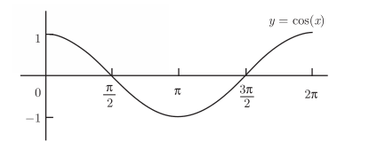

0-2π的函数图像，他的值域在[1，-1]

再拓展


# Math.tan()

## [概述](https://developer.mozilla.org/zh-CN/docs/Web/JavaScript/Reference/Global_Objects/Math/tan#%E6%A6%82%E8%BF%B0)

**Math.tan()** 方法返回一个数值的正切值。

## [语法](https://developer.mozilla.org/zh-CN/docs/Web/JavaScript/Reference/Global_Objects/Math/tan#%E8%AF%AD%E6%B3%95)

```
Math.tan(x)
```

### [参数](https://developer.mozilla.org/zh-CN/docs/Web/JavaScript/Reference/Global_Objects/Math/tan#%E5%8F%82%E6%95%B0)

- `x`

  一个数值，表示一个角（单位：弧度）。

## [描述](https://developer.mozilla.org/zh-CN/docs/Web/JavaScript/Reference/Global_Objects/Math/tan#%E6%8F%8F%E8%BF%B0)

`tan` 方法返回一个数值，表示一个角的正切值。

由于 `tan` 是 `Math` 的静态方法，所以应该像这样使用 `Math.tan()`，而不是作为你创建的 `Math` 实例的方法。

 由于 `Math.tan()` 函数接受弧度数值，但是通常使用度更方便，下面的函数可以接受以度为单位的数值，将其转为弧度，然后返回其正切值。

 因为 参数 需要弧度 所以  当 45度角的时候 js 应该这样写

```
    var rad = 45 * Math.PI/180;
     Math.tan(rad);
```

数学图像

tanθ，然后画出-π/2，到π/2


拓展 


# Math.asin()

## [概述](https://developer.mozilla.org/zh-CN/docs/Web/JavaScript/Reference/Global_Objects/Math/asin#%E6%A6%82%E8%BF%B0)

**Math.asin()** 方法返回一个数值的反正弦（单位为弧度），即：


## [语法](https://developer.mozilla.org/zh-CN/docs/Web/JavaScript/Reference/Global_Objects/Math/asin#%E8%AF%AD%E6%B3%95)

```
Math.asin(x)
```

### [参数](https://developer.mozilla.org/zh-CN/docs/Web/JavaScript/Reference/Global_Objects/Math/asin#%E5%8F%82%E6%95%B0)

- `x`

  一个数值

  x = y / r  是y比上r的一个比例 

- 比如说 x = 4  y = 3  ，那么 r = 5

- 弧度就是 : Math.asin(3/5)    0.6435011087932844

- 夹角为  36.86989764584402

  

## asin 让   Y 轴 和 R 比例 变成 弧度或角度

所以 该函数 可以 让 x , y 的坐标变成 deg 角，或者弧度角

```
  console.log((Math.asin(3/5)));
  console.log((Math.asin(3/5) * 180) / Math.PI);
```


数学函数图像

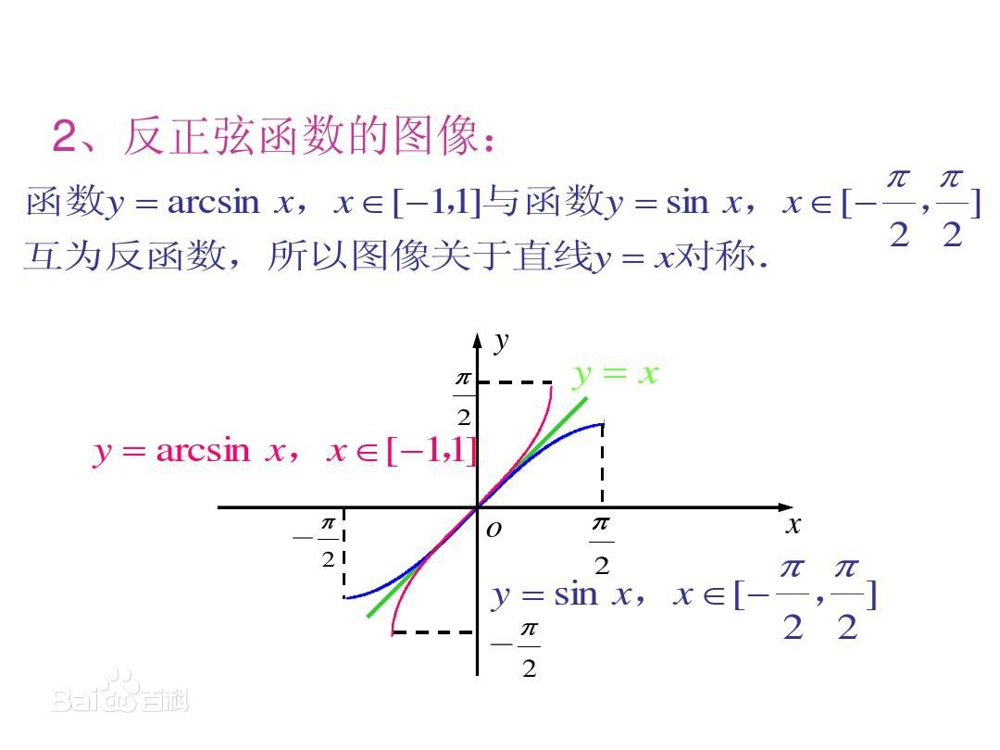


## [描述](https://developer.mozilla.org/zh-CN/docs/Web/JavaScript/Reference/Global_Objects/Math/asin#%E6%8F%8F%E8%BF%B0)

`asin` 方法接受 -1 到 1 之间的数值作为参数，返回一个介于 -π/2 到 π/2 弧度的数值。如果接受的参数值超出范围，则返回 `NaN`。

由于 `asin` 是 `Math` 的静态方法，所有应该像这样使用：`Math.asin()`，而不是作为你创建的 `Math` 实例的方法。

图像： y = Math.asin(x)

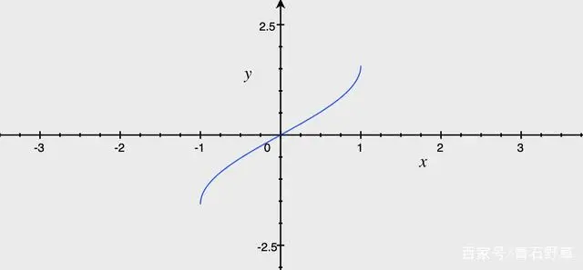


 

# Math.acos()

## [概述](https://developer.mozilla.org/zh-CN/docs/Web/JavaScript/Reference/Global_Objects/Math/acos#%E6%A6%82%E8%BF%B0)

**Math.acos()** 返回一个数的反余弦值（单位为弧度），即：

​    

## [语法](https://developer.mozilla.org/zh-CN/docs/Web/JavaScript/Reference/Global_Objects/Math/acos#%E8%AF%AD%E6%B3%95)

```
Math.acos(x)
```

## [参数](https://developer.mozilla.org/zh-CN/docs/Web/JavaScript/Reference/Global_Objects/Math/acos#%E5%8F%82%E6%95%B0)

- `x`

  一个数值

  - x = y / r  是y比上r的一个比例 
  - 比如说 x = 4  y = 3  ，那么 r = 5
  - 弧度就是 : Math.acos(4/5)    0.6435011087932843
  - 夹角为 36.86989764584401

    

## acos 让   X 轴 和 R 比例 变成 弧度或角度

所以 该函数 可以 让 x , y 的坐标变成 deg 角，或者弧度角

```
  console.log((Math.acos(3/5)));  // 0.6435011087932844
  console.log((Math.acos(3/5) * 180) / Math.PI);  // 36.86989764584402
```

数学图像

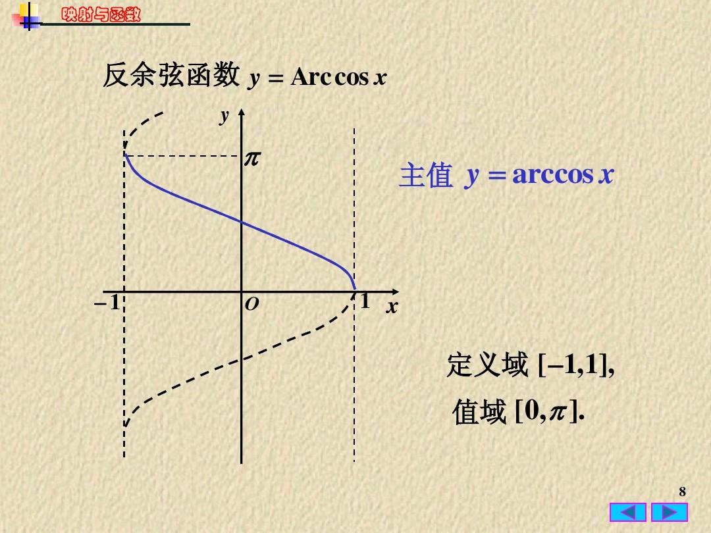


## [描述](https://developer.mozilla.org/zh-CN/docs/Web/JavaScript/Reference/Global_Objects/Math/acos#%E6%8F%8F%E8%BF%B0)

`acos` 方法以 -1 到 1 的一个数为参数，返回一个 0 到 pi（弧度）的数值。如果传入的参数值超出了限定的范围，将返回 `NaN`。

由于 `acos` 是 `Math` 的静态方法，所以应该像这样使用：`Math.acos()`，而不是作为你创建的 `Math` 实例的属性（`Math` 不是一个构造函数）。

## [示例](https://developer.mozilla.org/zh-CN/docs/Web/JavaScript/Reference/Global_Objects/Math/acos#%E7%A4%BA%E4%BE%8B)

### [示例：使用 `Math.acos`](https://developer.mozilla.org/zh-CN/docs/Web/JavaScript/Reference/Global_Objects/Math/acos#%E7%A4%BA%E4%BE%8B%EF%BC%9A%E4%BD%BF%E7%94%A8_math.acos)

```
Math.acos(-2);  // NaN
Math.acos(-1);  // 3.141592653589793
Math.acos(0);   // 1.5707963267948966
Math.acos(0.5); // 1.0471975511965979
Math.acos(1);   // 0
Math.acos(2);   // NaN
```


# Math.atan()

## [概述](https://developer.mozilla.org/zh-CN/docs/Web/JavaScript/Reference/Global_Objects/Math/atan#%E6%A6%82%E8%BF%B0)

**Math.atan()** 函数返回一个数值的反正切（以弧度为单位），即：


## [语法](https://developer.mozilla.org/zh-CN/docs/Web/JavaScript/Reference/Global_Objects/Math/atan#%E8%AF%AD%E6%B3%95)

```
Math.atan(x)

```

### [参数](https://developer.mozilla.org/zh-CN/docs/Web/JavaScript/Reference/Global_Objects/Math/atan#%E5%8F%82%E6%95%B0)

- `x`

  一个数值

  一个比例值  x / y 

  比如以下图表  假如 x = 4   y = 3

   那么 Math.atan(3 / 4 )  将得到一个弧度  0.6435011087932844

  那么他的对角 角度 是  36.86989764584402

    

## atan 让   Y ， X   轴 比例 变成 弧度或角度

所以 该函数 可以 让 x , y 的坐标变成 deg 角，或者弧度角

```
      console.log(Math.atan(3 / 4) );
      console.log((Math.atan(3 / 4) * 180) / Math.PI);
```

数学图像


## [描述](https://developer.mozilla.org/zh-CN/docs/Web/JavaScript/Reference/Global_Objects/Math/atan#%E6%8F%8F%E8%BF%B0)

`atan` 返回一个 -π/2 到 π/2 弧度之间的数值。

由于 `atan` 是 `Math` 的静态方法，所以应该像这样使用：`Math.atan()`，而不是作为你创建的 `Math` 实例的方法。

## [示例](https://developer.mozilla.org/zh-CN/docs/Web/JavaScript/Reference/Global_Objects/Math/atan#%E7%A4%BA%E4%BE%8B)

### [示例：使用 `Math.atan`](https://developer.mozilla.org/zh-CN/docs/Web/JavaScript/Reference/Global_Objects/Math/atan#%E7%A4%BA%E4%BE%8B%EF%BC%9A%E4%BD%BF%E7%94%A8_math.atan)

```
Math.atan(1);  // 0.7853981633974483
Math.atan(0);  // 0
```


# Math.atan2()

## [概述](https://developer.mozilla.org/zh-CN/docs/Web/JavaScript/Reference/Global_Objects/Math/atan2#%E6%A6%82%E8%BF%B0)

**Math.atan2()** 返回从原点 (0,0) 到 (x,y) 点的线段与 x 轴正方向之间的平面角度 (弧度值)，也就是 Math.atan2(y,x)

## [语法](https://developer.mozilla.org/zh-CN/docs/Web/JavaScript/Reference/Global_Objects/Math/atan2#%E8%AF%AD%E6%B3%95)

```
Math.atan2(y, x)
```

## [参数](https://developer.mozilla.org/zh-CN/docs/Web/JavaScript/Reference/Global_Objects/Math/atan2#%E5%8F%82%E6%95%B0)

- `y, x` 是顶点坐标

  数值

  假设 x=4    y=3 

  比如以下图表  假如 x = 4   y = 3

   那么 Math.atan2(3 ,  4 )  将得到一个弧度  0.6435011087932844

  那么他的对角 角度 是  36.86989764584402

  

    


## atan2 让   Y ， X   轴 坐标 变成 弧度或角度

所以 该函数 可以 让 x , y 的坐标变成 deg 角，或者弧度角

```
      console.log(Math.atan2(3, 4) );
      console.log((Math.atan2(3 , 4) * 180) / Math.PI);
```


## [描述](https://developer.mozilla.org/zh-CN/docs/Web/JavaScript/Reference/Global_Objects/Math/atan2#%E6%8F%8F%E8%BF%B0)

`atan2` 方法返回一个 -pi 到 pi 之间的数值，表示点 (x, y) 对应的偏移角度。这是一个逆时针角度，以弧度为单位，正 X 轴和点 (x, y) 与原点连线 之间。注意此函数接受的参数：先传递 y 坐标，然后是 x 坐标。

`atan2` 接受单独的 x 和 y 参数，而 `atan` 接受两个参数的比值。

 **计算一组点计算点(x，y)组成的向量的弧度，该弧度是与x轴正方向的弧度（这是与传统arctan的唯一区别）**

atan2(input, other, *, out=None) → Tensor
input (Tensor) – the first input tensor 是分子，也就是点y的坐标集合

other (Tensor) – the second input tensor 是分母，也就是点x的坐标集合，otrher这里填入什么轴的值，就以什么轴的为正方向的夹角的弧度，在二维时other=x，就是该点与x轴正方向的弧度，在三维时other=z，就是该点与z轴正方向的弧度
 在三角函数中，atan2是反正切函数的一个变种，有两个变数，主要是提供给计算机编程语言一个简便的弧度计算方式，其定义为：


此时的atan2函数的图像如下，y为弧度，x为任意值


此时指定弧度有了唯一的象限，同一个弧度不会再出现有两条相反方向向量的情况了。

 **此时A点的弧度=B的弧度+π，二者的弧度不再相等了，此时弧度相同，因为计算的是与x轴正半轴的弧度，也就是此时确定弧度可以唯一确定一个向量。**


## [示例](https://developer.mozilla.org/zh-CN/docs/Web/JavaScript/Reference/Global_Objects/Math/atan2#%E7%A4%BA%E4%BE%8B)

```
Math.atan2(90, 15) // 1.4056476493802699
Math.atan2(15, 90) // 0.16514867741462683
```


**怎么计算两点间连线的倾斜角？**

Math.atan2()函数返回点(x,y)和原点(0,0)之间直线的倾斜角.那么如何计算任意两点间直线的倾斜角呢? 只需要将两点x,y坐标分别相减得到一个新的点(x2-x1,y2-y1).然后利用这个新点与原点坐标的连线求出角度就可以了 使用下面的一个转换可以实现计算出两点间连线的夹角

```
Math.atan2(y2-y1,x2-x1)*180/Math.PI
```


举栗

计算点(5,5)到点(3,3)构成的连线的夹角

 


互化如下 极坐标与直角坐标之间的互换关系可以通过三角函数和勾股定理来建立。假设一个点P在平面上，其直角坐标为(x, y)，极坐标为(r, θ)。

1. 从极坐标转换为直角坐标：x = r × cos(θ)
2. ​                                              y = r × sin(θ)

2. 从直角坐标转换为极坐标：r = √(x² + y²)θ = arctan(y/x)
3. 注意：arctan表示反正切函数( Math.atan )，

用以求解角度。在实际计算过程中，可能需要考虑象限问题来确定正确的角度值。

**一般编程语言或计算器提供了atan2函数，它接受两个参数（y和x），并返回对应的角度，自动考虑象限问题。**


# 二维坐标系中的向量旋转公式


 

1、在二维坐标系中，一个向量可以使用三角函数来表示，左图中的向量用三角函数表示为：

x0 = |R| * cosA

y0 = |R| * sinA

2、右图是将左图中向量逆时针旋转B之后得到的向量，它的向量可表示为：

x1 = |R| * cos(A + B) = |R| * cosA * cosB - |R|* sinA * sinB

y1 = |R| * sin(A + B) = |R| * sinA * cosB + |R| *cosA * sinB

将1中的式子带到2中可以化简成下面这样：

x1 = x0*cosB - y0*sinB

y1 = y0*cosB + x0*sinB

当旋转方向是逆时针时，B取负值，如果旋转方向是顺时针方向，则B取正值

3、下图是一个例子，它是将向量v逆时针旋转a，得到向量v0，v0的向量表示为如下，这里不用管K，他是一个比例系数


 


//Math.atan2用法及应用场景
https://zhuanlan.zhihu.com/p/306534228
https://juejin.cn/post/6844903640537235470

https://zhuanlan.zhihu.com/p/103033370


// 艺术曲线

https://zhuanlan.zhihu.com/p/637644553


# 【技术小常识】如何计算弧形LED显示屏弧长、弦长和弦高

地址 ：http://www.yejibang.com/news-details-17940.html

类别：技术与产品

关键字：弧形屏 测量计算

摘要：一般常用的都是常规的LED显示屏，而弧形屏用得比较少，而弧形屏要知道弧长、弦长、弦高等才可以对钢结构、弧形屏的面积等进行计算，小编为您详细介绍有关弧形屏和弧形屏钢结构的计算方法。

​    一般常用的都是常规的LED显示屏，而弧形屏用得比较少，而弧形屏要知道弧长、弦长、弦高等才可以对钢结构、弧形屏的面积等进行计算，小编为您详细介绍有关弧形屏和弧形屏钢结构的计算方法。


1.量出弦长弦高弧长

​    一般弧长尺寸较难量出且尺寸差较大，所以根据弦高弦长计算出弧长和半径，进行核对。差值可以在10cm范围以内,若差值较大请反复测量和计算。


2.弦高弦长测量方法

​    弧形的两个端点直线距离为弦长，弦长的中点到弧形线的中点为弦高（或：弦长的中点垂直弦长画线到弧线上的距离为弦高）


​              弧形屏的弦长弦高弧长

3.根据弦高弦长算弧长和半径方法

​    计算思路:根公式计算出弦高和弦长构成直角三角形的角度。例：

​    ①设弦高为b 弦长为2a 测量2a=200 b=60


计算弧长和半径

​    ②弦高弦长构成三角形 边长即为 a=100 b=60


​            弦高弦长计算方法

​    ③弦高弦长构成三角形 边长即为 a=100 b=60 根据勾股定理计算c边长 勾股定理公式:a平方+b平方=c平方 即：c=116.62

​    ④再根据三角函数公式 sin∠A=a/c(∠A为a的对角) 即：sin∠A=0.86 再用计算器的反正弦函数算出∠A=59.32°


​        弦长弦高角度计算方法

​    ⑤把b边伸长至圆心处，∠B顶点到圆心处连接。即形成等腰三角形。根据三角形内角和180°得出等腰三角形∠C=62° 则算出弧形屏弧度为124°


​            弧度的计算方法

​    ⑥再根据sin∠C=c/斜边的公式 得出sin62=100/斜边 再用计算器的sin62为0.883 即斜边长为113.3 R=113.3


​                   斜边长计算方法

​    ⑦弧形所在圆周长即为：周长=2πR=2*3.14*113.3 =711.52 周长/360得出，此圆每角度值为：1.98 弧长=每度值1.98*广告牌弧度124°=245.52。

​    最终得出为 弧长：245.52 弧度为：124° 半径为：113.3


弧形屏计算方法

 ** ****  4.用计算弧长与实际测量的弧长进行对比**

​    差值可以在250px范围以内,若差值较大请反复测量和计算。


# 动画

偏移，缩放，旋转


### 几种插值算法简介

#### 最近邻点插值

最近邻点插值又称为零阶插值。它输出的像素值等于距离它映射到的位置最近的输入像素值。对于二维图像，该算法是“取带采样点周围四个相邻像素点中距离最近的一个邻点的灰度值作为该点的灰度值”。最近邻点插值算法是最简单的一种算法，这种算法是当图片放大时，缺少的像素通过直接使用与之最接近的原有像素的颜色生成，也就是照搬旁边的像素。虽然这种方法简单，因此处理的速度很快，但结果通常会产生明显可见的锯齿，效果往往不佳。

#### 双线性插值

双线性插值又称一阶插值。它先对水平方向上进行一阶线性插值，然后再对垂直方向进行一阶线性插值，而不是同时在两个方向上呈线性，或者反过来，最后将两者合并。这种算法是利用周围四个相邻点的灰度值在两个方向上作线性内插以得到待采样点的灰度值，即根据待采样点与相邻点的距离确定相应的权值计算出待采样点的灰度值，由于它是从原图中四个像素中运算的，因此这种算法很大程度上消除了锯齿想想。双线性插值计算量大，但缩放后图像质量高，不会出现像素值不连续的情况。由于双线性插值具有低通滤波器的性质，使高频分量受损，所以可能使图像轮廓在一定程度上变得模糊。

#### 双三次插值

双三次插值又称为卷积插值。它是一种更加复杂的插值方式，不仅考虑到四个直接邻点灰度值的影响，还考虑到各邻点间灰度值变化率的影响。利用待采样点周围更大邻域内像素的灰度值作三次插值。双三次插值能够克服以上两种算法的不足，计算精度高，但计算量大。
在图像处理工具箱中的函数imrotate可用来对图像进行插值旋转，默认的旋转方法最近邻插值法。
图像缩放函数imresize也可能实现图像的插值,imresize的语法格式：


https://www.cnblogs.com/stu-zhouqian/p/13252031.html


# 数学中的各种变换（Transformation）

注：以下分类不完全合理，待整理。后续计划补充每个词条对应的定义、含义和常用领域，不定期填坑。

函数中的变换：

1. 恒等变换
2. Fourier变换
3. Laplace变换
4. Z变换
5. 小波变换
6. Hough变换
7. Radon变换
8. Darboux变换（Bäcklund）
9. Miura变换
10. Hankel变换
11. Gegenbauer变换
12. 自相似变换

线性空间中的变换：

1. 正交变换
2. 酉变换（幺正变换）
3. 相似变换

几何中的变换：

1. 保角变换
2. 仿射变换
3. 射影变换
4. 拓扑变换

物理中常用的变换：

1. Galileo变换
2. Lorentz变换
3. Bogoliubov变换

