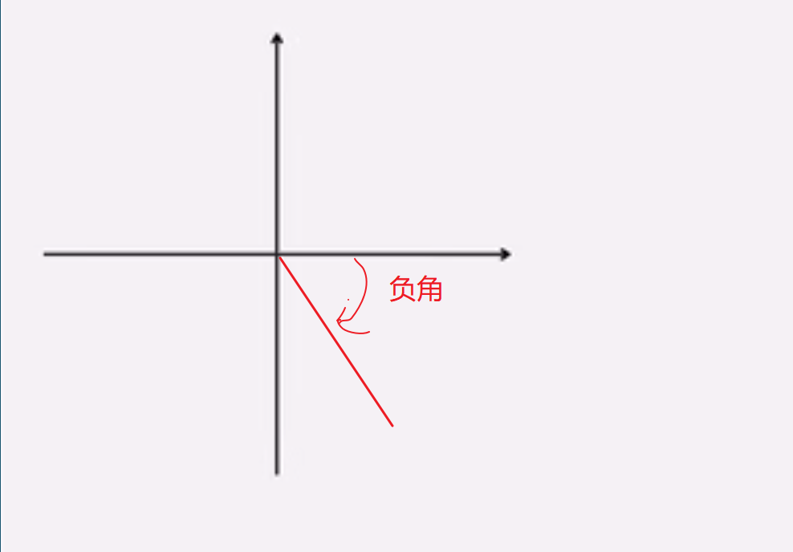

αβγ是希腊字母的第三个字母α，第二个字母β，第一个字母γ，分别有角度、系数和电导系数等含义。1.α：alpha，角度；系数。2.β：beta，磁通系数；角度；系数。3.γ：gamma，电导系数（小写）。

**一、锐角，**是指大于0°而小于90°（直角）的角，锐角是劣角。

1、锐角[三角函数值](https://zhidao.baidu.com/search?word=三角函数值&fr=iknow_pc_qb_highlight)都是正值。

2、当角度在0°～90°间变化时，[正弦值](https://zhidao.baidu.com/search?word=正弦值&fr=iknow_pc_qb_highlight)随着角度的增大（或减小）而增大（或减小），[余弦](https://zhidao.baidu.com/search?word=余弦&fr=iknow_pc_qb_highlight)值随着角度的增大（或减小）而减小（或增大）。

**二、**[钝角](https://zhidao.baidu.com/search?word=钝角&fr=iknow_pc_qb_highlight)**，**大于直角（90°）小于平角（180°）的角叫做钝角。

1、钝角是由两条射线构成的。

2、钝角是劣角的一种。

3、钝角一定是第二象限角，第二象限角不一定是钝角。

[](https://iknow-pic.cdn.bcebos.com/3812b31bb051f8199968ea35cab44aed2e73e704)

**扩展资料**

1、三个角都是锐角的三角形叫做[锐角三角形](https://zhidao.baidu.com/search?word=锐角三角形&fr=iknow_pc_qb_highlight)。

性质1：在锐角三角形中，每一个内角都是锐角且任意两内角之和大于直角；

性质2：在锐角三角形中，每一条边都夹在它的邻边和它们的夹角的余弦的积和商之间且任意两边的平方之和大于第三边的平方。

2、钝角：当角度在90°≤A≤180°间变化时，0≤sinA≤1，－1≤cosA≤0。

# 一二三四象限口诀是什么？

**一二三**[四象限](https://zhidao.baidu.com/search?word=四象限&fr=iknow_pc_qb_highlight)**口诀：**一象限横坐标为正，纵坐标为正；二象限横坐标为负，纵坐标为正；三象限横坐标为负，纵坐标为负；四象限横坐标为正，纵坐标为负。

[三角函数](https://zhidao.baidu.com/search?word=三角函数&fr=iknow_pc_qb_highlight)在四象限的正负口诀：一全正；二正弦（余割）；三两切；四[余弦](https://zhidao.baidu.com/search?word=余弦&fr=iknow_pc_qb_highlight)（正割）。

[](https://iknow-pic.cdn.bcebos.com/fcfaaf51f3deb48f5f5a394fe21f3a292df57874)

**一二三四象限坐标数值：**

[第一象限](https://zhidao.baidu.com/search?word=第一象限&fr=iknow_pc_qb_highlight)：（正+，+正），横纵坐标同号，记作xy>0。

第二象限：（负-，+正），横纵坐标异号，记作xy<0。

第三象限：（负-，-负），横纵坐标同号，记作xy>0。

第四象限：（正+，-负），横纵坐标异号，记作xy<0。


# 任意角和弧度制

任意角:

  正角：一条射线绕其端点按照逆时针方向旋转形成的角

   负角：一条射线绕其端点按照顺时针方向旋转形成的角

   零角：一条射线没有做任何旋转，就称他形成了一个零角


正角：


负角：




象限角：角的始边与x轴的非负半轴重合，终边落在第几象限，就叫第几象限角。


比如 角 120度


该角为第二象限角。


轴线角：

若终边落在坐标轴上则称为坐标轴角or轴线角。

因为该角为 -180度，刚好落在了x轴上，所以叫轴线角，只要轴落在x，或者y轴中就叫轴线角。


终边相同的角：

与角a终边相同的角b 的集合为


比如  30度。是 ob向量，和他终边相同的角有     30+k * 360  或者    a+k*2π


#  任意角的弧度制

弧度制：半径为r的圆心角a所对的弧长为l，则a=l/r （弧度或rad）

角度制和弧度制的互相转换，1弧度 =  180/π =57.3度   r(rad)=180度

比如下面是一个圆 

### 圆的周长:

### 周长

圆的周长：C = 2 * π * r= π * d(r为半径，d为直径)。

​                   C = 2 * π * r(r为半径)

​                   C = π * 2*r(r为半径)

​                   C = π * d(d为直径)。

### 弧长：

   推导出弧长

​    以一个圆一周是360度。 所以 可以上面公式为

​            C = 2 * π * r(r为半径)

​     如果是整个圆那么圆的周长等于弧长

​          因为 2*π=360度

​           C = 2 * π * r(r为半径)=360*r

​          两边消除2 和 r  

​          π =180 度

​          如果1度就等于           

​          π/180 = 1 度       

​    如果我们把 2*180 设置为 一个角度 n 把 C 变成 弧长 L 

​    那么弧长公式为：  L = n * π *  r / 180


### 弧度：

 π 是弧度，半圆弧度，2 π 是全圆弧度。

 什么是弧度呢？ 弧度是表示角度大小的另一种方式。即角度的大小除了可以直接用90°,180°这样的数字描述之外，还可以用弧度(rad)来表示。

定义：弧长等于圆半径长的弧所对的圆心角为1弧度。

弧度是角的量度单位。  弧度制，顾名思义，就是用弧的长度来度量角的大小的方法。
**由于圆弧长短与圆半径之比，不因为圆的大小而改变，所以弧度**。


所以公式 为 L/R    L是弧长， R是半径

因为 弧长  L = n * π *  r / 180

   所以弧度 rad  = n * π *  r / 180 / r

​           弧度 rad  = n * π *  / 180     

​           因为周长 = 2 * π * r

​           弧长 等于  周长 / r

​           所以 一个 360 度角 弧度 等于  2 * π

​           所以 一个 180 度角 弧度 等于  π          

           

​           

 根据定义，圆一周的弧度数为 2πr/r = 2π，360° = 2πrad，平角（即 180° 角）为 πrad，直角为 π/2rad

js 描述

```
弧度转角度     角度 = 弧度 * 180 / Math.PI 

角度转弧度     弧度 =  角度数 * Math.PI / 180
```


### 圆面积：

S=πr²（r—半径，d—直径，π—圆周率， n是角度）。

因为 圆可以内切成n个三角形，然后 两个三角形就可以组成一个长方形，长方形的长就是r，宽度就是周长的一半，

长方形的面积等于 长*宽

所以圆的面积 = r * （2πr / 2)

 所以得        S = πr²   

如果整个圆角度为n=360度 ：S= n *  πr² / 360    

那么可以推导 

   S（扇形面积）=nπr²/360

圆弧用符号“⌒”表示。例如，以A、B为端点的圆弧读做圆弧AB或弧AB。大于半圆的弧叫优弧，小于半圆的弧叫劣弧。圆弧的度数是指这段圆弧所对圆心角的度数。

半圆也是弧，连接AB两点的直线是弦AB，半圆既不是劣弧也不是优弧，它是区分劣弧和优弧的一个界限。


# 三角函数


sin=对边/斜边			

cos=邻边/斜边	

tan=对边/邻边							 				


高中原始定义:

在初中定义是角度的定义都限制在了90 度当中，到了高中有了新的原始定义 有可能是正角有可能是负角，反正是可以是任意角度。


p点是坐标 x 和 y		

r= √(x * x+y * y)


sin=对边/斜边		     sin=y/r	


sin(θ)=y/r

 cos(θ)=x/r

 cos(θ)=y/x


​	   

## 极坐标变成直角坐标：


简单地说，[极坐标](https://www.zhihu.com/search?q=%E6%9E%81%E5%9D%90%E6%A0%87&search_source=Entity&hybrid_search_source=Entity&hybrid_search_extra=%7B%22sourceType%22%3A%22answer%22%2C%22sourceId%22%3A%221445134404%22%7D)就是：**用角度和长度描述位置的坐标系**。结合上图明确这三点：

- 以原点 O为起点的射线作为[参考系](https://www.zhihu.com/search?q=%E5%8F%82%E8%80%83%E7%B3%BB&search_source=Entity&hybrid_search_source=Entity&hybrid_search_extra=%7B%22sourceType%22%3A%22answer%22%2C%22sourceId%22%3A%221445134404%22%7D)
- 点 PP 到原点的距离记为 OP¯ =   

- 从参考系射线出发逆时针旋转到OPOP 所经过的角度记为  

## 一般来说研究极坐标就要研究这个问题

极坐标和[直角坐标](https://www.zhihu.com/search?q=%E7%9B%B4%E8%A7%92%E5%9D%90%E6%A0%87&search_source=Entity&hybrid_search_source=Entity&hybrid_search_extra=%7B%22sourceType%22%3A%22answer%22%2C%22sourceId%22%3A%221445134404%22%7D)之间的转换


用这组公式就可以搞定上图：


1. 从极坐标转换为直角坐标：x = r × cos(θ)
2. ​                                              y = r × sin(θ)

3. 从直角坐标转换为极坐标：r = √(x² + y²)
4. θ = arctan(y/x)


 直角坐标变成极坐标要麻烦一点

主要是要考虑点所在的象限，比如图中的情况：


 

但如果不在[第一象限](https://www.zhihu.com/search?q=%E7%AC%AC%E4%B8%80%E8%B1%A1%E9%99%90&search_source=Entity&hybrid_search_source=Entity&hybrid_search_extra=%7B%22sourceType%22%3A%22answer%22%2C%22sourceId%22%3A1445407366%7D)，就要用[诱导公式](https://www.zhihu.com/search?q=%E8%AF%B1%E5%AF%BC%E5%85%AC%E5%BC%8F&search_source=Entity&hybrid_search_source=Entity&hybrid_search_extra=%7B%22sourceType%22%3A%22answer%22%2C%22sourceId%22%3A1445407366%7D)把角处理一下。

主要原因是反三角函数的值域都只有半个周期：


数学函数图像


## 一般来说：

一、[四象限](https://www.zhihu.com/search?q=%E5%9B%9B%E8%B1%A1%E9%99%90&search_source=Entity&hybrid_search_source=Entity&hybrid_search_extra=%7B%22sourceType%22%3A%22answer%22%2C%22sourceId%22%3A1445407366%7D)用arcsin,  arctan 都可以

二象限一般就用 arccos

三象限就比较麻烦，一般可以用，Math.PI-arcsin


## 极坐标主要是可以简化许多计算

比如：

- **圆心在原点，半径为 a的圆：**

r = a ，(a>0)

过圆点的直线 

- **对称中心在原点的圆锥曲线**

 


## 一些在[直角坐标系](https://www.zhihu.com/search?q=%E7%9B%B4%E8%A7%92%E5%9D%90%E6%A0%87%E7%B3%BB&search_source=Entity&hybrid_search_source=Entity&hybrid_search_extra=%7B%22sourceType%22%3A%22answer%22%2C%22sourceId%22%3A%221445134404%22%7D)下不好表示的曲线

- **玫瑰花曲线**


## 任意角的三角函数的正负

在平面直角坐标系中，对于任意角a，在终边上取一点P(x,y), P到原点的距离 r=√(x²+y²), 定义sin α = y/r, 

cos α= x/r,  tan α=x/y 根据勾股定理r永远是正数，所以 他们的 sin cos tan 的值正负是由x 和 y的正负来决定


# 同角三角函数的关系

有倒数关系，商数关系，平方关系。接下来给大家分享同角三角函数的基本关系公式，供参考。


# 同角三角函数的关系

## 倒数关系公式

① tanα * cotα=1

②sinα  * cscα=1

③cosα * secα=1

## 商数关系公式

tanα=sinα/cosα

cotα=cosα/sinα

## 平方关系公式

sinα^2+cosα^2=1 　　
1+tanα^2=secα^2
1+cotα^2=cscα^2

sin(α)^2表示sin（axa）,而(sina)^2表示sina x sina,前者是对自变量a的平方,后者是对因变量sina 的平方,

## 三角函数的转化关系

sin(-α)=-sinα

cos(-α)=cosα

sin(π/2-α)=cosα

cos(π/2-α)=sinα

sin(π/2+α)=cosα

cos(π/2+α)=-sinα

sin(π-α)=sinα

cos(π-α)=-cosα

sin(π+α)=-sinα

tanα=sinα/cosα

tan（π/2＋α）＝－cotα

tan（π/2－α）＝cotα

tan（π－α）＝－tanα

tan（π＋α）＝tanα


**sec、csc、cot的**[三角函数公式](https://zhidao.baidu.com/search?word=三角函数公式&fr=iknow_pc_qb_highlight)**是secx=1/(cosx)、cscx=1/(sinx)、cotx=1/(tanx)=(cosx)/(sinx)。**

[正弦函数](https://zhidao.baidu.com/search?word=正弦函数&fr=iknow_pc_qb_highlight)：sinθ＝y/r

[余弦函数](https://zhidao.baidu.com/search?word=余弦函数&fr=iknow_pc_qb_highlight)：cosθ＝x/r

[正切函数](https://zhidao.baidu.com/search?word=正切函数&fr=iknow_pc_qb_highlight)：tanθ＝y/x

[余切函数](https://zhidao.baidu.com/search?word=余切函数&fr=iknow_pc_qb_highlight)：cotθ＝x/y

正割函数：secθ＝r/x

[余割函数](https://zhidao.baidu.com/search?word=余割函数&fr=iknow_pc_qb_highlight)：cscθ＝r/y

[](https://iknow-pic.cdn.bcebos.com/aec379310a55b3193acdafe751a98226cffc176f)


积的关系：

sinα = tanα × cosα（即sinα / cosα = tanα ）

cosα = cotα × sinα（即cosα / sinα = cotα）

tanα = sinα × secα（即 tanα / sinα = secα）

cotα＝cosα＊cscα

secα＝tanα＊cscα

cscα＝secα＊cotα


## 倒数关系：

tanα·cotα＝1

sinα·cscα＝1

cosα·secα＝1


### 三角函数

> 三角函数一般用于计算三角形中未知长度的边和未知的角度


正弦（sin）      sinA = a / c        sinθ = y / r
 余弦（cos）     cosA = b / c      cosθ = y / r
 正切（tan）      tanA = a / b      tanθ = y / x
 余切（cot）      cotA = b / a       cotθ = x / y

 

平移伸缩变换口诀

左加右减

一个点作左右平移时，纵坐标不发生任何改变，而是横坐标在发生变化。当点向右平移时，横坐标变大，当点向左平移时，横坐标变小，这就是平移的左加右减。

上加下减

一个点作上下平移时，横坐标不发生任何改变，而是纵坐标在发生变化。当点向上平移时，纵坐标变大，当点向下平移时，纵坐标变小，这就是平移的上加下减。


 