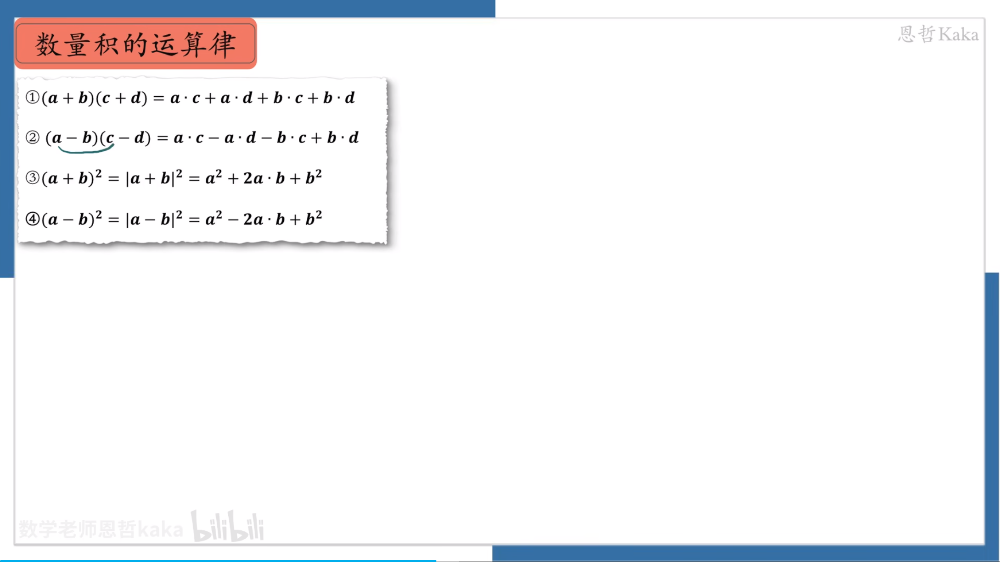
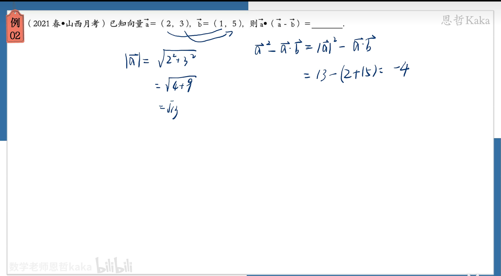
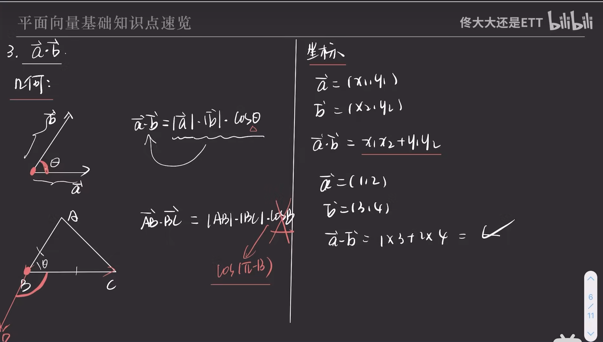

## 向量点成公式

文档地址 ：https://wenku.baidu.com/view/f598baac091c59eef8c75fbfc77da26924c596d4.html?_wkts_=1689784196619&bdQuery=%E5%90%91%E9%87%8F%E7%82%B9%E4%B9%98

向量的点乘a * b公式：a * b = |a|*|b|sinθ， sin是a，b的夹角，取值[0,π] 向量积|c|=|a x b|=|a||b| * sin<a,b> 点乘又叫向量的内积，数积，是一个向量和它在另外一个向量上的投影的长度乘积：是标量。

向量的乘法有两种，分别是内积和外积。

内积称为数量积，因为其结果为一个数标量，向量a , b 的内积为|a|*|b|cos<a,b>其中<a,b>表示a与b的夹角。

向量外积也叫叉乘，其结果为一个向量。方向是按右手系垂直与a,b所在平面|a|*|b|sin<a,b>

向量积 ≠不等于 向量积（向量的积一般指是点乘），要解析清楚的区分向量积(矢积)与数量积(标积)。

a * b=|a| * |b|* sinθ方向：a向量与b向量的向量积的方向与这两个向量所在的平面垂直，且遵守右手定则，一个简单的确定满足 右手定则，的结果向量的方法是这样的: 若坐标系是满足右手定则的，当右手四指从a以下不超过180度旋转的角度旋转向b时，竖起的大拇指方向是c的方向。

向量的夹角公式可以通过向量的点积来表示。假设有两个非零向量 A 和 B，它们之间的夹角 θ 可以由以下点积公式计算：
A·B = |A| * |B| * cos(θ)
其中，A·B 表示向量 A 和向量 B 的点积（内积），|A| 表示向量 A 的长度（模长），|B| 表示向量 B 的长度（模长），θ 表示向量 A 和向量 B 之间的夹角。
从上述点积公式中可以解出夹角 θ 的值：
cos(θ) = (A·B) / (|A| * |B|)

θ = arccos((A·B) / (|A| * |B|))

需要注意的是，点积公式中的夹角 θ 是以弧度为单位的。如果要将弧度转换为角度，可以使用以下关系：
角度 = 弧度 * (180° / π)
其中，π 是圆周率，约等于 3.14159。
通过这个公式，我们可以计算两个向量之间的夹角，从而了解它们之间的方向关系。如果两个向量夹角为零度，则表示它们的方向相同；如果夹角为180度，则表示它们的方向相反；如果夹角在0度和180度之间，则表示它们的方向不同。

向量积的最大夹角为 0到180度

# 向量中，a和这个|a|是什么关系呢？我分不清楚，是平方呢还是一样的呢？

a是向量，是有长度和方向的。|a|是a的长度，是a的一个方面，不考虑方向只考虑长度因素。而|a|是√X的平方加Y的平方。

 

向量的平方等于向量模的平方。向量a^2=向量a的模×向量a的模×cosθ。θ是两个向量之间的夹角，同一个向量的夹角为0°，所以cosθ=1，即向量a•a=|a|²cos0=|a|²。故向量的平方在数值上等于向量模的平方。这一说法仅仅是为了便于计算，在意义上两者是没有关系的。向量是具有大小和方向的量。

数量积的几何意义

投影 a * b = |a| * |b| * cosθ  这里的向量|a|值得是黑色的向量a， |b|指的是b向量 投影下来在a线上的长度，就是起点到投影下来的长度。

向量相乘的坐标关系

向量相乘等于  a * b=  x1 * x2+ y1 * y2

左边模长换算等于 平方等于   |a| * |a| = √(x * x + y * y)

向量相加

两套 一套是几何 一套是坐标

向量相减

同起点的话都是第二个的尾巴指向第一个的尾巴

向量相乘

记住向量a b 的夹角必须是起点相同的，如果不相同则需要平移。

 k系数向量

向量的模长计算，如果是坐标那就等于 x平方 y平方在开方，相当于三角函数的勾股定理

两个向量的夹角

a向量在b向量的投影

投影 等于 a * cos<a,b>

cos<a,b> = (a-b)/(a*b)

投影 等于= a* (a-b)/(a*b)

投影 等于=  (a-b)/(b)

向量是否平行

向量是否垂直

线性空间>矩阵空间>向量空间

# 向量和矩阵的点乘和叉乘

#### 向量

------

定义：向量是由N个实数组成的一行N列或N行一列的的数组。

- 点乘：又叫做点积、内积、数量积、标量积，向量a[a1,a2,...,an]和向量b[b1,b2b...,bn]点乘的结果是一个标量，记作**a.b**；

几何解释：a.b = |a| |b| ，故而点乘可以计算出两个向量的夹角，且向量垂直，点乘结果为零。

- 叉乘：又叫向量积、外积、叉积，叉乘，向量a[x1,y1,z1]和向量b[x2,y2,z2]叉乘的运算结果是一个向量，并且两个向量的叉积与这两个向量组成的坐标平面垂直，记作**axb**；

计算方式：利用行列式方式，设i[1,0,0],j[0,1,0],k[0,0,1]，则如下图：

几何解释：axb =  |a| |b| ，故两个向量平行，则其叉乘等于零。

几何意义：叉积的长度|**a**×**b**|可以解释成这两个叉乘向量**a**，**b**共起点时，所构成平行四边形的面积。