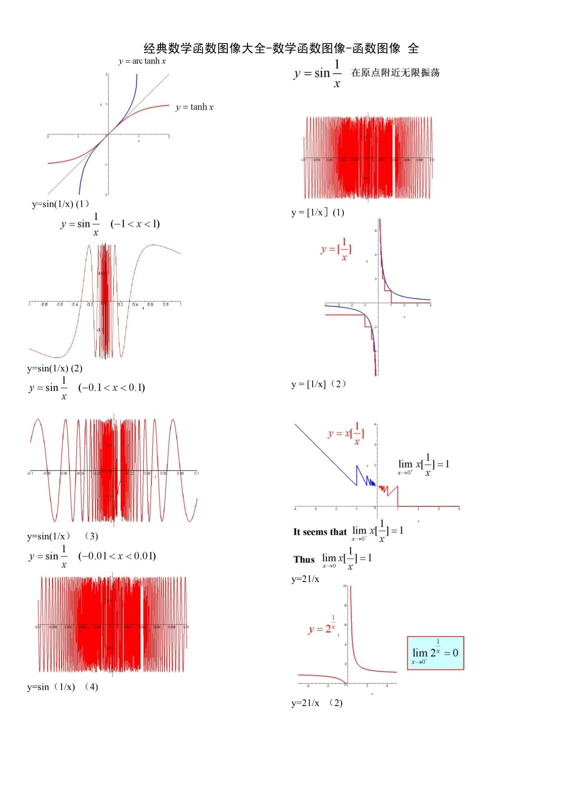

**平面直角坐标系**

两点之间距离

一次函数

反比例函数

二次函数

**平面直角坐标系**

**初中数学函数的概念**

**一次函数（正比例函数）**

**反比例函数**

**二次函数（抛物线）**

https://www.bilibili.com/read/cv13534546

https://www.docin.com/p-2700977903.html

https://zhuanlan.zhihu.com/p/128997764?utm_source=wechatmessage_article_bottom

行列式=》矩阵 =》

《立体几何》、《解析几何》

不等式→函数→立体几何→解析几何→三角函数→平面向量→算法→数列→统计与概率→计数原理随机变量→微积分→难点解读。

  空间向量 和 向量空间不一样

  向量空间,是一个空间,空间向量,是向量空间里的一个向量.很不一样,完全不是一个概念.

线性空间>矩阵空间>  向量空间

向量->空间向量->立体几何->解析几何->行列式->矩阵->向量空间(线性空间)->线性代数

 线性代数》或者《高等代数》里面的行列式定义？

### [《有限*维向量*空间》](http://www.baidu.com/link?url=0gJrrkaWQciOZ3y4Nzya3Lw3mkDetHxMExLwbLFIsgmCXjU96vPLhcAudVcoRiKmIC80O8t9EnosDl7kCGYA3K)

8. **矩阵的应用**：线性代数在各种领域有广泛的应用，包括工程、计算机图形学、数据分析、物理学等。学生可能会学习如何在这些领域中应用线性代数的概念和技巧。
