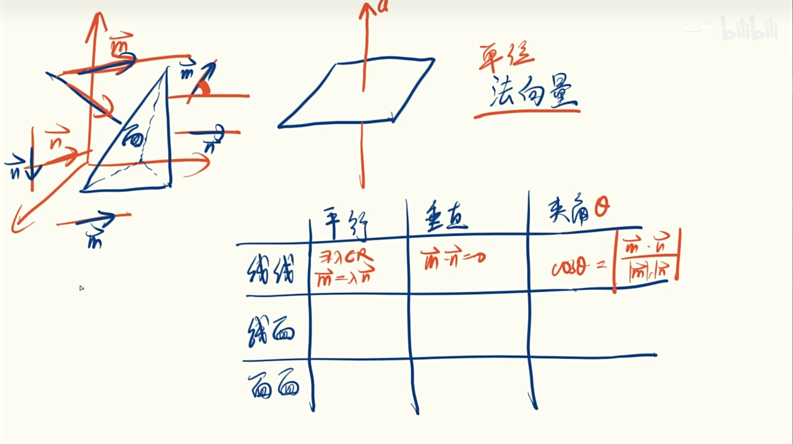

空间向量和平面向量的区别就是空间向量只是多了一个Z轴

回顾下向量 坐标 a 为 (x,y)

空间向量坐标a为(x, y ,z)

向量a的模|a|=√(x * x + y * y)

空间向量a的模|a|=√(x * x + y * y + z * z )

空间向量的 零向量和单位向量，和相反向量和平面向量一样的。

向量相加  a + b = (x1+x2 ,  y1+y2 )

空间向量相加   a + b = (x1+x2 ,  y1+y2 ，z1+z2 )

向量点成几何 a * b = |a| * |b| * cosθ

 平面向量坐标  a * b = x1 * x2 + y1*y2

 a * b = |a| * |b| * cosθ  = x1 * x2 + y1*y2

|a| * |b| * cosθ =  √(x1 * x1+y1 * y1) * √(x2 * x2+y2 * y2)  * cosθ

cosθ = (a * b) /( |a| * |b| )

cosθ  = (x1* x2+ y1 * y2) / ( √( x1 * x1 + y1 * y1) * √( x2 * x2 + y2 * y2)  )

空间向量点成几何 a * b = |a| * |b| * cosθ

 空间向量坐标  a * b = x1 * x2 + y1*y2 + z1 * z2

a * b = |a| * |b| * cosθ =  x1 * x2 + y1*y2 + z1 * z2

 |a| * |b| * cosθ =  √(x1 * x1+y1 * y1 + z1 * z1) * √(x2 * x2 + y2 * y2 + z2 * z2)  * cosθ

cosθ = (a * b) /( |a| * |b| )

cosθ  = (x1* x2+ y1 * y2 + z1 * z2 ) / ( √( x1 * x1 + y1 * y1 + z1 *z1) * √( x2 * x2 + y2 * y2 + z2  * z2)  )

平面向量倍数关系    a =  λb

平面向量坐标关系    λa =  (λx, λy)

空间向量倍数关系    a =  λb

空间向量坐标关系    λa =  (λx, λy，λz)

如果向量 a 和向量 b 垂直

 a * b = 0

距离 向量 |AB|的模 为

|AB| = √((x2-x1) * (x2-x1) + (y2-y1)*(y2-y1)+ (z2-z1) * (z2-z1))

## 线与面判断是否垂直

  要判断一个线是否平行一个面，需要在这个面上面做一个法向量，然后通过一个面和一个法向量垂直，然后再通过法向量是否与这个线垂直，如果垂直则这个面和这条线垂直。

## 如果判定一个法向量

就是在面中做两条平面线，如果两条平面线与该法线都垂直，那么该法线就会垂直该面。所以法向量必定垂直面。

 

面与面的夹角判断就是两个法向量的夹角，如果是锐角则使他们两个法向量的夹角，如果是钝角则是

π-θ

