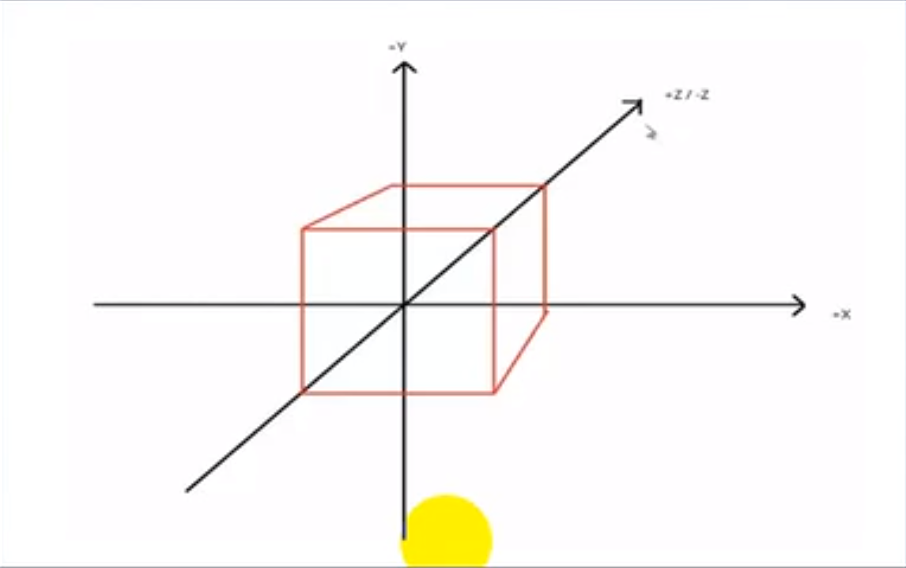
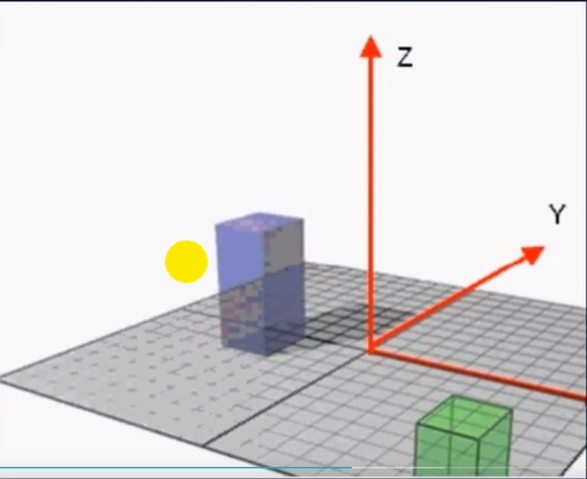
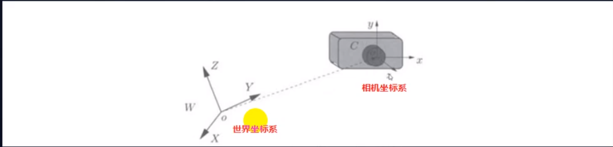
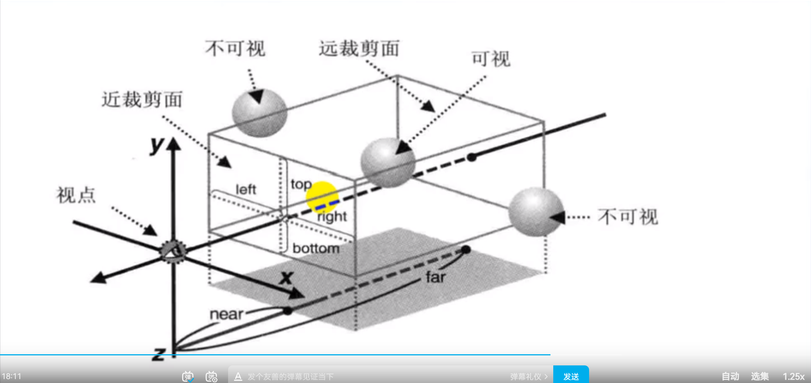
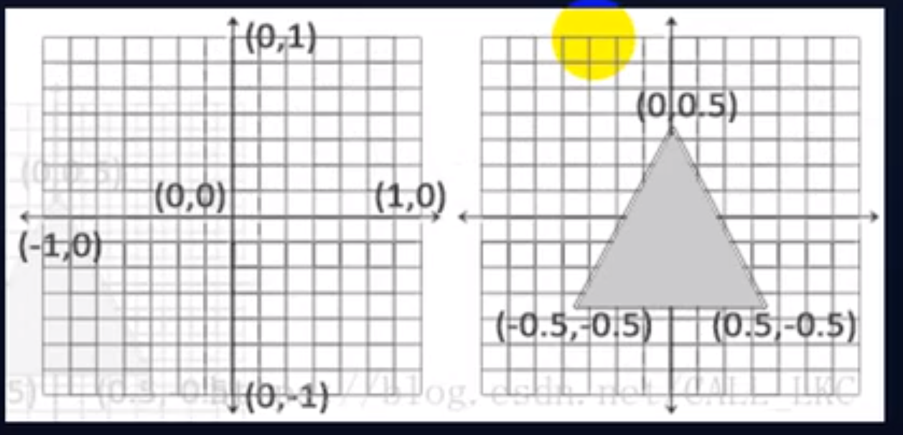

# 局部坐标系

局部坐标系，也就是以物体为中心的为坐标原点，物体的旋转，平移，等操作都是围绕局部坐标系进行的，这时，当物体模型进行旋转，或者平移等操作，局部坐标系也执行相应的旋转平移操作。

# 世界坐标系

一个三维场景中通常都不会只有一个物体，我们真正需要的是把我们建立的物体按照我们所需的形式摆放在场景中，每个物体分布在适当的位置上，整个场景坐标就成为世界坐标系。

# 相机坐标系

相机坐标系：相机的重心为原点，上方为y轴，原点与视点的连线为z轴，x轴为YOZ面的垂线。

# 投影坐标系

剪切坐标系:指的是相机坐标经过投影矩阵转换后得到的空间坐标系，之所以叫剪切坐标系，是因为投影矩阵约定啦视角上下左右的边界，(对应是相机的Frustum范围)，后面会将处于边界之外的数据直接Clip到边界上

# 规范化设备坐标系

标准设备坐标：实际上这个坐标跟我们说的裁剪坐标系中的坐标并不是同一个东西，所谓的的NDC指的是与设备平台无关的一套三维坐标系，（比如同一个物件，无论设备使用什么的分辨率，在这个坐标系中都得到数值相同的）

标准设备坐标系与裁剪坐标系的关联与区别在于，NDC是裁剪坐标系中的四维坐标clip除以第四维齐次坐标分量clip.w后得到的，而这个过程称为透视除法，硬件自动完成，经过透视除法后，就完成了坐标从四维空间得到三维空间的转换，

一旦你的顶点坐标系已经在顶点着色器中处理过，他们就应该标准化设备坐标啦，标准坐标是一个x，y和z值在-1.0到1.0的一小段空间，任何落在范围外的坐标都会被裁剪和丢弃，不会显示在屏幕上，下面你会看到我们定义的在标准化的设备坐标系中的三角形(忽略z轴)

# 屏幕空间坐标系

屏幕空间坐标系是一个二维屏幕的坐标，这个坐标系也是Fragment Shader，Pixel Shader的输入，上一步我们得到NDC之后，坐标范围分布在[-1,1] (WEGBL为列) 而之后则需要经过Viewport Transform将NDC转换到屏幕空间中，得到屏幕分辨率相一致的2D整数坐标系，(更准确的说，坐标范围与Viewport分辨率一致)处于这个坐标系中的坐标，我们称之为Framebuffer Coordinates或者Viwport Coordinates,屏幕坐标系是建立在屏幕上的二维坐标系，是以像素为单位，屏幕左下角（0,0）右上角为(Screen.width, Screen.height )

我们平常说的backFace culling (CW/CCW)等，就是在这个阶段完成的。