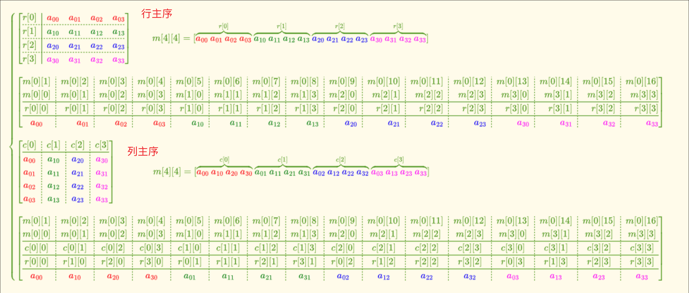

# 矩阵：行主序、列主序、行向量、列向量


**一、从数学角度讲解向量、主要包括以下概念：**

**1.向量**

对于数学家而言，向量就是一个数字列表，对程序员而言则是另一种相似的概念——数组。数学上，一个向量就是一个数组。

**2.标量**

数学上区分向量和标量。标量是对我们平时所用数字的技术称谓。使用该术语时，是想强调数量值，比如稍后将要讨论的，“速度”和“位移”是向量，而“速率”和"长度“是标量，稍后将详细讨论

**3.向量的维度**

向量的维度就是向量包含的”数“的数目。向量可以有任意整数堆，当然也包括一维，事实上，标量可以被认为是一维向量。下面主要讨论2维，3维和4维向量。

**4.行向量和列向量**

**书写向量时，用方括号将一列数括起来，如【1，2，3】。在叙述时书写向量时，每个数字中间都有逗号，在等式中写时，则通常省略逗号。不管是哪些情况。水平书写的向量叫行向量，人们也经常垂直地列出各分量，如**


垂直书写的向量叫列向量。本书同时使用这两种记法。现在，暂时认为行向量和列向量是没有区别的。

我们通常使用下标记法来引用向量的某个分量。在数学中，整数下标表示引用该元素。如，V1表示引用向量v的第一个元素。因为本书只讨论2D，3D，4D向量，不涉及n维向量，所以很少使用下标记法。取而代之的是，用x,y代表2D向量的分量:x,y,x代表3D向量的分量:x,y,z,w代表4D向量分量。下面公式展示了所有记法：


请注意，4D向量的分量不是按字母排序的，第4个分量是w。


## **行主序和列主序**

行主序指矩阵在内存中逐行存储，列主序指矩阵在内存中逐列存储。

行主序矩阵内存布局：


列主序矩阵内存布局：


## **行向量和列向量**

行向量指的是把向量当成一个一行n列的矩阵，列向量指的是把向量当成一个n行一列的矩阵。

## **左乘和右乘**

矩阵“左乘”：矩阵和向量相乘时放在左边。

矩阵“右乘”：矩阵和向量相乘时放在右边。

**对于同一个矩阵和同一个向量，“左乘”和“右乘”的结果是不一样的，这是因为矩阵不满足交换律。**

## **总结**

HLSL中默认是使用**列主序**存储矩阵的，也就是矩阵的每一列存储在一个常量寄存器中，此时使用矩阵“右乘”效率更高，因为一个float4和一个4x4的矩阵相乘只需要四个点乘就能计算出结果：


如果使用“左乘”，结果就是：


HLSL中可以通过 **#pragmapack_matrix指令**或者 **row_major** 、**column_major keyword**来修改矩阵的存储方式。在Shader执行之前会加载矩阵的数据， **行主序还是列主序的设置只会影响Shader读取输入的矩阵数据** ， **矩阵读取到Shader后矩阵是行主序还是列主序就不会有其他影响（只会影响计算的效率）** ，比如通过代码获取某个元素的值，我们要获取第一行第三列的值，都是通过_m02来获取。

**但是为了使效率最高，对于列主序存储的矩阵我们要“右乘”，对于行主序存储的矩阵我们要“左乘”。**

因为DirectXMath中使用行主序矩阵，向量和矩阵相乘使用“左乘”，要想在Shader中读取正确的矩阵，我们就要转置一下，比如一个平移变换，在DirectXMath中是这样：


矩阵“左乘”表示平移变换：


那在HLSL中使用的是列主序矩阵，我们使用“右乘”，要表示相同的平移变换，就要传入上面矩阵的转置矩阵：


所以在把DirectXMath的矩阵传入HLSL时需要传入原矩阵的转置。


```text
行主序：在数组中按照a[0][0]、a[0][1]、a[0][2]…a[1][0]、a[1][1]、a[1][2]…依次存储数据
列主序：在数组中按照a[0][0]、a[1][0]、a[2][0]…a[0][1]、a[1][1]、a[2][1]…依次存储数据
基地址：即数组首元素地址，数组的起始地址。
```

布局应该是这样的




# 矩阵 – 行主序矩阵与列主序矩阵


## 1 线性代数中[矩阵](https://www.stubbornhuang.com/tag/%e7%9f%a9%e9%98%b5/ "浏览关于“矩阵”的文章")的标准定义

矩阵的标准定义：

> 矩阵A与B的乘积矩阵C的第i行第j列的元素c(ij)等于A的第i行与B的第j列的对应元素乘积的和。

无论是Direct3D或者OpenGL，所表示的矢量和矩阵都是依据线性代数中的标准定义的。

## 2 [行主序矩阵](https://www.stubbornhuang.com/tag/%e8%a1%8c%e4%b8%bb%e5%ba%8f%e7%9f%a9%e9%98%b5/ "浏览关于“行主序矩阵”的文章")与[列主序矩阵](https://www.stubbornhuang.com/tag/%e5%88%97%e4%b8%bb%e5%ba%8f%e7%9f%a9%e9%98%b5/ "浏览关于“列主序矩阵”的文章")

矩阵的存储方式分为两种，一种是行主序/行优先矩阵，另一种是列主序/列优先矩阵。在Direct3D中采用行主序矩阵存储矩阵，将矩阵每一行存储到数组的每一行中。而在OpenGL中采用列主序矩阵存储，将矩阵的每一列存储到数组的每一行中。

说的有点复杂，将下面矩阵示例：

1. 标准的线性代数矩阵

<pre class="vditor-reset" placeholder="" contenteditable="true" spellcheck="false"><p data-block="0"></p></pre>


2. Direct3D行主序矩阵


<pre class="vditor-reset" placeholder="" contenteditable="true" spellcheck="false"><div class="vditor-wysiwyg__block" data-type="html-block" data-block="0"><pre class="vditor-wysiwyg__preview" data-render="1"><pre class="vditor-reset" placeholder="" contenteditable="true" spellcheck="false"><p data-block="0"></p></pre></pre></div></pre>


3. OpenGL列主序矩阵


## 3 由矩阵存储顺序引发的矩阵左乘/前乘或者右乘/后乘问题


从根本上来说，矩阵的定义是确定的，但是在不同的引擎的实现过程中对矩阵的存储方式选择了行主序矩阵或者列主序矩阵的存储方式，而由此引发了矩阵左乘或者是右乘的问题。

在线性代数中，矩阵乘法是“行*列”。

而对于行主序矩阵，通常采用前乘。
对于列主序矩阵，通常采用后乘。


## 由矩阵存储顺序引发的变换顺序问题

而这种矩阵乘法的顺序通常影响了对目标物体的变换顺序。
在OpenGL中，因为其实际上是列主序矩阵，采用列向量，所以在OpenGL中，做旋转变换时通常先处理右边的矩阵，然后再处理左边的矩阵。
在Direct3D中，因为其实际上是行主序矩阵，采用行向量，所以在Direct3D中，做旋转变换时通常先处理左边的矩阵，然后在处理右边的矩阵。
