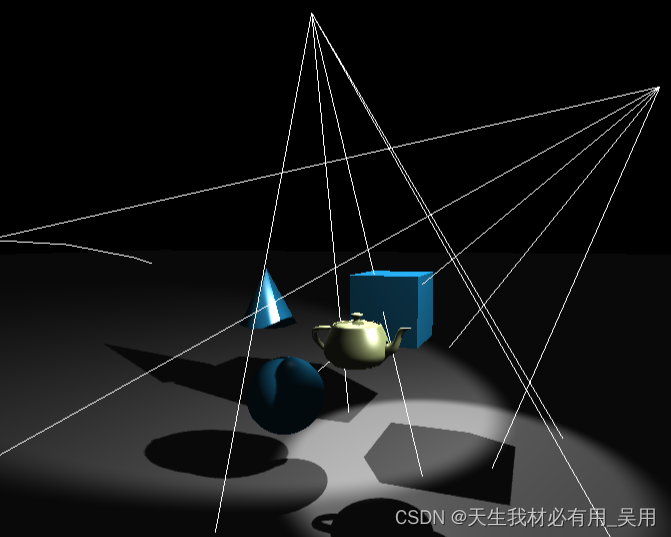

# Three.js中的Raycasting技术：实现3D场景交互事件的Raycaster详解

前言
在Web开发中，Three.js是一个极为强大的库，它让开发者能够轻松地在浏览器中创建和展示3D图形。随着3D技术在网页设计、游戏开发、数据可视化等领域的广泛应用，用户与3D场景的交互变得日益重要。而要实现这种交互，一个核心的技术就是光线投射（Raycasting）。通过Three.js提供的Raycaster类，我们可以检测鼠标或触摸事件在3D空间中的对应位置，进而实现点击、悬停等交互效果。本文将深入探讨如何使用Three.js的Raycaster来实现3D场景的交互事件。
光线投射原理及其属性介绍

##### 什么是Raycasting？
Raycasting是一种计算机图形学技术，用于确定从一个点（通常是观察者的位置或屏幕上的某一点）发射出的光线与场景中物体的交点。在3D应用中，这一技术常用于模拟光照效果、碰撞检测以及用户交互。简单来说，当你在屏幕上点击或触摸时，Three.js会从该点向场景发射一条虚拟的射线，然后检查这条射线与场景中哪些对象相交，从而判断用户点击了哪个对象。

这个类用于进行raycasting（光线投射）。 光线投射用于进行鼠标拾取（在三维空间中计算出鼠标移过了什么物体）。


`


##### Three.js中的Raycaster

在Three.js中，Raycaster类是实现这一功能的关键。它允许你创建一个射线，并提供方法来检测这个射线与场景中对象的交点。以下是使用Raycaster的基本步骤：

Raycaster实例解释

```
new THREE.Raycaster(origin, direction, near, far)
```

```
origin - 光线投射的原点，Vector3类型。
direction - 射线的方向，Vector3类型。
near - 投射近点，不能为负值，应该小于far，其默认值为0 。
far 投射远点，不能小于near，其默认值为无穷大。

```

