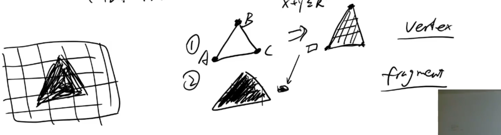

# webgl主要组成模块

webgl 在浏览器语言组成

1. JavaScript 

2. glsl  shader language

    vertex shader program

     fragment 片段 像素意思

   

   图片 

      矢量图    是记录x和y轴 然后根据x和y轴进行放大

      位图（像素图） 是在一个画布中画出一点点针像素

   

   假设我们需要画一个三角形，

      首先我们需要定义 三个坐标  定义坐标的作用就是vertex shader

      然后要填充这个三角形的像素，就是 fragment

    这个图形的叫渲染管线

   

   这个程序有 program

     这个程序有  vertex shader   字符

     还有 fragment  字符

    传到gup中

   

   

   

   

   

   

   ## GLSL语言基础](https://www.cnblogs.com/kekec/p/14065756.html)

   [GLSL](https://www.khronos.org/opengl/wiki/Core_Language_(GLSL))（[wiki](https://en.wikipedia.org/wiki/OpenGL_Shading_Language)   [chs](https://zh.wikipedia.org/wiki/GLSL)）是OpenGL（OpenGL ES、WebGL）的着色器语言，拥有如下特点：

   1. 基于C语言的语法（如：大小写敏感，每条语句必须以分号结尾），是一门面向过程的强类型语言（type sensitive language）

   2. 预处理中没有#include包含文件指令

   3. 除了bool、int、uint、float基础类型外，还支持数组类型，另外GLSL还内置了适合3D图形操作的向量与矩阵类型，以及采样器（纹理）类型   

   4. double、dvec*、dmat*类型需要#version 400及以上才支持

   5. 更严格类型隐式转换规则

   6. 变量没有赋初值时，都会被填充为false、0或0.0

   7. if条件语句和switch条件语句与C语言一致

   8. for循环语句和while循环语句与C语言一致

   9. return、continue和break与C语言一致。另外引入了discard，该关键字只能在fs中使用，表示放弃当前片元，直接处理下一个片元。

   10. 无指针、无字符和字符串类型

   11. 无union、无enum

   12. 向量、矩阵、自定义结构体变量可通过构造函数进行初始化

   13. 增添了一些C++语言的特性：如函数重载

   14. **与C语言一样，包括：预处理 -- 编译 -- 链接 -- 执行   四大步骤** 

       

示意代码如下：

[](javascript:void(0);)

```
const char *vertexShaderSource = "#version 330 core\n"
    "layout (location = 0) in vec3 aPos;\n"
    "void main()\n"
    "{\n"
    "   gl_Position = vec4(aPos.x, aPos.y, aPos.z, 1.0);\n"
    "}\0";
const char *fragmentShaderSource = "#version 330 core\n"
    "out vec4 FragColor;\n"
    "void main()\n"
    "{\n"
    "   FragColor = vec4(1.0f, 0.5f, 0.2f, 1.0f);\n"
    "}\n\0";
    
// build and compile our shader program
// ------------------------------------
// vertex shader
unsigned int vertexShader = glCreateShader(GL_VERTEX_SHADER);
glShaderSource(vertexShader, 1, &vertexShaderSource, NULL);
glCompileShader(vertexShader);
// check for shader compile errors
int success;
char infoLog[512];
glGetShaderiv(vertexShader, GL_COMPILE_STATUS, &success); // 检查是否vs编译成功
if (!success)
{
    glGetShaderInfoLog(vertexShader, 512, NULL, infoLog); // 获取编译错误消息
    std::cout << "ERROR::SHADER::VERTEX::COMPILATION_FAILED\n" << infoLog << std::endl;
}

// fragment shader
unsigned int fragmentShader = glCreateShader(GL_FRAGMENT_SHADER);
glShaderSource(fragmentShader, 1, &fragmentShaderSource, NULL);
glCompileShader(fragmentShader);
// check for shader compile errors
glGetShaderiv(fragmentShader, GL_COMPILE_STATUS, &success); // 检查是否fs编译成功
if (!success)
{
    glGetShaderInfoLog(fragmentShader, 512, NULL, infoLog); // 获取编译错误消息
    std::cout << "ERROR::SHADER::FRAGMENT::COMPILATION_FAILED\n" << infoLog << std::endl;
}

// link shaders
unsigned int shaderProgram = glCreateProgram();
glAttachShader(shaderProgram, vertexShader);
glAttachShader(shaderProgram, fragmentShader);
glLinkProgram(shaderProgram);
// check for linking errors
glGetProgramiv(shaderProgram, GL_LINK_STATUS, &success); // 检测链接着色器程序是否失败
if (!success) {
    glGetProgramInfoLog(shaderProgram, 512, NULL, infoLog); // 获取链接错误消息
    std::cout << "ERROR::SHADER::PROGRAM::LINKING_FAILED\n" << infoLog << std::endl;
}


glDeleteShader(vertexShader); // 链接完成后，不在需要vs着色器对象
glDeleteShader(fragmentShader); // 链接完成后，不在需要fs着色器对象


// render loop
// -----------
while (1)
{
    // Sleep for a while
    glUseProgram(shaderProgram); // 设置要使用的着色器程序
    // Draw Something  
}   

// 释放着色器程序
glDeleteProgram(shaderProgram); 
```

[](javascript:void(0);)

 

## **注释**

单行注释

```
// Hello GLSL.
```

多行注释

```
/*********************************
 This is my first GLSL.
 Let's take a look.
*********************************/
```

 

## **预处理**

### #version XXX

// 用于指定当前glsl文件的版本   

①不同的版本glsl，所能使用语言特性是不一样的。如：layout (location = 0) in vec3 Position;  // layout是330才支持的特性

②如果要加该#version指令，必须是当前glsl文件的第一句有效代码行

③如果不加该#version指令，默认为GLSL 1.1，即：#version 110   注：WebGL1.0中vs和fs开头不用写#version版本，其语法对应GLSL ES 1.0（或GLSL 1.1）

[](javascript:void(0);)

```
#version 110          // GLSL 1.1         OpenGL 2.0  【默认】
#version 120          // GLSL 1.2         OpenGL 2.1
#version 130          // GLSL 1.3         OpenGL 3.0
#version 140          // GLSL 1.4         OpenGL 3.1
#version 150          // GLSL 1.5         OpenGL 3.2
#version 330          // GLSL 3.3         OpenGL 3.3
#version 330 core     // GLSL 3.3核心模式   OpenGL 3.3
#version 400          // GLSL 4.0         OpenGL 4.0
#version 410          // GLSL 4.1         OpenGL 4.1
#version 420          // GLSL 4.2         OpenGL 4.2
#version 430          // GLSL 4.3         OpenGL 4.3
#version 440          // GLSL 4.4         OpenGL 4.4
#version 450          // GLSL 4.5         OpenGL 4.5
#version 460          // GLSL 4.6         OpenGL 4.6

#version 150 compatibility // GLSL 1.5 并向前兼容GLSL 1.2、1.3、1.4的语法

#version 300 es // GLSL ES 3.0 或称 ESSL 3.0   注：声明为这个后，宏GL_ES会被定义为1 
```

[](javascript:void(0);)

GLSL不同版本的差异点，可参考：[这里](https://github.com/mattdesl/lwjgl-basics/wiki/GLSL-Versions)

 

### #extension  extname : behaivor

extname为编译器支持的扩展名称

behaivor可以是require、enable、warn、disable

```
#extension all : disable   // 禁用所有扩展

#extension GL_NV_shadow_samplers_cube : enable  // 启用名为GL_NV_shadow_samplers_cube的扩展
```

扩展行为说明

| 扩展行为 | 说明                                         |
| -------- | -------------------------------------------- |
| require  | 扩展是必需的。若当前扩展不受支持，将抛出错误 |
| enable   | 启用扩展。若当前扩展不支持，将抛出警告       |
| warn     | 对于扩展的任何使用均抛出警告                 |
| disable  | 禁用扩展。若当前扩展被使用，将抛出错误       |

 

### #if  #elif [defined(), !defined()]  #else    #ifdef   #ifndef     #endif   

// 条件编译

[](javascript:void(0);)

```
#define TEST1  // 定义为空的宏
//#define TEST1 1  // 宏已被定义 编译失败 error C7101: Macro TEST1 redefined

#ifdef TEST1  // 条件成立
#endif

//#if TEST1  // 空值不能进行条件判断 编译失败 error C0105: Syntax error in #if
//#endif

#undef TEST1  // 取消TEST1宏

#if TEST1  // 条件不成立   注：OpenGL有效； 但openGL es下  编译失败  error C0105: Syntax error in #if
#endif

#ifndef TEST1  // 条件成立
#endif

#define TEST1 -1  // 定义为int的宏

#define TEST2 // 定义为空的宏

#if TEST1 && defined(TEST2) // 条件成立
#endif

#define TEST3 true // 定义为bool的宏

#if TEST3  // 条件不成立  注：OpenGL有效；但openGL es下，bool不能进行条件判断  编译失败  error C0105: Syntax error in #if
#endif

#if !TEST3  // 条件成立   注：OpenGL有效；openGL es下，bool不能进行条件判断  编译失败  error C0105: Syntax error in #if
#endif

#if TEST3==true  // 条件成立  注：OpenGL有效；openGL es下，bool不能进行条件判断  编译失败  error C0105: Syntax error in #if
#endif

#if !defined(TEST0) && TEST1 && defined(TEST2) // 条件成立
#endif

#define TEST4 100  // 定义为int的宏

#if TEST4  // 条件成立
#endif

#if TEST4 > 150
#elif (TEST4 > 120) || TEST1 // 进入elif分支
#endif

#if !TEST4
#else // 进入else分支
#endif

#define TEST5 2.0  // 定义为float的宏

//#if TEST5  //float不能进行条件判断  编译失败  error C0105: Syntax error in #if
//#endif

//#if TEST5>0.0  //float不能进行条件判断  编译失败  error C0105: Syntax error in #if
//#endif
```

[](javascript:void(0);)

 

更多 #if 示例：

[](javascript:void(0);)

```
// Shader inputs and outputs keywords
//
// - ATTRIBUTE: used to mark a vertex shader inputs
// - SHADER_IN: used to mark a non-vertex shader inputs
// - SHADER_OUT: used to mark a non-fragment shader output
// - OUT: used to mark a fragment shader output
#if __VERSION__ >= 130

#define ATTRIBUTE in
#define SHADER_IN in
#define SHADER_OUT out
#define OUT out

#else

#define ATTRIBUTE attribute
#define SHADER_IN varying
#define SHADER_OUT varying
#define OUT

#endif

// Support array attributes
#if __VERSION__ >= 130

#define ARRAY_ATTRIBUTE(name, size) name[size]

#else

#define ARRAY_ATTRIBUTE(name, size) name[size]

#endif

// Uniform blocks
#if __VERSION__ >= 130

#define BEGIN_UNIFORM_BLOCK(name)   uniform name {

#define END_UNIFORM_BLOCK() };

#else

#define BEGIN_UNIFORM_BLOCK(name)

#define END_UNIFORM_BLOCK()

#endif

// Input and output blocks
#if __VERSION__ >= 150

#define BEGIN_INPUT_BLOCK(name) in name {
#define END_INPUT_BLOCK() };

#define BEGIN_OUTPUT_BLOCK(name) out name {
#define END_OUTPUT_BLOCK() };

#else

#define BEGIN_INPUT_BLOCK(name)
#define END_INPUT_BLOCK()

#define BEGIN_OUTPUT_BLOCK(name)
#define END_OUTPUT_BLOCK()

#endif

// Texturing functions
#if __VERSION__ >= 130

#define TEXTURE_2D texture
#define TEXTURE_3D texture
#define TEXTURE_RECT texture
#define TEXTURE_CUBE texture

#if __VERSION__ >= 150
#define TEXTURE_SIZE(sampler) textureSize(sampler)
#else
#define TEXTURE_SIZE(sampler) sampler ## _Size
#endif

#else

#define TEXTURE_2D texture2D
#define TEXTURE_3D texture3D
#define TEXTURE_RECT texture2DRect
#define TEXTURE_CUBE textureCube

#endif

// Invariance
#if __VERSION__ >= 120
#define INVARIANT invariant
#else
#define INVARIANT
#endif

// Attribute location
#if defined(GL_ARB_explicit_attrib_location)
#define LOCATION(loc)       layout(location = loc)
#else
#define LOCATION(loc)
#endif

// Geometry shader layout
#if __VERSION__ >= 150
#define GEOMETRY_LAYOUT_IN(from) layout (from) in
#define GEOMETRY_LAYOUT(to, max) layout (to, max_vertices = max) out
#else
#define GEOMETRY_LAYOUT_IN(from)
#define GEOMETRY_LAYOUT(to, max)
#endif


// 为GLSL ES着色器脚本时，需要设置float和int类型的精度
#ifdef GL_ES
precision mediump float;// 设置float类型的精度为中精度  注：高精度为highp、低精度为lowp
precision mediump int;  // 设置int类型的精度为中精度  注：高精度为highp、低精度为lowp
#endif
```

[](javascript:void(0);)

 

### #define  #undef     

// 宏定义、宏取消

[](javascript:void(0);)

```
#define TEST1 100  // 定义TEST1宏为100

#ifdef TEST1  // 条件成立
#undef TEST1   // 取消TEST1宏的定义
#endif

#if !defined(TEST1) // 条件成立
#endif

#define SQUARE(a) ((a)*(a))

#define MAX(a,b) \   // 宏必须在一行写完，多行写时必须带上 \行连接符
    (((a) > (b)) ? (a) : (b))

#define MERGE(a, b) a##b // ## 字符拼接符
```

[](javascript:void(0);)

 

### #line   

// 指示下一行的行号，及当前所在的文件；该命令会修改__FILE__、__LINE__的值

该命令是提供给编译器使用的，程序员最好不要使用该命令

[](javascript:void(0);)

```
#if __LINE__==10  // 判断当前行号是否为10
#endif

#if __FILE__==0  // 条件成立  __FILE__好像缺省为0
#endif

#line 116 // 指定下一行的行号为116
#if __LINE__==116  // 条件成立
#endif

#line 200 5  // 指定下一行的行号为200，当前文件的ID标识为5
#if __FILE__==5  // 条件成立
#endif
```

[](javascript:void(0);)

 

### #pragma   

// 用来控制编译器的一些行为

[](javascript:void(0);)

```
#pragma optimize(on) // 开启编译器优化 【默认】
#pragma optimize(off) // 关闭编译器优化

#pragma debug(on)  // 开启debug选项，以获得更多的调试信息
#pragma debug(off) // 关闭debug选项 【默认】

#pragma STDGL invariant(all)  // 让所有的变量全都不变   注：因为编译器需要保证不变性，所以会限制对着色器进行优化
```

[](javascript:void(0);)

 

### #error  

// error命令被执行，会导致当前文件编译失败

```
#if __VERSION__ >= 150 // __VERSION__为内置宏，十进制整数，为当前GLSL文件的版本号
#error This is an error! // error C0000: This is an error!
#endif
```

 

### __VERSION__、__FILE__、__LINE__、GL_ES、GL_FRAGMENT_PRECISION_HIGH

[](javascript:void(0);)

```
#if __VERSION__ >= 330 // __VERSION__为内置宏，int类型，为当前GLSL文件的版本号
#endif

#line 100 3  // 指定下一行的行号为100，当前文件的ID标识为3
#if __FILE__==3  // 条件成立  宏__FILE__为int类型，当前Source String的唯一ID标识
#endif

#if __LINE__==103  // 条件成立  宏__LINE__为int类型，当前的行号
#endif

#if GL_ES // OpenGL下，内置宏GL_ES未定义，条件不成立；openGL es下，GL_ES为1，条件成立
#if GL_FRAGMENT_PRECISION_HIGH  // 若当前片元着色器支持高浮点精度,则宏GL_FRAGMENT_PRECISION_HIGH为1
precision highp float; // 设置float类型的精度为高精度
precision highp int; // 设置int类型的精度为高精度
#else
precision mediump float;// 设置float类型的精度为中精度
precision lowp int;  // 设置int类型的精度为低精度
#endif
#endif
```

[](javascript:void(0);)

 

## **运算符**

除了没有指针相关的运算符外，其他的与c语言完全一致

注：对于向量、矩阵类型，运算符会在各个分量上进行

 

## **变量**

变量名需要符合以下规则：

① 只能包括大小写字母、数字和下划线

② 变量名不能以数字开头

③ 不能是关键字或预留的关键字

④ 不能以gl_、webgl_或_webgl_开头

 

### 全局变量

定义在函数体外的变量。作用域规则与c语言全局变量一致。

 

### 局部变量

定义在函数内的变量。作用域规则与c语言局部变量一致。

 

### 内置常量

以gl_开头

| 所在shader | 常量                                                         |
| ---------- | ------------------------------------------------------------ |
| vs         | const mediump int gl_MaxVertexAttribs = 16; // 可用的顶点输入变量（GLSL 1.3之前为attribute变量）的最大数量const mediump int gl_MaxVertexUniformVectors = 256;  // 可用的vec4统一变量（uniform变量）的最大数量  需要#version 410及以上const mediump int gl_MaxVertexOutputVectors = 16; // 可用的顶点输出变量（GLSL 1.3之前为varying变量）的最大数量  需要#version 410及以上const mediump int gl_MaxVertexTextureImageUnits = 16;  // 可用的纹理的最大数量const mediump int gl_MaxCombinedTextureImageUnits = 32; // vs和fs中可用的纹理的最大数量的总和 |
| fs         | const mediump int gl_MaxFragmentInputVectors = 15; // 片元输入变量（GLSL 1.3之前为varying变量）的最大数量  需要#version 410及以上const mediump int gl_MaxTextureImageUnits = 16;  // 可用的纹理的最大数量const mediump int gl_MaxFragmentUniformVectors = 224;  // 可用的vec4统一变量（uniform变量）的最大数量  需要#version 410及以上const mediump int gl_MaxDrawBuffers = 4;  // 多重渲染目标（MRT）的最大支持数量。const mediump int gl_MinProgramTexelOffset = -8;  // 内建ESSL函数texture*Offset偏移参数迟滞的最小偏移值  需要#version 410及以上const mediump int gl_MaxProgramTexelOffset = 7;  // 内建ESSL函数texture*Offset偏移参数迟滞的最大偏移值  需要#version 410及以上 |

 

### 内置变量

以gl_开头

| 所在shader | 变量                                                         |
| ---------- | ------------------------------------------------------------ |
| vs         | vec4 gl_Position;  //必须将变换后的位置写入到这个变量中，用于输出顶点位置的裁剪坐标。该变量用highp精度限定符声明。float gl_PointSize;  // 用于写入以像素表示的点精灵尺寸。在渲染点时使用。该变量用highp精度限定符声明。int gl_VertexID; // 输入变量，用于保存当前顶点的索引。该变量用highp精度限定符声明。int gl_InstanceID; // 输入变量，用户保存当前图元的编号。对于常规的绘图调用，该值为0。该变量用highp精度限定符声明。bool gl_FrontFacing; // 一个特殊变量，但不是vs直接写入，而是根据vs生成的位置和渲染的图元类型生成的。 struct gl_DepthRangeParameters {     highp float near; // near Z     highp float far; // far Z     highp float diff; // far - near }; uniform gl_DepthRangeParameters gl_DepthRange; // vs唯一内建统一变量：窗口坐标中的深度范围 |
| fs         | vec4 gl_FragCoord;  // 只读变量，保存窗口相对坐标(x,y,z,1/w)。bool gl_FrontFacing; // 只读变量，片段是正面时为ture，否则为false。vec2 gl_PointCoord;  // 只读变量，保存点精灵的纹理坐标，处于[0.0, 1.0]区间float gl_FragDepth;  // 一个只写输出变量。在fs中写入时，覆盖片段固定功能深度值。应谨慎使用该功能，可能禁用GPU的深度优化（如：Early-Z）vec4 gl_FragColor;  // fs输出的片元颜色 |

 

### const变量

表示该变量的值不能被修改。声明的同时必须对它进行初始化，声明之后就不能再去改变它的值了，否则会导致编译错误。

```
const int lightspeed = 399792458;  // 光速 m/s
const vec4 red = vec4(1.0, 0.0, 0.0);  // 红色
const mat4 identity = mat4(1.0);  // 4x4单位矩阵 
```

 

### 顶点输入变量（GLSL 1.3之前为attribute变量）

与顶点相关的输入型变量，被用来表示逐顶点的信息，也叫顶点属性(Vertex Attribute)，必须声明为全局变量，仅在vs中使用。如：顶点的position、normal、uv等。这些变量为cpu传来的数据。

其只能是float或由float组合成的复合类型（vec2、vec3、vec4、mat2、mat3、mat4）

在#version 130及以上，顶点输入变量使用关键字in，而不再使用attribute

[](javascript:void(0);)

```
#if __VERSION__ >= 130

in vec3 position;
in vec3 normal;
in vec2 uv;
in vec2 uv2;

#else

attribute vec3 position;
attribute vec3 normal;
attribute vec2 uv;
attribute vec2 uv2;

#endif
```

[](javascript:void(0);)

顶点输入变量可以使用布局限定符来修饰

```
layout (location = 0) in vec3 position;
layout (location = 1) in vec3 normal;
```

location的值由void glVertexAttribPointer( GLuint index, GLint size, GLenum type, GLboolean normalized, GLsizei stride, const void * pointer)函数的第一个参数index来指定

 

### 统一变量（uniform变量）

是只读的，与顶点和像素无关的输入型变量，被用来表示非逐顶点、非逐像素、各顶点、各像素共用的信息，必须声明为全局变量，可在vs和fs中使用。如：mvp矩阵

可以是除了数组或结构体之外的任意类型。如果vs和fs中声明了同名的统一变量（uniform变量），那么它就会被两种着色器共享。

vs代码：

[](javascript:void(0);)

```
#version 330

layout (location = 0) in vec3 Position;

uniform mat4 gWVP;

out vec4 Color;

void main()
{
    gl_Position = gWVP * vec4(Position, 1.0);
    Color = vec4(clamp(Position, 0.0, 1.0), 1.0);
}
```

[](javascript:void(0);)

openGL代码：

[](javascript:void(0);)

```
GLuint ShaderProgram = glCreateProgram();

// ... ... 

GLuint Location = glGetUniformLocation(ShaderProgram, "gWVP");  // 获取shader中uniform mat4 gWVP变量的location

if (Location != INVALID_UNIFORM_LOCATION) {
    float m[4][4] = { {0.0f, 1.0f, 0.5f, 0.2f},
                      {0.1f, 0.0f, 1.5f, 0.0f},
                      {0.0f, 1.2f, -0.5f, 0.1f},
                      {0.2f, 1.0f, 1.5f, 0.7f}
                    };
    glUseProgram(ShaderProgram);  // 要先指定Program
    glUniformMatrix4fv(Location, 1, GL_TRUE, (const GLfloat*)m);  // 设置uniform mat4 gWVP变量的值
}
```

[](javascript:void(0);)

 

### 统一变量块（uniform变量块） 

OpenGL中使用统一变量缓冲区对象来支持统一变量块（uniform变量块） 数据的存储。

相比单一的统一变量（uniform变量），统一变量块（uniform变量块） 具有以下优势：

① 更高效   ② 不受默认大小限制，增加了统一变量的可用存储

vs代码：

[](javascript:void(0);)

```
// ... ...
layout (std140) uniform LightBlock
{
    vec3 lightDirection;
    vec4 lightPosition;
};

// ... ...
```

[](javascript:void(0);)

openGL代码：

[](javascript:void(0);)

```
GLuint ShaderProgram = glCreateProgram();

// ... ...

GLuint blockId, bufferId;
GLint blockSize;
GLuint bindingPoint = 1;
GLfloat lightData[] = 
{
    // lightDirection (padding to vec4 based on std140 rule)
    1.0f, 0.0f, 0.0f, 0.0f,
    
    // lightPosition
    0.0f, 0.0f, 0.0f, 1.0f
};

// Retrieve the uniform block index
blockId = glGetUniformBlockIndex(ShaderProgram, "LightBlock");

// Associate the uniform block index with a binding point
glUniformBlockBinding(ShaderProgram, blockId, bindingPoint);

// Get the size of lightData
// alternatively, we can calculate it using sizeof(lightData) in this example
glGetActiveUniformBlockiv(ShaderProgram, blockId, GL_UNIFORM_BLOCK_DATA_SIZE, &blockSize);

// Create and fill a buffer object
glGenBuffers(1, &bufferId);
glBindBuffer(GL_UNIFORM_BUFFER, bufferId);
glBufferData(GL_UNIFORM_BUFFER, blockSize, lightData, GL_DYNAMIC_DRAW); // 将lightData数组的数据绑定到名为统一变量块LightBlock上

// Bind the buffer object to the uniform block binding point
glBindBufferBase(GL_UNIFORM_BUFFER, bindingPoint, bufferId);
```

[](javascript:void(0);)

 

布局限定符

| 限定符               | 说明                                     |
| -------------------- | ---------------------------------------- |
| shared（默认）       | 多个着色器程序间共享。可省略不写         |
| packed               | 最小内存占用，无法在多个着色器程序间共享 |
| std140               | 标准内存布局                             |
| column_major（默认） | 矩阵变量以列优先顺序。可省略不写         |
| row_major            | 矩阵变量以行优先顺序                     |

① shared、packed和std140有着不同地内存对齐方式

② 布局限定符可用于统一的变量块，也可以用在统一变量块中某个单独的变量上    注：用在单独变量上时，对于该变量会覆盖掉全局对应的布局限定符

```
layout (shared, column_major) uniform TransformBlock
{
    layout (std140, row_major) mat4 matViewProj;      // matViewProj布局为std140行优先
    layout (row_major) mat3 matNormal;                // matNormal布局为shared行优先
    mat3 matTexGen;                                    // matViewProj布局为shared列优先
};
```

 

### 顶点输出与片元输入变量（GLSL 1.3之前为varying变量）

必须声明为全局变量，其任务是从vs向fs传输数据。该数据对cpu是不可见的。

在#version 410和#version 300 es之前，在vs和fs中必须声明同名、同类型的该变量。注：当变量的类型和名字一样时，OpenGL就会把两个变量在链接到一起（在链接程序对象时完成的），这样它们之间就能发送数据了。

需要注意的是，vs中输出变量的值并不是直接传给fs的输入变量。

在进入fs之前，会进行光栅化，根据绘制的图形，对vs的输出变量进行插值（Interpolation），然后再传递给fs的v输入变量。

该类型的变量只能是float或由float组合成的复合类型（vec2、vec3、vec4、mat2、mat3、mat4）

在#version 130及以上，顶点输出与片元输入变量使用关键字in，而不再使用varying

 

vs中顶点输出变量

[](javascript:void(0);)

```
#if __VERSION__ >= 130

out vec3 vPosition;
out vec3 vNormal;
out vec2 vUv;
out vec2 vUv2;

#else

varying vec3 vPosition;
varying vec3 vNormal;
varying vec2 vUv;
varying vec2 vUv2;

#endif
```

[](javascript:void(0);)

为了保证不变性，GLSL引入了invariant关键字来修饰顶点输出变量。

主要的原因是，为了优化，编译器可能对shader指令重新排序，可能导致2个着色器之间的等价计算不能保证产生完全相同的结果。特别是在进行多遍渲染时，尤其可能成为问题。

例如：fs中第一遍中计算镜面反射光，第二遍计算环境光和漫反射光，顶点输出变量如果不使用invariant关键字，精度带来的小误差会导致深度冲突（Z fighting）。

invariant关键字既可用于声明变量，也可以用于已经声明过的变量。

```
invariant vec2 texCoord; // 用于声明变量

invariant gl_Position;  // 用于已经声明过的变量

#pragma STDGL invariant(all)  // 让所有的变量全都不变   注：因为编译器需要保证不变性，所以会限制对着色器进行优化
```

 

fs中片元输入变量

[](javascript:void(0);)

```
#if __VERSION__ >= 130

in vec3 vPosition;
in vec3 vNormal;
in vec2 vUv;
in vec2 vUv2;

#else

varying vec3 vPosition;
varying vec3 vNormal;
varying vec2 vUv;
varying vec2 vUv2;

#endif
```

[](javascript:void(0);)

 

fs中片元输出变量

```
layout(location = 0) out vec4 FragColor;

void main()
{
    FragColor = vec4(1.0, 0.0, 0.0, 0.0);
}
```

注1：在典型情况下，只会渲染一个颜色缓冲区，这个时候，layout(location = 0)布局限定符可忽略不写（默认输出变量会进入位置0）

注2：当渲染到多个渲染目标（MRT）时，可以使用布局限定符指定每个输出前往的渲染目标

 

在#version 410和#version 300 es之前，与顶点输入变量相比，顶点输出与片元输入变量不能使用layout布局限定符。

在#version 410和#version 300 es及之后，顶点输出与片元输入变量可使用layout布局限定符的location索引来建立关联，不需要两边的变量同名。更多请查看：[Program separation linkage](https://www.khronos.org/opengl/wiki/Layout_Qualifier_(GLSL)#Program_separation_linkage)

vs中顶点输出变量

```
layout(location = 0) out vec4 color;
layout(location = 1) out vec2 texCoord;
layout(location = 2) out vec3 normal;
```

 

fs中片元输入变量

```
layout(location = 0) in vec4 diffuseAlbedo;
layout(location = 1) in vec2 texCoord;
layout(location = 2) in vec3 cameraSpaceNormal;
```

 

插值限定符来修饰顶点输出与片元输入变量（GLSL 1.3之前为varying变量）

| **插值限定符** | **说明**                                                     | **示例**                                                     |
| -------------- | ------------------------------------------------------------ | ------------------------------------------------------------ |
| smooth（缺省） | 平滑着色                                                     | /*** vs ***/smooth out vec3 v_color;  // smooth可省略不写/*** fs ***/smooth in vec3 v_color;  // smooth可省略不写 |
| flat           | 平面着色                                                     | /*** vs ***/flat out vec3 v_color;/*** fs ***/flat in vec3 v_color; |
| centroid       | 质心采样（centroid sampling） 使用多重采样渲染时，centroid可用于强制插值发生在被渲染图元内部这可防止图元的边缘出现伪像 | /*** vs ***/centroid out vec3 v_color;/*** fs ***/centroid in vec3 v_color; |

 

### 变量总结

vs/fs中能容纳的顶点输入变量（attribute变量）、uniform变量、顶点输出与片元输入变量（varying变量）是储存在硬件中的，其最大数目与设备有关，具体详见下表：

| 变量类别                                | 保存在硬件的哪个位置             | 是否会打包 | 内置全局变量（表示最大数量）                                 | glGetintegerv查询               | OpenGL ES 3.0最小值     |
| --------------------------------------- | -------------------------------- | ---------- | ------------------------------------------------------------ | ------------------------------- | ----------------------- |
| 顶点输入变量（attribute变量）           |                                  | No         | const mediump int gl_MaxVertexAttribs                        | GL_MAX_VERTEX_ATTRIBS           | 16                      |
| vs：统一变量（uniform变量）             | 常量存储：对应一个向量的物理数组 | Yes        | const mediump int gl_MaxVertexUniformVectors                 | GL_MAX_VERTEX_UNIFORM_VECTORS   | 256                     |
| fs：统一变量（uniform变量）             | 常量存储：对应一个向量的物理数组 | Yes        | const mediump int gl_MaxFragmentUniformVectors               | GL_MAX_FRAGMENT_UNIFORM_VECTORS | 224                     |
| 顶点输出变量片元输入变量（varying变量） | 插值器：对应一个向量的物理数组   | Yes        | const mediump int gl_MaxVertexOutputVectorsconst mediump int gl_MaxFragmentInputVectorsconst mediump int gl_MaxVaryingVectors |                                 | 16158（Open GL ES 2.0） |

注1：为了有效利用宝贵的硬件存储资源，OpenGL会对变量打包再进行存放。

注2：用uniform修饰的变量、const变量、字面值（如：在代码中写的0，1.0等）都会占用常量储存空间。

 


 

 注：GLSL 1.3及以后（也就在OpenGL 3.0及以后，OpenGL ES 3.0及以后，WebGL 2.0及以后），开始使用in修饰顶点输入变量和片元输入变量，使用out修饰顶点输出变量

 

## **精度限定符**

用来表示每种数据具有的精度（占用的字节数）。精度越高，计算结果误差就越小、效果也更好，但也意味着更大的内存、更多能耗和更久的计算时间。

使用精度限定符，可以精细地控制shader程序在效果和性能间的平衡。

| 精度限定符        | 描述                                                         | float数值范围和精度           | int数值范围  |
| ----------------- | ------------------------------------------------------------ | ----------------------------- | ------------ |
| highp（高精度）   | vs的最低精度 注：在某些webgl环境中，fs可能不支持highp精度如果支持的话，会定义内置宏GL_FRAGMENT_PRECISION_HIGH | 范围：(-2^62~2^62)精度：2^-16 | (-2^16~2^16) |
| mediump（中精度） | fs的最低精度                                                 | 范围：(-2^14~2^14)精度：2^-10 | (-2^10~2^10) |
| lowp（低精度）    | 可以表示所有的颜色                                           | 范围：(-2~2)精度：2^-8        | (-2^8~2^8)   |

 

各精度限定符的数值范围和精度实际上与系统环境有关，可动态地使用gl.GetShaderPrecisionFormat()来获取

 

对单个变量

```
mediump float size;  // 中精度的浮点型变量
highp vec4 position;  // 具有高精度浮点型元素的vec4对象
lowp vec4 color; // 具有低精度浮点型元素的vec4对象
```

 

对整个文件

```
precision mediump float; // 所有float和由float组合成的复合类型（vec2、vec3、vec4、mat2、mat3、mat4）的数默认为中精度
precision highp int;  // 所有int和由int组合成的复合类型的数默认为高精度
```

注：需要放在shader文件紧跟#version xxx的后面，其他语句之前

 

各数据类型的默认精度

| shader类型  | 数据类型                         | 默认精度 |
| ----------- | -------------------------------- | -------- |
| vs          | int                              | highp    |
| float       | highp                            |          |
| sampler2D   | lowp                             |          |
| samplerCube | lowp                             |          |
| fs          | int                              | mediump  |
| float       | 无（需手动指定，否则会编译报错） |          |
| sampler2D   | lowp                             |          |
| samplerCube | lowp                             |          |

## **基础类型**

[](javascript:void(0);)

```
bool b1 = true;

int n1 = 10;
int n2 = -25;
int n3 = 0;
//int n4 = 3.5;  // 编译失败！ 不能将float隐式地转换成int

//uint u1 = 0; // 编译失败！ 不能将int隐式地转换成uint
uint u2 = 0u;
uint u3 = 100u;


float f1 = 2.0;
float f2 = 3;
float f3 = 0.2f;
float f4 = n1;
float f5 = float(n1);
float f6 = u2;
float f7 = float(u3);
//float f8 = b1; // 编译失败！ 不能将bool隐式地转换成float
//float f9 = (float)b1;// 编译失败！ 不能使用c类型的转换方式
float f9 = float(b1);

int n4 = int(f3);
//int n5 = f3; // 编译失败！ 不能将float隐式地转换成int
//int n6 = u3; // 编译失败！ 不能将uint隐式地转换成int
int n7 = int(u3);
//uint u4 = n1; // 编译失败！ 不能将int隐式地转换成uint
uint u5 = uint(n2);

//bool b2 = n1; // 编译失败！ 不能将int隐式地转换成bool
bool b3 = bool(n1);
//bool b4 = u3; // 编译失败！ 不能将uint隐式地转换成bool
bool b5 = bool(u3);
//bool b6 = f3; // 编译失败！ 不能将float隐式地转换成bool
bool b7 = bool(f3);
```

[](javascript:void(0);)

 

## **数组**

只支持一维数组。

[](javascript:void(0);)

```
const float a1[3] = float[](0.25, 0.5, 1.0);
float a2[2] = float[2](0.3, 0.8);

float a4[3];
a4[0] = 0.1;
a4[1] = 0.2;
a4[2] = 0.3;

int len = a4.length(); // len为3  获取数组a4的元素个数

const int N = 2;
vec3 va1[N];
va1[0] = vec3(1.0, 0.0, 0.0);
va1[1] = vec3(0.0, 0.0, 1.0);

vec3 va2[2] = vec3[](vec3(1.0), vec3(0.2, 0.3, 0.5));
```

[](javascript:void(0);)

 

## **结构体（struct）**

① 与C语言结构体一样，不可从其他结构体上派生

② 与C语言结构体一样，不允许有构造函数和析构函数

③ 可直接对2个结构体变量进行比较

[](javascript:void(0);)

```
#version 330

out vec4 FragColor;

struct light // 与C语言一样，不允许从其他结构体上派生
{
    vec4 color;
    vec3 position;
    
    //light(){} // 与C语言一样，不允许有构造函数
    //~light(){} // 与C语言一样，不允许有析构函数

    void test()
    {
        color.x = 0.2;
    }
} GL1; // 定义light结构体，并定义全局变量GL1

light GL2; // 定义light结构体的全局变量GL2

void main()
{
    // light结构体的构造函数参数的顺序必须与结构体定义中的成员顺序一致
    // 如下：参数一 vec4(1.0, 1.0, 0.0, 1.0)会赋值给vec4 color  参数二 vec3(10.0, 10.0, 0.0)会赋值给vec3 position
    GL1 = light(vec4(1.0, 1.0, 0.0, 1.0), vec3(10.0, 10.0, 0.0));
    
    GL1.test();

    GL2.color.r = 1.0;
    GL2.position = vec3(3.0, 4.0, 5.0);

    light L1, L2; // 定义light结构体的局部变量L1,L2
    L1.color = vec4(0.0, 1.0, 0.0, 1.0);
    
    L2 = L1;
    if (L1 == L2)  // true  结构体支持==运算符比较
    {
        
    }

    L2.position.x = 100;
    if (L1 != L2)  // true   结构体支持!=运算符比较
    {
        
    }

    FragColor = GL1.color;
}
```

[](javascript:void(0);)

 

## **向量**

向量的分量可以为：

① {x,y,z,w} ： 用来获取顶点坐标分量

② {r,g,b,a} ： 用来获取颜色分量

③ {s,t,p,q} ：用来获取纹理坐标分量

 

从向量中可以同时抽取多个分量，这个过程称作混合或重组（swizzling）。但要注意地是，以上三种不能相互混着使用，如：xyr、rgst、xrsw等

| 分量类型 | 2维   | 3维   | 4维   |
| -------- | ----- | ----- | ----- |
| bool     | bvec2 | bvec3 | bvec4 |
| int      | ivec2 | ivec3 | ivec4 |
| uint     | uvec2 | uvec3 | uvec4 |
| float    | vec2  | vec3  | vec4  |

 

[](javascript:void(0);)

```
vec2 v2a; // v2a为(0.0, 0.0)
vec2 v2b = vec2(1.0f); // v2b为(1.0f, 1.0f)
vec2 v2c = vec2(1.0, 0.0); // v2c为(1.0, 0.0)
//vec3 v2d = v2c.xx; // 编译失败 incompatible types in initialization
vec2 v2e; // v2e为(0.0, 0.0)
v2e = v2c.yx; // v2e为(0.0, 1.0)
vec2 v2f; // v2f为(0.0, 0.0)
v2f = v2c.rr; // v2f为(1.0, 1.0)

float f1 = v2c[0];  // f1为1.0  v2c[0]=v2c.x=v2c.r=v2c.s
float f2 = v2c.y;  // f1为0.0  v2c.y=v2c.g=v2c.t=v2c[1]

// 向量运算
vec2 v2g = vec2(0.4, 0.6);
vec2 v2h = vec2(0.1, 0.2);
vec2 v2i = v2g + v2h; // v2i为(0.5, 0.8)
vec2 v2j = v2g + 0.2; // v2j为(0.6, 0.8)
vec2 v2k = v2h * 2; // v2k为(0.2, 0.4)
vec2 v2m = v2g * v2h; // v2m为(0.04, 0.12)

vec3 v3a = vec3(0.5); // v3a为(0.5, 0.5, 0.5)
//vec3 v3b = vec3(1.0, 1.0); // 编译失败  too little data in type constructor
vec3 v3c = vec3(1.0, 0.5, 0.25); // v3c为(1.0, 0.5, 0.25)

//vec3 v3d = vec3(v2a); // 编译失败  cast not allowed
vec3 v3e = vec3(v2a, 1.0); // v3e为(0.0, 0.0, 1.0)

vec2 v2n = vec2(v3c);  // 使用v3c的前2个元素 v2n为(1.0, 0.5)

vec4 v4a = vec4(0.0, 0.3, 1.0, 0.5);  // v4a为(0.0, 0.3, 1.0, 0.5)
v4a.xw = vec2(0.2, 0.6);  // v4a为(0.2, 0.3, 1.0, 0.6)
v4a.gbr = vec3(0.0, 0.0, 1.0);  // v4a为(1.0, 0.0, 0.0, 0.6)
v4a.pq = vec2(1.0, 0.0); // v4a为(1.0, 0.0, 1.0, 0.0)
vec4 v4b = vec4(v2c, v3c);  // 先使用v2c来填充，如果没填满继续使用v3c来填充  v4b为(1.0, 0.0, 1.0, 0.5)
vec4 v4c;
v4c = vec4(0.0, 0.3, 1.0, 0.5).wwwx;  // v4c为(0.5, 0.5, 0.5, 0.0)
```

[](javascript:void(0);)

 

## **矩阵**

分量类型均为float，按照列优先顺序来存储（列主序）

| 矩阵类型       | 解释                                                      |
| -------------- | --------------------------------------------------------- |
| mat2（mat2x2） | 由2个列向量vec2组成（可通过m[0]、m[1]来访问）             |
| mat2x3         | 由2个列向量vec3组成（可通过m[0]、m[1]来访问）             |
| mat2x4         | 由2个列向量vec4组成（可通过m[0]、m[1]来访问）             |
| mat3x2         | 由3个列向量vec2组成（可通过m[0]、m[1]、m[2]来访问）       |
| mat3（mat3x3） | 由3个列向量vec3组成（可通过m[0]、m[1]、m[2]来访问）       |
| mat3x4         | 由3个列向量vec4组成（可通过m[0]、m[1]、m[2]来访问）       |
| mat4x2         | 由4个列向量vec2组成（可通过m[0]、m[1]、m[2]、m[3]来访问） |
| mat4x3         | 由4个列向量vec3组成（可通过m[0]、m[1]、m[2]、m[3]来访问） |
| mat4（mat4x4） | 由4个列向量vec4组成（可通过m[0]、m[1]、m[2]、m[3]来访问） |

 

[](javascript:void(0);)

```
vec2 v2a = vec2(1.0, 0.5); // v2a为(1.0, 0.5)
vec3 v3a = vec3(0.3, 0.2, 0.9); // v3a为(0.3, 0.2, 0.9)
vec4 v4a = vec4(0.2, 0.3, 0.8, 0.0); // v4a为(0.2, 0.3, 0.8, 0.0)
mat2 m2a;  // m2a为(0.0, 0.0, 0.0, 0.0)
mat2 m2b = mat2(1.0);  // m2b为(1.0, 0.0, 0.0, 1.0)
                       // | 1.0  0.0 |
                       // | 0.0  1.0 | 
mat2 m2c = mat2(0.2, 0.5, 0.0, 0.8);  // m2c为(0.2, 0.5, 0.0, 0.8)
                                      // | 0.2  0.0 |
                                      // | 0.5  0.8 |
mat2 m2d = mat2(v2a, 0.1, 0.3); // m2d为(1.0, 0.5, 0.1, 0.3)
mat2 m2e = mat2(0.6, v3a); // m2e为(0.6, 0.3, 0.2, 0.9)
mat2 m2f = mat2(v2a, v3a); // 先使用v2a来填充，如果没填满继续使用v3a来填充  m2f为(1.0, 0.5, 0.3, 0.2)
mat2 m2g = mat2(v4a); // m2g为(0.2, 0.3, 0.8, 0.0)
                      // | 0.2  0.8 |
                      // | 0.3  0.0 |
mat2 m2h = mat2(v2a.yyxx); // m2g为(0.5, 0.5, 1.0, 1.0)
                      // | 0.5  1.0 |
                      // | 0.5  1.0 |
mat2x3 m2x3a = mat2x3(v2a.xyx, v3a); // m2x3a为(1.0, 0.5, 1.0, 0.3, 0.2, 0.9)
                                     // | 1.0  0.3 |
                                     // | 0.5  0.2 |
                                     // | 1.0  0.9 |

vec2 v2b = m2b[1];  // v2b为(0.0, 1.0)
vec3 v3b = m2x3a[0]; // v3b为(1.0, 0.5, 1.0)
int n = 1;
vec3 v3c = m2x3a[n]; // v3c为(0.3, 0.2, 0.9)

float f1 = m2c[1][0];  // f1为0.0
float f2 = m2c[0].y;  // f2为0.5
float f3 = m2x3a[0].b;  // f3为1.0

mat4 m4a = mat4(0.5); // m4a为(0.5, 0.0, 0.0, 0.0, 0.0, 0.5, 0.0, 0.0, 0.0, 0.0, 0.5, 0.0, 0.0, 0.0, 0.0, 0.5)
                      // | 0.5  0.0  0.0  0.0 |
                      // | 0.0  0.5  0.0  0.0 |
                      // | 0.0  0.0  0.5  0.0 |
                      // | 0.0  0.0  0.0  0.5 |
// 矩阵与浮点数相加
mat4 m4b = m4a + 0.5; // m4b为(1.0, 0.5, 0.5, 0.5, 0.5, 1.0, 0.5, 0.5, 0.5, 0.5, 1.0, 0.5, 0.5, 0.5, 0.5, 1.0)
                      // | 1.0  0.5  0.5  0.5 |
                      // | 0.5  1.0  0.5  0.5 |
                      // | 0.5  0.5  1.0  0.5 |
                      // | 0.5  0.5  0.5  1.0 |
// 矩阵与浮点数相乘
mat4 m4c = m4a * 2;   // m4c为(1.0, 0.0, 0.0, 0.0, 0.0, 1.0, 0.0, 0.0, 0.0, 0.0, 1.0, 0.0, 0.0, 0.0, 0.0, 1.0)
                      // | 1.0  0.0  0.0  0.0 |
                      // | 0.0  1.0  0.0  0.0 |
                      // | 0.0  0.0  1.0  0.0 |
                      // | 0.0  0.0  0.0  1.0 |

mat4 m4d = mat4(1.0, 0.5, 0.5, 0.5, 0.5, 1.0, 0.5, 0.5, 0.5, 0.25, 0.25, 0.5, 0.5, 0.5, 0.5, 1.0);
                      // | 1.0  0.5  0.5  0.5 |
                      // | 0.5  1.0  0.25 0.5 |
                      // | 0.5  0.5  0.25 0.5 |
                      // | 0.5  0.5  0.5  1.0 |

// 矩阵右乘向量 
vec4 v4b = m4d * v4a; // v4b为(0.75, 0.6, 0.45, 0.65)  注：v4a被当成列向量
                      // v4b.x = m4d[0].x * v4a.x + m4d[1].x * v4a.y + m4d[2].x * v4a.z + m4d[3].x * v4a.w = 0.75
                      // v4b.y = m4d[0].y * v4a.x + m4d[1].y * v4a.y + m4d[2].y * v4a.z + m4d[3].y * v4a.w = 0.6
                      // v4b.z = m4d[0].z * v4a.x + m4d[1].z * v4a.y + m4d[2].z * v4a.z + m4d[3].z * v4a.w = 0.45
                      // v4b.w = m4d[0].w * v4a.x + m4d[1].w * v4a.y + m4d[2].w * v4a.z + m4d[3].w * v4a.w = 0.65
// 矩阵左乘向量 
vec4 v4c = v4a * m4d; // v4c为(0.75, 0.8, 0.375, 0.65)  注：v4a被当成行向量
                      // v4c.x = v4a.x * m4d[0].x  + v4a.y * m4d[0].y + v4a.z * m4d[0].z + v4a.w * m4d[0].w = 0.75
                      // v4c.y = v4a.x * m4d[1].x  + v4a.y * m4d[1].y + v4a.z * m4d[1].z + v4a.w * m4d[1].w = 0.8
                      // v4c.z = v4a.x * m4d[2].x  + v4a.y * m4d[2].y + v4a.z * m4d[2].z + v4a.w * m4d[2].w = 0.375
                      // v4c.w = v4a.x * m4d[3].x  + v4a.y * m4d[3].y + v4a.z * m4d[3].z + v4a.w * m4d[3].w = 0.65

// 矩阵矩阵相乘
mat2 m2i = mat2(0.1, 0.0, 0.6, 0.2);  // m2i为(0.1, 0.0, 0.6, 0.2)
                                      // | 0.1  0.6 |
                                      // | 0.0  0.2 |
mat2 m2j = m2c * m2i; // m2j为(0.02, 0.05, 0.12, 0.46)
                      // | m2c[0].x*m2i[0].x+m2c[1].x*m2i[0].y  m2c[0].x*m2i[1].x+m2c[1].x*m2i[1].y |    |  0.02  0.12  |
                      // | m2c[0].y*m2i[0].x+m2c[1].y*m2i[0].y  m2c[0].y*m2i[1].x+m2c[1].y*m2i[1].y |    |  0.05  0.46  |
```

[](javascript:void(0);)

 

## **采样器（纹理）**

只能是uniform变量，该变量从OpenGL中接受纹理单元编号，使得shader能通过该编号来访问纹理数据。

采样器（sampler）类型：

| 大类型                     | 小类型                   | 说明                            | 示例                  |
| -------------------------- | ------------------------ | ------------------------------- | --------------------- |
| 浮点采样器（不透明）       | sampler1D                | 1D纹理                          | uniform sampler1D s;  |
| sampler2D                  | 2D纹理                   | uniform sampler2D s;            |                       |
| sampler3D                  | 3D纹理                   | uniform sampler3D s;            |                       |
| samplerCube                | 立方图纹理               | uniform samplerCube s;          |                       |
| samplerCubeShadow          | 带有对比的立方图深度纹理 | uniform samplerCubeShadow s;    |                       |
| sampler1DShadow            | 带有对比的1D深度纹理     | uniform sampler1DShadow s;      |                       |
| sampler1DArray             | 1D数组纹理               | uniform sampler1DArray s;       |                       |
| sampler1DArrayShadow       | 带有对比的1D数组深度纹理 | uniform sampler1DArrayShadow s; |                       |
| sampler2DShadow            | 带有对比的2D深度纹理     | uniform sampler2DShadow s;      |                       |
| sampler2DArray             | 2D数组纹理               | uniform sampler2DArray s;       |                       |
| sampler2DArrayShadow       | 带有对比的2D数组深度纹理 | uniform sampler2DArrayShadow s; |                       |
| 有符号整数采样器（不透明） | isampler1D               | 有符号整数1D纹理                | uniform isampler1D s; |
| isampler2D                 | 有符号整数2D纹理         | uniform isampler2D s;           |                       |
| isampler3D                 | 有符号整数3D纹理         | uniform isampler3D s;           |                       |
| isamplerCube               | 有符号整数立方图纹理     | uniform isamplerCube s;         |                       |
| isampler1DArray            | 有符号整数1D数组纹理     | uniform isampler1DArray s;      |                       |
| isampler2DArray            | 有符号整数2D数组纹理     | uniform isampler2DArray s;      |                       |
| 无符号整数采样器（不透明） | usampler1D               | 无符号整数1D纹理                | uniform usampler1D s; |
| usampler2D                 | 无符号整数2D纹理         | uniform usampler2D s;           |                       |
| usampler3D                 | 无符号整数3D纹理         | uniform usampler3D s;           |                       |
| usamplerCube               | 无符号整数立方图纹理     | uniform usamplerCube s;         |                       |
| usampler1DArray            | 无符号整数1D数组纹理     | uniform usampler1DArray s;      |                       |
| usampler2DArray            | 无符号整数2D数组纹理     | uniform usampler2DArray s;      |                       |

 

除了=、==和!=外，采样器变量不可以作为操作数参与运算

vs/fs中能使用采样器的个数，详见下表：

| 着色器类型 | 最大数量                      | 最小数量 |
| ---------- | ----------------------------- | -------- |
| vs         | gl_MaxVertexTextureImageUnits | 0        |
| fs         | gl_MaxTextureImageUnits       | 8        |

 

示例代码如下： 

\1. 创建并填充数据到纹理对象

[](javascript:void(0);)

```
unsigned int TexID;
glGenTextures(1, &TexID); //分配1个独一无二的id，并赋值给TexID

glBindTexture(GL_TEXTURE_2D, TexID); // 把id为TexID绑定到GL_TEXTURE_2D类型的Buffer上

// 为当前绑定的纹理对象设置环绕、过滤方式
glTexParameteri(GL_TEXTURE_2D, GL_TEXTURE_WRAP_S, GL_REPEAT);   
glTexParameteri(GL_TEXTURE_2D, GL_TEXTURE_WRAP_T, GL_REPEAT);
glTexParameteri(GL_TEXTURE_2D, GL_TEXTURE_MIN_FILTER, GL_LINEAR);
glTexParameteri(GL_TEXTURE_2D, GL_TEXTURE_MAG_FILTER, GL_LINEAR);

// 加载并生成纹理
int width, height, nrChannels;
unsigned char *data = stbi_load("container.tga", &width, &height, &nrChannels, 0);
if (data)
{
    glTexImage2D(GL_TEXTURE_2D, 0, GL_RGB, width, height, 0, GL_RGB, GL_UNSIGNED_BYTE, data); // 拷贝data数据块（内存）到GL_TEXTURE_2D类型的Buffer（显存）
    glGenerateMipmap(GL_TEXTURE_2D); // 生成mipmap
}
stbi_image_free(data);
```

[](javascript:void(0);)

\2. 创建并填充VBO

[](javascript:void(0);)

```
/******************  创建并填充VBO  ******************/
float vertices[] = {
//     ---- 位置 ----       ---- 颜色 ----     - 纹理坐标 -
     0.5f,  0.5f, 0.0f,   1.0f, 0.0f, 0.0f,   1.0f, 1.0f,   // 右上
     0.5f, -0.5f, 0.0f,   0.0f, 1.0f, 0.0f,   1.0f, 0.0f,   // 右下
    -0.5f, -0.5f, 0.0f,   0.0f, 0.0f, 1.0f,   0.0f, 0.0f,   // 左下
    -0.5f,  0.5f, 0.0f,   1.0f, 1.0f, 0.0f,   0.0f, 1.0f    // 左上
};

unsigned int VBO;
glGenBuffers(1, &VBO);  //分配1个独一无二的id，并赋值给VBO

glBindBuffer(GL_ARRAY_BUFFER, VBO);  // 把id为VBO绑定到GL_ARRAY_BUFFER类型的Buffer上
glBufferData(GL_ARRAY_BUFFER, sizeof(vertices), vertices, GL_STATIC_DRAW); // 拷贝vertices数组（内存）到GL_ARRAY_BUFFER类型的Buffer（显存）
```

[](javascript:void(0);)


\3. 绑定VBO并传递顶点属性（Vertex Attribute）到vs着色器

[](javascript:void(0);)

```
/************  使用VAO来记录顶点属性（Vertex Attribute）的上下文信息  ************/
unsigned int VAO;
glGenVertexArrays(1, &VAO); //分配1个独一无二的id，并赋值给VAO

glBindVertexArray(VAO); 

glBindBuffer(GL_ARRAY_BUFFER, VBO);  // 把id为VBO绑定到GL_ARRAY_BUFFER类型的Buffer上

// position顶点属性
glVertexAttribPointer(0, 3, GL_FLOAT, GL_FALSE, 8 * sizeof(float), (void*)0);
glEnableVertexAttribArray(0); // 启用location为0的顶点属性  注：顶点属性默认是禁用的
// color顶点属性
glVertexAttribPointer(1, 3, GL_FLOAT, GL_FALSE, 8 * sizeof(float), (void*)(3* sizeof(float)));
glEnableVertexAttribArray(1);   // 启用location为1的顶点属性  注：顶点属性默认是禁用的
// uv顶点属性
glVertexAttribPointer(2, 2, GL_FLOAT, GL_FALSE, 8 * sizeof(float), (void*)(6 * sizeof(float)));
glEnableVertexAttribArray(2);
```

[](javascript:void(0);)

\4. 编译并链接ShaderProgram，并设置名为ourTexture的Uniform变量

[](javascript:void(0);)

```
// 下面为Shader编译和Program链接的部分代码
unsigned int shaderProgram = glCreateProgram();
glAttachShader(shaderProgram, vertexShader);
glAttachShader(shaderProgram, fragmentShader);
glLinkProgram(shaderProgram);

glUseProgram(shaderProgram);
glUniform1i(glGetUniformLocation(shaderProgram, "ourTexture"), 0); // 将shader中名为ourTexture的Uniform变量，绑定到GL_TEXTRUE0纹理上
```

[](javascript:void(0);)

\5. 顶点着色器代码：

[](javascript:void(0);)

```
#version 330 core
layout (location = 0) in vec3 aPos;
layout (location = 1) in vec3 aColor;
layout (location = 2) in vec2 aTexCoord;

out vec3 ourColor;
out vec2 TexCoord;

void main()
{
    gl_Position = vec4(aPos, 1.0);
    ourColor = aColor; // 将颜色值传给片段着色器
    TexCoord = aTexCoord; // 将纹理坐标传给片段着色器
}
```

[](javascript:void(0);)

\6. 片段着色器代码：

[](javascript:void(0);)

```
#version 330 core
out vec4 FragColor;

in vec3 ourColor;
in vec2 TexCoord;

uniform sampler2D ourTexture;

void main()
{
    FragColor = texture(ourTexture, TexCoord); // 用TexCoord的uv坐标从贴图ourTexture上采样颜色值
}
```

[](javascript:void(0);)

\7. 用纹理采样的方式来渲染对象

[](javascript:void(0);)

```
while (1)
{
    // Sleep for a while
    
    glActiveTexture(GL_TEXTURE0); // 设置当前活动纹理为GL_TEXTURE0    注：OpenGL一般至少支持16张贴图：GL_TEXTURE0、GL_TEXTURE1、... 、GL_TEXTURE15
    glBindTexture(GL_TEXTURE_2D, TexID); // 将TexID的纹理绑定到GL_TEXTURE0上
    
    glUseProgram(shaderProgram); // 使用ID为shaderProgram的Shader
    
    glBindVertexArray(VAO);

    // Draw Something
}
```

[](javascript:void(0);)

\8. 游戏结束前释放相关资源

```
glDeleteVertexArrays(1, &VAO);
glDeleteBuffers(1, &VBO); 

glDeleteProgram(shaderProgram);
glDeleteTextures(1, &TexID);
```

 

## **函数**

函数用法和C语言一样

vs和fs执行的入口函数均为void main()  {  }

函数参数限定词说明：

| 限定词 | 说明                                                         |
| ------ | ------------------------------------------------------------ |
| in     | 缺省限定词，可以省略不写                                     |
| const  | 当前参数为常量，不可在函数内被修改                           |
| out    | ① 进入函数时，会被初始化为0, 0.0或false② 在函数内修改后，对外可见 |
| inout  | ① 接受函数外传入的初始值② 在函数内修改后，对外可见           |

① 参数限定词只需要用在函数上，函数调用时不用带。

② 不允许函数递归    这一限制的原因是编译器会把函数都内联展开，以支持没有堆栈的GPU

[](javascript:void(0);)

```
float square(float value) // 求平方
{
    return value * value;
}

void fuc1(const float value) // const参数不能在函数内部修改
{
    //value = 0.2; // assignment to const variable value  编译错误
}

void fuc2(out float value)  // value进入函数时，会被重新初始化为0；在函数内修改，对外可见
{
    value += 0.5;
}

void fuc3(inout float value) // value的初始值从函数外传入；在函数内修改，对外可见
{
    value += 0.5;
}

int fun4(int n)  // 如果在main函数中直接或间接调用fun4函数，会编译报错：recursive call to function
{
    if (n == 0 || n == 1)
    {
        return 1;
    }
    return fun4(n-1) + fun4(n-2);
}
```

[](javascript:void(0);)

 

### 内置函数

| 类别     | 内置函数                                                     |
| -------- | ------------------------------------------------------------ |
| 角度函数 | radians //角度转弧度degrees // 弧度转角度                    |
| 三角函数 | sin // 正弦cos // 余弦tan // 正切asin // 反正弦acos // 反余弦atan // 反正切 |
| 指数函数 | pow // x^y exp // 自然指数log // 自然对数exp2  // 2^x log2 // 以2为底对数sqrt // 开平方inversesqrt // 开平方倒数 |
| 通用函数 | abs // 绝对值min // 最小值max // 最大值mod // 取余数sign // 取正负号floor // 向下取整ceil // 向上取整clamp // 限定范围mix // 线性内插step // 步进函数smoothstep // 艾米内插步进fract // 获取小数部分 |
| 几何函数 | length // 矢量长度distance // 两点间距离dot // 内积cross // 外积normalize // 归一化 reflect // 矢量反射faceforward // 使矢量“朝前” |
| 矩阵函数 | matrixCmpMult // 逐元素乘法                                  |
| 矢量函数 | lessThan // 逐元素小于lessThanEqual // 逐元素小于等于greaterThan // 逐元素大于greaterThanEqual // 逐元素大于等于equal // 逐元素相等notEqual // 逐元素不等any // 任一元素为true则为trueall // 所有元素为true则为truenot // 逐元素取补 |
| 纹理函数 | textureSize // 获取某级lod纹理的宽高  如：vec2 textureSize(sampler2D sampler, int lod)  texelFetch // 取得单一texel的颜色值  如：vec4 texelFetch(sampler2D sampler, ivec2 P, int lod) texelFetchOffset // 带Offset取得单一texel的颜色值   如：vec4 texelFetchOffset(sampler2D sampler, ivec2 P, int lod, ivec2 offset) // 设置的过滤采样算法，会影响从texture*函数中得到的颜色值 texture // 从纹理上读取颜色值（P为指定的uv坐标，bias为mip的offset）（）  如：vec4 texture(sampler2D sampler, vec2 P [, float bias]) textureProj // 用投影方式从纹理上读取颜色值  如：vec4 textureProj(sampler2D sampler, vec3 P [, float bias])textureLod // 指定lod从纹理上读取颜色值   如：vec4 textureLod(sampler2D sampler, vec2 P, float lod)textureOffset // 带Offset从纹理上读取颜色值  如：vec4 textureOffset(sampler2D sampler, vec2 P, ivec2 offset [, float bias])textureProjOffset  // 用投影方式带Offset从纹理上读取颜色值  如：vec4 textureProjOffset(sampler2D sampler, vec3 P, ivec2 offset [, float bias])textureLodOffset  // 指定lod带Offset从纹理上读取颜色值  如：vec4 textureLodOffset(sampler2D sampler, vec2 P, float lod, ivec2 offset)textureProjLod  // 指定lod用投影方式从纹理上读取颜色值  如：vec4 textureProjLod(sampler2D sampler, vec3 P, float lod)textureProjLodOffset  // 指定lod用投影方式带Offset从纹理上读取颜色值  如：vec4 textureProjLodOffset(sampler2D sampler, vec3 P, float lod, ivec2 offset)textureGrad  // 指定梯度从纹理上读取颜色值  如：vec4 textureGrad(sampler2D sampler, vec2 P, vec2 dPdx, vec2 dPdy)textureGradOffset  // 指定梯度带Offset从纹理上读取颜色值  如：vec4 textureGradOffset(sampler2D sampler, vec2 P, vec2 dPdx, vec2 dPdy, ivec2 offset)textureProjGrad  // 指定梯度用投影方式从纹理上读取颜色值  如：vec4 textureProjGrad(sampler2D sampler, vec3 P, vec2 dPdx, vec2 dPdy)textureProjGradOffset  // 指定梯度带Offset用投影方式从纹理上读取颜色值  如：vec4 textureProjGradOffset(sampler2D sampler, vec3 P, vec2 dPdx, vec2 dPdy, vec2 offset) |

 

## **限定符顺序规则**

一般变量中：不变性（invariant ） >  插值（smooth、flat）  > 存储（const、in、out、uniform、centroid in、centroid out）  >  精度（highp、mediump、lowp）

参数变量中：存储（const、in、out、uniform、centroid in、centroid out）  >  参数（in、out、inout）   >  精度（highp、mediump、lowp）

 