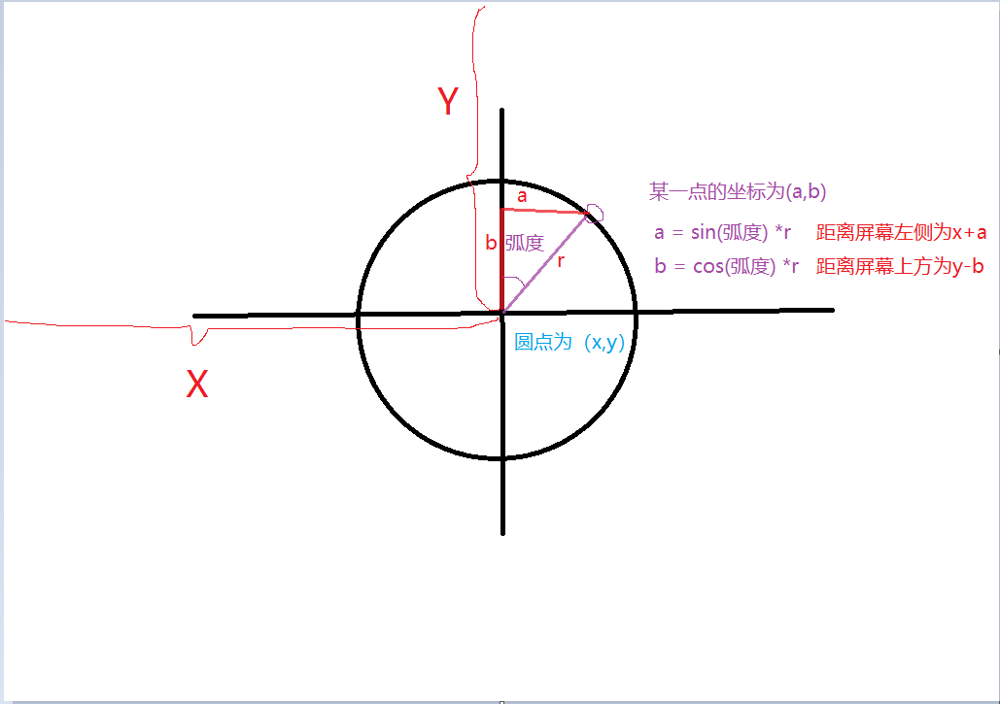

## 画布动画，画一个圆圈

 在canvas动画中，不断的绘画点就能变成线。接下来我们来画一条线

```
import initShader from '@/pages/3d/utils/initShader.js';

import './index.less';

window.onload = function () {
    const canvas = document.createElement('canvas');
    document.body.appendChild(canvas);
    canvas.width = 500;
    canvas.height = 500;

    if (!canvas.getContext) return;
    let gl = canvas.getContext('webgl');

    // vertexShader, fragmentShader
    // 类似 c 语言的东西
    // 顶点着色器程序
    let vertexShader = `
      attribute vec4  a_Position;  // 声明a_Position变量
      attribute float a_PointSize; // 声明a_PointSize变量
      void main(){
        // vec4 表示是由4位float小数组成
        gl_Position = a_Position;
        // vec4(
        //   0.0,  // x 轴
        //   0.0,  // y轴
        //   0.0,   // z 轴
        //   1.0  // 偏移量缩放参数 但这个值最小值不能小于0
        //   );  // 表示顶点颜色的位置
        gl_PointSize = a_PointSize;   //w 表示顶点颜色的尺寸，设置越大，这个像素就会越大
      }
    `;

    // 片元着色器程序
    let fragmentShader = `
      void main(){
          gl_FragColor = vec4(1.0, 1.0, 0.0 , 1.0);    // 颜色rgba
      }
    `;

    // 初始化initShader
    initShader(gl, vertexShader, fragmentShader);

    // 设置动态变量
    //获取arrtibute变量
    const a_Position = gl.getAttribLocation(gl.program, 'a_Position');

    if (a_Position < 0) {
        console.log('Failed to get the storage loacation of a_Position');
        return false;
    }

    const a_PointSize = gl.getAttribLocation(gl.program, 'a_PointSize');
    if (a_PointSize < 0) {
        console.log('Failed to get the storage loacation of a_PointSize');
        return false;
    }

    // 第一步清空这个画布
    gl.clearColor(0.5, 0.5, 0.5, 1.0); // rgba()
    // 真正清空颜色 并填充为黑色

    //gl.COLOR_BUFFER_BIT  webgl 常量api
    gl.clear(
        // 指定颜色缓存
        gl.COLOR_BUFFER_BIT
    );

    let PointSize = 10.0;
    let Position = [0.0, 0.0, 0.0, 1.0];

    // 画一个斜线
    let i = 0;
    while (i <= 100) {
       // 不断的控制偏移量
        Position[0] += 0.1;
        Position[1] += 0.1;
        // 将顶点位置输入给 attribute变量
        gl.vertexAttrib1f(a_PointSize, PointSize);
        // // 数组传递
        gl.vertexAttrib4fv(a_Position, new Float32Array(Position));
        // 画一个点
        gl.drawArrays(
            gl.POINTS, // 画点参数
            0,
            1
        );
        console.log('Position==', Position);
        i++;
    }
  
};

```


画一个正方形

​    画一个正方形需要4条变组成，所以要定义一个线的类型 为 linType 

```
   // 画一个正方形
    while (i <= 1000) {
        if (linType === 'top' && Position[0] < 5) {
            Position[0] = (Position[0] * 10 + 0.1 * 10) / 10;
        } else if (linType === 'top' && Position[0] === 5) {
            linType = 'right';
        } else if (linType === 'right' && Position[1] > -5) {
            Position[1] = (Position[1] * 10 - 0.1 * 10) / 10;
        } else if (linType === 'right' && Position[1] === -5) {
            linType = 'bottom';
        } else if (linType === 'bottom' && Position[0] > -5) {
            Position[0] = (Position[0] * 10 - 0.1 * 10) / 10;
        } else if (linType === 'bottom' && Position[0] === -5) {
            linType = 'left';
        } else if (linType === 'left' && Position[1] < 5) {
            Position[1] = (Position[1] * 10 + 0.1 * 10) / 10;
        }
        // console.log('Position==', Position);
        // console.log('linType==', linType);
        // 将顶点位置输入给 attribute变量
        gl.vertexAttrib1f(a_PointSize, PointSize);
        // // 数组传递
        gl.vertexAttrib4fv(a_Position, new Float32Array(Position));
        // 画一个点
        gl.drawArrays(
            gl.POINTS, // 画点参数
            0,
            1
        );

        i++;
    }
```

一开始先画top，然后就是 改动top的x 轴，

然后画right 右边的 改动 y轴

然后再画底部的buttom，  改动x轴

然后再画left 改变 y轴


画一个圆形

我们需要用到以下公式

Math.PI 是π

用弧长公式
L=nπR/180

弧度=角度*Math.PI/180

弧长 = 弧度*半径

L代表弧长,R代表半径,n代表圆心角的度数




如何得到圆上每个点的坐标？
解决思路：根据三角形的正玄、余弦来得值；

假设一个圆的圆心坐标是(a,b)，半径为r

则圆上每个点的：

其中a 和 b是初始的位置

angle 是角度

X坐标 = x + Math.sin(angle * 2 *Math.PI / 360) * r ；

Y坐标 = y + Math.cos(angle * 2 * Math.PI / 360) * r ；


坐标旋转公式-- 角度和弧度
https://blog.51cto.com/u_15060545/4363314

1*************************************************
x1=cos(angle)x-sin(angle)y;
y1=cos(angle)y+sin(angle)x;
其中x，y表示物体相对于旋转点旋转angle的角度之前的坐标，x1，y1表示物体旋转angle后相对于旋转点的坐标
angle 为弧度

弧度和角度转换公式：
弧度 = 角度/57.3
单位弧度定义为圆弧长度等于半径时的圆心角，单位是rad。
一个完整的圆的弧度是2π，所以2π rad = 360°
1 π rad = 180°，1°=π/180 rad，1 rad = 180°/π（约57.29577951°）

2**************************************************
还有一个计算弧度常用的：（一样的）

弧度的计算公式为： 2PI/360角度；

弧度 = 角度 ×（PI/180）；
3*****************************************************
案例二：如何得到圆上每个点的坐标？
解决思路：根据三角形的正玄、余弦来得值；

假设一个圆的圆心坐标是(a,b)，半径为r

则圆上每个点的：

X坐标 = a + Math.sin(angle * 2 *Math.PI / 360) * r ；

Y坐标 = b + Math.cos(angle * 2 * Math.PI / 360) * r ；
————————————————
角度与弧度互转（比较好的文章内容）
1、角度定义
两条射线从圆心向圆周射出，形成一个夹角和夹角正对的一段弧。当弧长正好等于圆周长的360分之一时，两条射线的夹角的大小为1度。(单位: º）

2、弧度定义
两条射线从圆心向圆周射出，形成一个夹角和夹角正对的一段弧。当这段弧长正好等于圆的半径时，两条射线的夹角大小为1弧度（单位：rad)。
可简单理解为：弧度 = 弧长 / 半径

3、弧长与弧度
3.1 圆的周长C的计算公式为：C = 2πr = πd (r - 半径；d - 直径)
3.2 圆一周的弧长为：2πr (弧长 = 周长）
3.2 圆一周的弧度为：2πr / r = 2π (根据：弧度 = 弧长 / 半径）

4、度与角度的转换
根据圆为360 º，弧度为2π，即 360º = 2π

4.1 角度转弧度：2π / 360 = π / 180 ≈ 0.0174rad, 即: 度数 * (π / 180） = 弧度
例如：将30º转为弧度rad
30º * (π / 180）= 0.523320 rad

4.2 弧度转角度: 360 / 2π = 180 / π ≈ 57.3º, 即: 弧度 * (180 / π） = 度数
例如：将0.523320rad转为度º

0.523320rad * (180 / π) = 29.9992352688º


代码

```
  let angle = 0;
    let r = 0.1;
    Position = [-5.0, 1.0, 0.0, 10.0];
    while (i <= 1000) {
        angle += 1;

        Position[0] = Position[0] + Math.sin((angle * 2 * Math.PI) / 360) * r;
        Position[1] = Position[1] + Math.cos((angle * 2 * Math.PI) / 360) * r;

        console.log('Position==', Position);
        // 将顶点位置输入给 attribute变量
        gl.vertexAttrib1f(a_PointSize, PointSize);
        // // 数组传递
        gl.vertexAttrib4fv(a_Position, new Float32Array(Position));
        // 画一个点
        gl.drawArrays(
            gl.POINTS, // 画点参数
            0,
            1
        );

        i++;
    }
```


```
  //  画一个圆
    let angle = 0;
    let r = 0.1;
    Position = [-5.0, 1.0, 0.0, 10.0];
    let x = -5.0;
    while (i <= 10000) {
        angle += 1;


        // 画多个圆
        if (angle >= 360) {
            angle = 0;
            r += 0.02;
            x -= 1.0;
            Position = [x, 1.0, 0.0, 10.0];
        }

        Position[0] = Position[0] + Math.sin((angle * 2 * Math.PI) / 360) * r;
        Position[1] = Position[1] + Math.cos((angle * 2 * Math.PI) / 360) * r;

        console.log('Position==', Position);
        // 将顶点位置输入给 attribute变量
        gl.vertexAttrib1f(a_PointSize, PointSize);
        // // 数组传递
        gl.vertexAttrib4fv(a_Position, new Float32Array(Position));
        // 画一个点
        gl.drawArrays(
            gl.POINTS, // 画点参数
            0,
            1
        );

        i++;
    }
```


