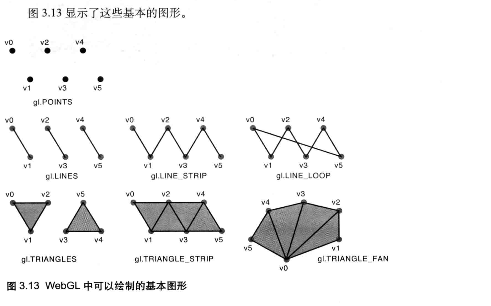
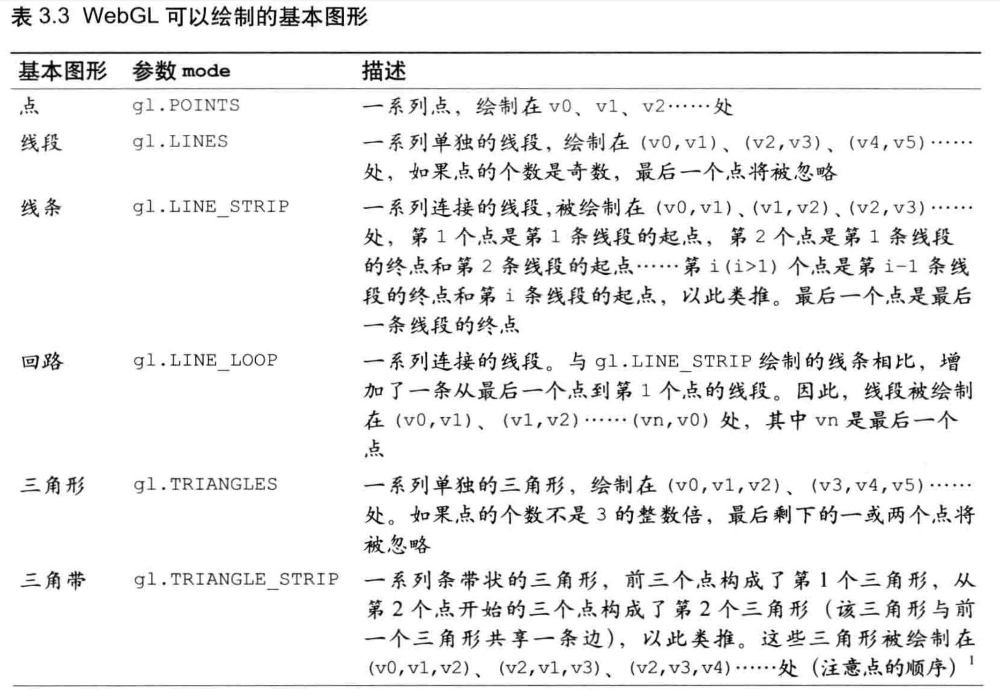

# 图形绘制

webgl只能绘制三种图形，点，线段，和三角形，但是如文章开头所说到的，从球体到立方体，再到游戏中的三维角色都可以由小的三角形组成，实际上，你可以使用这届最基本的图形来绘制任何东西。






画一个正方形


```
import initShader from '@/pages/3d/utils/initShader.js';

import './index.less';

window.onload = function () {
    const canvas = document.createElement('canvas');
    document.body.appendChild(canvas);
    canvas.width = 1000;
    canvas.height = 1000;

    if (!canvas.getContext) return;
    let gl = canvas.getContext('webgl');
    console.log('gl==', gl);

    /*

    // 这个和下面这个声明一样
    // vertexShader
    // 顶点坐标
    const vertexShader = `
     attribute vec4   a_Position;
     attribute vec4   a_Color;
     varying vec4  v_Color;
     void main(){
         gl_Position = a_Position;
         gl_PointSize = 10.0;
         v_Color = a_Color;
     }
    `;
    // 片段代码
    const fragmentShader = `
     precision mediump float;
     varying vec4  v_Color;
     void main(){
      gl_FragColor = v_Color;
     }
    `;

*/

    // vertexShader
    // 顶点坐标
    const vertexShader = `
     attribute vec2 a_Position;
     attribute vec3 a_Color;
     varying vec3 v_Color;
     void main(){
         gl_Position = vec4(a_Position,0.0,1.0);
         gl_PointSize = 10.0;
         v_Color = a_Color;
     }
    `;
    // 片段代码
    const fragmentShader = `
     precision mediump float;
     varying vec3 v_Color;
     void main(){
      gl_FragColor = vec4(v_Color, 1.0);
     }
    `;
    // 初始化shader
    initShader(gl, vertexShader, fragmentShader);

    // 清除画布
    gl.clearColor(0.0, 0.0, 0.0, 1.0);
    gl.clear(gl.COLOR_BUFFER_BIT);

    // 写三角形顶点位置
    const vertices = new Float32Array([
        //x     y      r     g     b
         -0.5,  0.5,   1.0,  0.0,  0.0, 
         0.5,   0.5,   0.0,  1.0,  0.0,
         0.5,   -0.5,   0.0,  0.0,  1.0,
         -0.5,   -0.5,   0.0, 0.0, 1.0,
    ]);
    const FSIZE = vertices.BYTES_PER_ELEMENT;

    //1. 创建 buffer
    const vertexBuffer = gl.createBuffer();

    //2. 绑定bindbuffer
    gl.bindBuffer(gl.ARRAY_BUFFER, vertexBuffer);
    //3
    // 向缓冲区写入数据
    gl.bufferData(gl.ARRAY_BUFFER, vertices, gl.STATIC_DRAW);

    // 4: 把带有数据的buffer给arrribute
    // 将缓冲区对象分配给a_Position变量
    const a_Position = gl.getAttribLocation(gl.program, 'a_Position');

    // WebGL系统会根据stride和offset参数从缓冲区中正确地抽取出数据，依次赋值给着色器中的各个attribute变量并进行绘制
    // stride（第5个参数）为FSIZE*5意味着verticesColors数据中5个数为一组是属于一个顶点的所有数据(包括顶点坐标和颜色大小等)，
    // offset（第6个参数）为0意味着从5个数一组的单元中的第0个数开始取值（offset代表当前考虑的数据项距离首个元素的距离，即偏移参数）
    // size（第2个参数）为2意味着从5个数一组的单元中取出两个数，
    // type(第3个参数)为gl.FLOAT意味着数据类型为浮点数
    // normalize(第4个参数)为false意味着不对这些数据进行归一化操作
    /*
     
     告诉显卡从当前绑定的缓冲区（bindBuffer() 指定的缓冲区）中读取顶点数据。
     方法绑定当前缓冲区范围到gl.ARRAY_BUFFER,
     成为当前顶点缓冲区对象的通用顶点属性并指定它的布局 (缓冲区对象中的偏移量)。


 
index：第几个属性，从0开始取，0，1，2，顺序自己定义，例如顶点位置，纹理，法线

这里只有顶点位置，也只能讨论顶点位置，所以为0

size：一个顶点所有数据的个数，这里每个顶点又两个浮点数属性值，所以是2

type：顶点描述数据的类型，这里position数组中的数据全部为float，所以是GL_FLOAT

normalized：是否需要显卡帮忙把数据归一化到-1到+1区间，这里不需要，所以设置GL_FALSE

stride：一个顶点占有的总的字节数，这里为两个float，所以是sizeof(float)*2

pointer：当前指针指向的vertex内部的偏离字节数，可以唯一的标识顶点某个属性的偏移量
这里是指向第一个属性，顶点坐标，偏移量为0
 
*/

 

    console.log('a_Position==', a_Position);
    gl.vertexAttribPointer(
        a_Position,  // index：第几个属性，从0开始取，0，1，2，顺序自己定义，例如顶点位置，纹理，法线
         2,   // size：一个顶点所有数据的个数，这里每个顶点又两个浮点数属性值，所以是2
         gl.FLOAT,  // 顶点描述数据的类型，这里position数组中的数据全部为float，所以是GL_FLOAT
         false,  // 是否需要显卡帮忙把数据归一化到-1到+1区间，这里不需要，所以设置GL_FALSE
         FSIZE * 5,  // 一个顶点占有的总的字节数，这里为两个float，所以是sizeof(float)*5
          0  // 这里是指向第一个属性，顶点坐标，偏移量为0    [-0, 0.5, 1.0,0.0,0.0,] 从索引下表是从0开始  2就是颜色下标了 
          );
    // 连接a_Position变量与分配给他的缓冲区对象
    gl.enableVertexAttribArray(a_Position);

    const a_Color = gl.getAttribLocation(gl.program, 'a_Color');
    console.log('a_Color==', a_Color);


    gl.vertexAttribPointer(
        a_Color,  // 颜色变量
         3, // size：一个顶点所有数据的个数，这里每个顶点又两个浮点数属性值，所以是 3
         gl.FLOAT,
         false, 
         FSIZE * 5,  // 一个顶点占有的总的字节数，这里为两个float，所以是sizeof(float)*5
         FSIZE * 2 // 这里是指向第一个属性，顶点坐标，偏移量为2 从第二个开始 比如 
       );
    gl.enableVertexAttribArray(a_Color);

    let n = 4;

    // 画图
    gl.drawArrays(
        gl.TRIANGLE_FAN, // 正方形是由两个三角形组成
        0, // 从哪个点开始
        n
    );
    // 画点
    gl.drawArrays(
        gl.POINTS, // 画什么图形
        0, // 从哪个点开始
        n
    );
};

```


画一个圆；

弧度公式

```
        x = x + (Math.sin((angle * 2 * Math.PI) / 360) * r) / n;
        y = y + (Math.cos((angle * 2 * Math.PI) / 360) * r) / n;
```


全部代码

```
import initShader from '@/pages/3d/utils/initShader.js';

import './index.less';

window.onload = function () {
    const canvas = document.createElement('canvas');
    document.body.appendChild(canvas);
    canvas.width = 1000;
    canvas.height = 1000;

    if (!canvas.getContext) return;
    let gl = canvas.getContext('webgl');
    console.log('gl==', gl);

    /*

    // 这个和下面这个声明一样
    // vertexShader
    // 顶点坐标
    const vertexShader = `
     attribute vec4   a_Position;
     attribute vec4   a_Color;
     varying vec4  v_Color;
     void main(){
         gl_Position = a_Position;
         gl_PointSize = 10.0;
         v_Color = a_Color;
     }
    `;
    // 片段代码
    const fragmentShader = `
     precision mediump float;
     varying vec4  v_Color;
     void main(){
      gl_FragColor = v_Color;
     }
    `;

*/

    // vertexShader
    // 顶点坐标
    const vertexShader = `
     attribute vec2 a_Position;
     attribute vec3 a_Color;
     varying vec3 v_Color;
     void main(){
         gl_Position = vec4(a_Position,0.0,1.0);
         gl_PointSize = 10.0;
         v_Color = a_Color;
     }
    `;
    // 片段代码
    const fragmentShader = `
     precision mediump float;
     varying vec3 v_Color;
     void main(){
      gl_FragColor = vec4(v_Color, 1.0);
     }
    `;
    // 初始化shader
    initShader(gl, vertexShader, fragmentShader);

    // 清除画布
    gl.clearColor(0.0, 0.0, 0.0, 1.0);
    gl.clear(gl.COLOR_BUFFER_BIT);
    //  画一个圆
    let angle = 0;
    let r = 2;
    let x = -0.5;
    let y = 0;
    // Position = [-5.0, 1.0, 0.0, 10.0];
    // 这里的rgb 最大值是1 而不是 255
    let rgba = [Math.random(), Math.random(), Math.random()];
    let position = [];
    let n = 10;
    for (let i = 0; i < n; i++) {
        angle += 360 / n;
        console.log('angle==', angle);
        x = x + (Math.sin((angle * 2 * Math.PI) / 360) * r) / n;
        y = y + (Math.cos((angle * 2 * Math.PI) / 360) * r) / n;
        position = position.concat([
            x,
            y,
            Math.random(),
            Math.random(),
            Math.random(),
        ]);
    }
    console.log('position==', position);

    // 写三角形顶点位置
    const vertices = new Float32Array(position);

    const FSIZE = vertices.BYTES_PER_ELEMENT;

    //1. 创建 buffer
    const vertexBuffer = gl.createBuffer();

    //2. 绑定bindbuffer
    gl.bindBuffer(gl.ARRAY_BUFFER, vertexBuffer);
    //3
    // 向缓冲区写入数据
    gl.bufferData(gl.ARRAY_BUFFER, vertices, gl.STATIC_DRAW);

    // 4: 把带有数据的buffer给arrribute
    // 将缓冲区对象分配给a_Position变量
    const a_Position = gl.getAttribLocation(gl.program, 'a_Position');

    // WebGL系统会根据stride和offset参数从缓冲区中正确地抽取出数据，依次赋值给着色器中的各个attribute变量并进行绘制
    // stride（第5个参数）为FSIZE*5意味着verticesColors数据中5个数为一组是属于一个顶点的所有数据(包括顶点坐标和颜色大小等)，
    // offset（第6个参数）为0意味着从5个数一组的单元中的第0个数开始取值（offset代表当前考虑的数据项距离首个元素的距离，即偏移参数）
    // size（第2个参数）为2意味着从5个数一组的单元中取出两个数，
    // type(第3个参数)为gl.FLOAT意味着数据类型为浮点数
    // normalize(第4个参数)为false意味着不对这些数据进行归一化操作
    /*
     
     告诉显卡从当前绑定的缓冲区（bindBuffer() 指定的缓冲区）中读取顶点数据。
     方法绑定当前缓冲区范围到gl.ARRAY_BUFFER,
     成为当前顶点缓冲区对象的通用顶点属性并指定它的布局 (缓冲区对象中的偏移量)。


 
index：第几个属性，从0开始取，0，1，2，顺序自己定义，例如顶点位置，纹理，法线

这里只有顶点位置，也只能讨论顶点位置，所以为0

size：一个顶点所有数据的个数，这里每个顶点又两个浮点数属性值，所以是2

type：顶点描述数据的类型，这里position数组中的数据全部为float，所以是GL_FLOAT

normalized：是否需要显卡帮忙把数据归一化到-1到+1区间，这里不需要，所以设置GL_FALSE

stride：一个顶点占有的总的字节数，这里为两个float，所以是sizeof(float)*2

pointer：当前指针指向的vertex内部的偏离字节数，可以唯一的标识顶点某个属性的偏移量
这里是指向第一个属性，顶点坐标，偏移量为0
 
*/

    console.log('a_Position==', a_Position);
    gl.vertexAttribPointer(
        a_Position, // index：第几个属性，从0开始取，0，1，2，顺序自己定义，例如顶点位置，纹理，法线
        2, // size：一个顶点所有数据的个数，这里每个顶点又两个浮点数属性值，所以是2
        gl.FLOAT, // 顶点描述数据的类型，这里position数组中的数据全部为float，所以是GL_FLOAT
        false, // 是否需要显卡帮忙把数据归一化到-1到+1区间，这里不需要，所以设置GL_FALSE
        FSIZE * 5, // 一个顶点占有的总的字节数，这里为两个float，所以是sizeof(float)*5
        0 // 这里是指向第一个属性，顶点坐标，偏移量为0    [-0, 0.5, 1.0,0.0,0.0,] 从索引下表是从0开始  2就是颜色下标了
    );
    // 连接a_Position变量与分配给他的缓冲区对象
    gl.enableVertexAttribArray(a_Position);

    const a_Color = gl.getAttribLocation(gl.program, 'a_Color');
    console.log('a_Color==', a_Color);

    gl.vertexAttribPointer(
        a_Color, // 颜色变量
        3, // size：一个顶点所有数据的个数，这里每个顶点又两个浮点数属性值，所以是 3
        gl.FLOAT,
        false,
        FSIZE * 5, // 一个顶点占有的总的字节数，这里为两个float，所以是sizeof(float)*5
        FSIZE * 2 // 这里是指向第一个属性，顶点坐标，偏移量为2 从第二个开始 比如
    );
    gl.enableVertexAttribArray(a_Color);

    // let n = 4;

    // // 画图
    gl.drawArrays(
        gl.LINE_LOOP, // 正方形是由两个三角形组成
        0, // 从哪个点开始
        n
    );
    // 画点
    gl.drawArrays(
        gl.POINTS, // 画什么图形
        0, // 从哪个点开始
        n
    );
};

```


## 理解glVertexAttribPointer、glEnableVertexAttribArray、VAO、VBO的关系

荆楚闲人

已于 2023-05-16 16:16:54 修改

7309
 收藏 17
分类专栏： OpenGL 文章标签： VAO VBO OPenGL
版权

OpenGL
专栏收录该内容
24 篇文章1 订阅
订阅专栏
OpenGL抛弃glEnable(),glColor(),glVertex(),glEnable()这一套流程的函数和管线以后，就需要一种新的方法来传递数据到Graphics Card来渲染几何体，我们可以用VBO， 在3+版本我们可以使用Vertex Array Object-VAO，VAO是一个对象，其中包含一个或者更多的Vertex Buffer Objects。而VBO是Graphics Card中的一个内存缓冲区，用来保存顶点信息，颜色信息，法线信息，纹理坐标信息和索引信息等等。

       VAO在Graphics Card线性的存储几个对象信息，替代了以前发送我们需要的数据到Graphics Card上，这也是Direct3D没有立即模式情况下工作的方法，这就意味着应用程序不需要传输数据到Graphics Card上而得到较高的性能。一个VAO有多个VBO，如下图所示：


VAO是一个容器，它将所有可以由glVertexAttribPointer和其它一些函数进行设置的状态包装到一起。在使用一个VAO时，所有通过一次glVertexAttribPointer调用来指定的状态都会被存储到当前的VAO中,glVertexAttribPointer 指定了渲染时索引值为 index 的顶点属性数组的数据格式和位置。它们之间也是通过上下文，只有唯一的激活VAO，在VAO后创建的VBO都属于该VAO。关联VBO数据用取得当前激活的缓存区对象偏移来指定。

说白了，VAO可以想象为是一个大瓶子；VBO是一个内存缓冲区，用来保存顶点信息，颜色信息，法线信息，纹理坐标信息和索引信息等等；glVertexAttribPointer调用后，就相当于把多个VBO丢进指定的瓶子（在最近一次代码中创建的VAO）中装起来了，之后瓶子的瓶盖是紧紧盖着没打开状态，调用glEnableVertexAttribArray（其参数和glVertexAttribPointer函数的第一个参数相同，具体参考《glVertexAttribPointer第一个参数理解》）后，瓶盖就打开了，然后调用诸如：glDrawArrays、glDrawElements、glDrawElementsBaseVertex等绘图函数后，就相当于瓶子中存放的多个VBO中的数据都出来了，一次性并发送到GPU进行绘制。采用VBO、VAO节省了绘制多个物体时 CPU 与 GPU 之间的通讯时间，提高了渲染性能。

需要特别注意的是，在stackoverflow发现了这句话，如果你的VAO不能绘制出东西:
If you're on OpenGL-4 core, you need to create a VAO first, otherwise nothing will draw

注： VAO和VBO都是用来存储顶点信息的，并把这些信息送入顶点着色器。至于什么是顶点和顶点着色器，这里就不多说了，不了解的读者可自行CSDN。

VBO的B为Buffer之意，用来存储顶点数据；VAO的A为Array，但我认为理解为 Attribute(属性) 之意更好，意思是 Buffer(VBO)的属性。

即，我们用VBO来存储数据，而用VAO来告诉计算机这些数据分别有什么属性、起什么作用。

一、VBO的作用
VBO是 CPU 和 GPU 之间传递信息的桥梁，我们把数据存入VBO(这一步在CPU执行)，然后VBO会自动把数据送入GPU。

送入GPU这一步，不需任何人为操作，用户只负责往VBO中存入数据就可以了。如下：


但是，对GPU来说，VBO中存的就只是一堆数字而已，要怎么解释它们呢？这就要用到VAO了

二、VAO的作用
VBO是为了向GPU传递顶点数据，那么VAO就是为了向GPU解释顶点数据。有的读者会奇怪，顶点数据无非是一个个三维坐标，三个为一组，传就传了，为什么还需要解释呢？那么我们来看下面这个VBO中的数据：

float buffer = {
   	//顶点坐标(3个一组)              //顶点颜色（3个一组）              //纹理坐标(2个一组)
    0.5f,  0.5f, 0.0f,                1.0f, 0.0f, 0.0f,               1.0f, 1.0f,
    0.5f, -0.5f, 0.0f,                0.0f, 1.0f, 0.0f,               1.0f, 0.0f,
   -0.5f, -0.5f, 0.0f,                0.0f, 0.0f, 1.0f,               0.0f, 0.0f,
   -0.5f,  0.5f, 0.0f,                1.0f, 1.0f, 0.0f,               0.0f, 1.0f
};
//以上数据仅为本博文编造，不具有实操意义
由以上数据可见，顶点数据并非只是三个为一组的三维坐标！

如果我们向VBO中传入了以上buffer，并且VBO把它们送入了GPU。

然而，顶点着色器不知道该如何解释这些数字，到底是把它们3个一组，还是先3个一组、后2个一组，或者是3个、2个、3个？

GPU并不知道。

这就需要VAO的参与了，它负责告诉GPU，VBO中的信息到底该以几个为一组。如下这一段程序，就是把对VBO中数据的描述存到了一个VAO中：

	//vertex coord
	glVertexAttribPointer(0, 3, GL_FLOAT, GL_FALSE, 8 * sizeof(float), (void*)0);
	glEnableVertexAttribArray(0);
	// color attribute
	glVertexAttribPointer(1, 3, GL_FLOAT, GL_FALSE, 8 * sizeof(float), (void*)(3 * sizeof(float)));
	glEnableVertexAttribArray(1);
	// texture coord attribute
	glVertexAttribPointer(2, 2, GL_FLOAT, GL_FALSE, 8 * sizeof(float), (void*)(6 * sizeof(float)));
	glEnableVertexAttribArray(2);
上面程序看似有三段(glVertexAttribPointer() + glEnableVertexAttribArray()为一段)，但它们都存在同一个VAO里。(这里就不介绍glVertexAttribPointer()和glEnableVertexAttribArray()函数的作用了，不懂的读者可以上网去查。)

在一些复杂的OpenGL程序中，VBO可能会有多个，但VAO只有一个。那么，如何用一个VAO来解释多个VBO呢？

三、一个VAO和多个VBO
在OpenGL程序中，VBO可能会有多个，但VAO只有一个。那么，如何用一个VAO来解释多个VBO呢？

这就涉及到OpenGL的上下文知识：一个完整的OpenGL程序相当于一个容器，我们在用到VAO、VBO时，需要先绑定(Bind操作)、再使用，没有经过绑定的VAO/VBO是不起作用的。

一个VAO和多个VBO之间的关系大致如下所示：


那么，根据一个VAO与多个VBO的关系，以及OpenGL上下文(绑定)的知识，用一个VAO来解释多个VBO的操作流程就如下：

首先，绑定VAO，以告知OpenGL程序该使用这个VAO来对VBO做出解释。
然后，绑定第一个VBO，向这个VBO中写入数据，告知VAO该如何解释这个VBO的信息；
然后，解绑这个VBO。

然后，绑定第二个VBO，向这个VBO中写入数据，并在VAO中保存该如何解释这个VBO的信息；
然后，解绑这个VBO。
……

如下一段程序：

	unsigned int VBO[2], VAO;
	glGenVertexArrays(1, &VAO);
	glGenBuffers(2, VBO);
//=绑定VAO=======
glBindVertexArray(VAO);
//===============================================================

//=绑定第一个VBO======
glBindBuffer(GL_ARRAY_BUFFER, VBO[0]);
//===============================================================

glBufferData(GL_ARRAY_BUFFER, sphereVertices.size() * sizeof(float), &sphereVertices[0], GL_STATIC_DRAW); //向第一个VBO中写入数据
//告知VAO该如何解释第一个VBO的信息=
glVertexAttribPointer(0, 3, GL_FLOAT, GL_FALSE, 3 sizeof(float), (void)0);
glEnableVertexAttribArray(0);
//===============================================================

//=解绑第一个VBO=====
glBindBuffer(GL_ARRAY_BUFFER, 0);
//===============================================================

//=绑定第二个VBO======
glBindBuffer(GL_ARRAY_BUFFER, VBO[1]);
//===============================================================

## glBufferData(GL_ARRAY_BUFFER, sizeof(texVertrices), texVertrices, GL_STATIC_DRAW);//向第二个VBO中写入数据

//告知VAO该如何解释第二个VBO的信息=
glVertexAttribPointer(1, 2, GL_FLOAT, GL_FALSE, 2 sizeof(float), (void)0);
glEnableVertexAttribArray(1);
