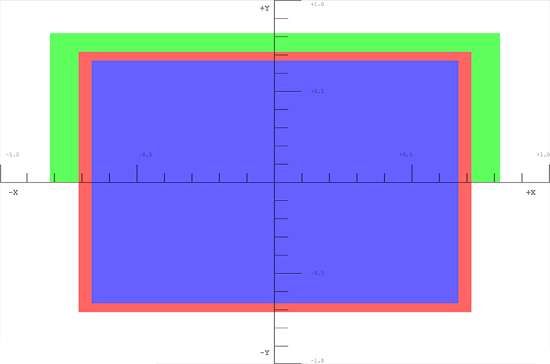

# WebGL model view projection

本文探讨如何在 WebGL 项目中获取数据，并将其投影到适当的空间以在屏幕上显示。它假定了你具备用于平移，缩放和旋转的基本矩阵数学知识。它解释了组成 3D 场景时通常使用的三个核心矩阵：模型，视图和投影矩阵。

**备注：** 本文还可作为 [MDN 内容套件](https://github.com/TatumCreative/mdn-model-view-projection) 提供。它还使用 `MDN`全局对象下可用的 [实用函数](https://github.com/TatumCreative/mdn-webgl) 集合。

## [模型、视图、投影矩阵](https://developer.mozilla.org/zh-CN/docs/Web/API/WebGL_API/WebGL_model_view_projection#%E6%A8%A1%E5%9E%8B%E3%80%81%E8%A7%86%E5%9B%BE%E3%80%81%E6%8A%95%E5%BD%B1%E7%9F%A9%E9%98%B5)

WebGL 空间中的点和多边形的个体转化由基本的转换矩阵（例如平移，缩放和旋转）处理。可以将这些矩阵组合在一起并以特殊方式分组，以使其用于渲染复杂的 3D 场景。这些组合成的矩阵最终将原始数据类型移动到一个称为裁剪空间的特殊坐标空间中。这是一个中心点位于 (0, 0, 0)，角落范围在 (-1, -1, -1) 到 (1, 1, 1) 之间，2 个单位宽的立方体。该剪裁空间被压缩到一个二维空间并栅格化为图像。

下面讨论的第一个矩阵是 **模型矩阵** ，它定义了如何获取原始模型数据并将其在 3D 世界空间中移动。**投影矩阵**用于将世界空间坐标转换为剪裁空间坐标。常用的投影矩阵（ **透视矩阵** ）用于模拟充当 3D 虚拟世界中观看者的替身的典型相机的效果。**视图矩阵**负责移动场景中的对象以模拟相机位置的变化，改变观察者当前能够看到的内容。

以下的几个部分提供了对模型，视图和投影矩阵背后的思想及实现的深入理解。这些矩阵是在屏幕上移动数据的核心，是胜过各个框架和引擎的概念。

## [裁剪空间](https://developer.mozilla.org/zh-CN/docs/Web/API/WebGL_API/WebGL_model_view_projection#%E8%A3%81%E5%89%AA%E7%A9%BA%E9%97%B4)

在 WebGL 程序中，数据通常上传到具有自己的坐标系统的 GPU 上，然后顶点着色器将这些点转换到一个称为**裁剪空间**的特殊坐标系上。延展到裁剪空间之外的任何数据都会被剪裁并且不会被渲染。如果一个三角形超出了该空间的边界，则将其裁切成新的三角形，并且仅保留新三角形在裁剪空间中的部分。


上面的图像裁剪空间的可视化，所有点都必须被包含在其中。它是一个角在 (-1, -1, -1)，对角在 (1, 1, 1)，中心点在 (0, 0, 0) 的每边 2 个单位的立方体。裁剪空间使用的这个两个立方米坐标系称为归一化设备坐标（NDC）。在研究和使用 WebGL 代码时，你可能时不时的会使用这个术语。

在本节中，我们将直接将数据放入裁剪空间坐标系中。通常使用位于任意坐标系中的模型数据，然后使用矩阵进行转换，将模型坐标转换为裁剪空间系下的坐标。这个例子，通过简单地使用从 (-1，-1，-1) 到 (1,1,1) 的模型坐标值来说明剪辑空间的工作方式是最简单的。下面的代码将创建 2 个三角形，这些三角形将在屏幕上绘制一个正方形。正方形中的 Z 深度确定当前正方形共享同一个空间时在顶部绘制的内容，较小的 Z 值将呈现在较大的 Z 值之上。

### [WebGLBox 例子](https://developer.mozilla.org/zh-CN/docs/Web/API/WebGL_API/WebGL_model_view_projection#webglbox_%E4%BE%8B%E5%AD%90)

本示例将创建一个自定义 WebGL 对象，该对象将在屏幕上绘制一个 2D 框。

**备注：** 每一个 WebGL 示例代码在此 [github repo](https://github.com/TatumCreative/mdn-model-view-projection/tree/master/lessons) 中可找到，并按章节组织。此外，每个章节底部都有一个 JSFiddle 链接。

#### WebGLBox Constructor

构造函数看起来像这样：

**JS**Copy to Clipboard

```
function WebGLBox() {
  // 设置 canvas 和 WebGL 上下文
  this.canvas = document.getElementById("canvas");
  this.canvas.width = window.innerWidth;
  this.canvas.height = window.innerHeight;
  this.gl = MDN.createContext(canvas);

  var gl = this.gl;

  // 设置一个 WebGL 程序，任何 MDN 对象相关的部分在本文之外定义
  this.webglProgram = MDN.createWebGLProgramFromIds(
    gl,
    "vertex-shader",
    "fragment-shader",
  );
  gl.useProgram(this.webglProgram);

  // 保存 attribute 和 uniform 位置
  this.positionLocation = gl.getAttribLocation(this.webglProgram, "position");
  this.colorLocation = gl.getUniformLocation(this.webglProgram, "color");

  // 告诉 WebGL 在绘制时测试深度，所以如果一个正方形后面有另一个正方形
  // 另一个正方形不会被绘制
  gl.enable(gl.DEPTH_TEST);
}
```

#### WebGLBox 绘制

现在，我们将创建一个在屏幕上绘制框的方法。

**JS**Copy to Clipboard

```
WebGLBox.prototype.draw = function (settings) {
  // 创建一下 attribute 数据; 这些是最终绘制到屏幕上的三角形
  // 有两个形成一个正方形

  var data = new Float32Array([
    //Triangle 1
    settings.left,
    settings.bottom,
    settings.depth,
    settings.right,
    settings.bottom,
    settings.depth,
    settings.left,
    settings.top,
    settings.depth,

    //Triangle 2
    settings.left,
    settings.top,
    settings.depth,
    settings.right,
    settings.bottom,
    settings.depth,
    settings.right,
    settings.top,
    settings.depth,
  ]);

  // 使用 WebGL 将其绘制到屏幕上

  // 性能要点：为每个绘制创建新的缓冲器很慢
  // 这个方法仅用于说明

  var gl = this.gl;

  // 创建一个缓冲区并绑定数据
  var buffer = gl.createBuffer();
  gl.bindBuffer(gl.ARRAY_BUFFER, buffer);
  gl.bufferData(gl.ARRAY_BUFFER, data, gl.STATIC_DRAW);

  // 设置指向 attribute 数据的指针（三角形）
  gl.enableVertexAttribArray(this.positionLocation);
  gl.vertexAttribPointer(this.positionLocation, 3, gl.FLOAT, false, 0, 0);

  // 设置将在所有三角形之间共享的 color uniform
  gl.uniform4fv(this.colorLocation, settings.color);

  // 在屏幕上绘制该三角形
  gl.drawArrays(gl.TRIANGLES, 0, 6);
};
```

着色器是用 GLSL 编写的代码片段，它接收我们的点数据并最终将它们渲染到屏幕上。为了方便起见，这些着色器存储在 [`<script>`](https://developer.mozilla.org/zh-CN/docs/Web/HTML/Element/script) 元素之中，该元素通过自定义函数 `MDN.createWebGLProgramFromIds()` 引入程序中。这个方法是为这些教程编写的 [实用函数](https://github.com/TatumCreative/mdn-webgl) 集合的一部分，此处不再赘述。此函数用于处理获取一些 GLSL 源代码并将其编译为 WebGL 程序的基础操作。该函数具有三个参数 - 用于渲染程序的上下文，包含顶点着色器的 [`<script>`](https://developer.mozilla.org/zh-CN/docs/Web/HTML/Element/script) 元素的 ID 和包含片段着色器的 [`<script>`](https://developer.mozilla.org/zh-CN/docs/Web/HTML/Element/script) 元素的 ID。顶点着色器放置顶点，片段着色器为每个像素着色。

首先看一下将在屏幕上移动顶点的顶点着色器：

**GLSL**Copy to Clipboard

```
// 一个顶点位置
attribute vec3 position;

void main() {

  // gl_Position 是顶点着色器对其修改后在裁剪空间的最终位置
  gl_Position = vec4(position, 1.0);
}
```

接下来，要实际将数据栅格化为像素，片段着色器将在每个像素的基础上计算评估一切，设置一个单一颜色。GPU 为需要渲染的每个像素调用着色器方法。着色器的工作是返回要用于该像素的颜色。

**GLSL**Copy to Clipboard

```
precision mediump float;
uniform vec4 color;

void main() {
  gl_FragColor = color;
}
```

有了这些设置，是时候使用裁剪空间坐标直接绘制到屏幕了。

**JS**Copy to Clipboard

```
var box = new WebGLBox();
```

首先在中间画一个红色框。

**JS**Copy to Clipboard

```
box.draw({
  top: 0.5, // x
  bottom: -0.5, // x
  left: -0.5, // y
  right: 0.5, // y

  depth: 0, // z
  color: [1, 0.4, 0.4, 1], // red
});
```

接下来，在上面的红色框的后面绘制一个绿色框。

**JS**Copy to Clipboard

```
box.draw({
  top: 0.9, // x
  bottom: 0, // x
  left: -0.9, // y
  right: 0.9, // y

  depth: 0.5, // z
  color: [0.4, 1, 0.4, 1], // green
});
```

最后，为了演示裁剪实际上发生了，这个框没有被绘制，因为它完全在裁剪空间之外，深度超出 -1.0 到 1.0 的范围。

**JS**Copy to Clipboard

```
box.draw({
  top: 1, // x
  bottom: -1, // x
  left: -1, // y
  right: 1, // y

  depth: -1.5, // z
  color: [0.4, 0.4, 1, 1], // blue
});
```

#### 结果

[在 JSFiddle 中查看](https://jsfiddle.net/2x03hdc8)



### [练习](https://developer.mozilla.org/zh-CN/docs/Web/API/WebGL_API/WebGL_model_view_projection#%E7%BB%83%E4%B9%A0_2)

* 尝试使用这些值，看看它们如何影响屏幕上渲染的内容。请注意如何通过设置其 w 分量将先前裁剪的蓝色框带回带范围内。
* 尝试创建一个在裁剪空间之外的新框，然后将其除以 w，将其返回裁剪空间。

## [模型转换](https://developer.mozilla.org/zh-CN/docs/Web/API/WebGL_API/WebGL_model_view_projection#%E6%A8%A1%E5%9E%8B%E8%BD%AC%E6%8D%A2)

将点直接放入裁剪空间的用途有限。在现实世界的应用程序中，你拥有的源坐标不全部在裁剪空间中。因此大多数时候，你需要将模型数据和其他坐标转换到裁剪空间中。简单的立方体就是一个如何执行此操作的简单示例。立方体数据由顶点位置，立方体表面颜色和构成单个多边形的顶点位置的顺序组成（以 3 个顶点为一组，以构成立方体表面的三角形）。这些位置和颜色存储在 GL 缓冲区中，作为属性发到着色器，然后分别进行操作。

最后，计算并设置单个模型矩阵。该矩阵表示要在组成模型的每个点上执行的转换，以将其移到正确的空间，并在模型中的每个点上执行任何其他所需的转换。这不仅适用于每一个顶点，而且还适用于模型每个表面的每个点。

在这种情况下，对于动画的每一帧，一系列缩放，旋转和平移矩阵会将数据移动到裁剪空间中所需的位置。这个立方体是裁剪空间 (-1, -1, -1) 到 (1, 1, 1) 的大小，因此需要缩小以不填满整个裁剪空间。该矩阵事先已经在 JavaScript 中进行了乘法运算，直接发到着色器。

以下代码示例在 `CubeDemo` 对象上定义了一个创建模型矩阵的方法。它使用了自定义函数来创建和乘以 [MDN WebGL](https://github.com/TatumCreative/mdn-webgl) 共享代码中定义的矩阵。新的函数如下：

**JS**Copy to Clipboard

```
CubeDemo.prototype.computeModelMatrix = function (now) {
  // 缩小 50%
  var scale = MDN.scaleMatrix(0.5, 0.5, 0.5);

  // 轻微旋转
  var rotateX = MDN.rotateXMatrix(now * 0.0003);

  // 根据时间旋转
  var rotateY = MDN.rotateYMatrix(now * 0.0005);

  // 稍微向下移动
  var position = MDN.translateMatrix(0, -0.1, 0);

  // 相乘，确定以相反的顺序读取它们
  this.transforms.model = MDN.multiplyArrayOfMatrices([
    position, // step 4
    rotateY, // step 3
    rotateX, // step 2
    scale, // step 1
  ]);
};
```

为了在着色器中使用它，必须将其设置在 uniforms 的位置。uniforms 的位置保存在 `locations` 对象中，如下所示：

**JS**Copy to Clipboard

```
this.locations.model = gl.getUniformLocation(webglProgram, "model");
```

最后，将 uniforms 设置在那个位置，这就把矩阵交给了 GPU。

**JS**Copy to Clipboard

```
gl.uniformMatrix4fv(
  this.locations.model,
  false,
  new Float32Array(this.transforms.model),
);
```

在着色器中，每个位置顶点首先被转换为齐次坐标（vec4 对象），然后与模型矩阵相乘。

**GLSL**Copy to Clipboard

```
gl_Position = model * vec4(position, 1.0);
```

**备注：** 在 JavaScript 中，矩阵乘法需要自定义函数，而在着色器中，它使用了内置在语言中的简单的 * 运算。

### [结果](https://developer.mozilla.org/zh-CN/docs/Web/API/WebGL_API/WebGL_model_view_projection#%E7%BB%93%E6%9E%9C_3)

[在 JSFiddle 中查看](https://jsfiddle.net/5jofzgsh)


此时，变换点的 w 值仍为 1.0。立方体仍然没有什么角度。下一节将进行此设置并修改 w 值以提供一些透视效果。

### [练习](https://developer.mozilla.org/zh-CN/docs/Web/API/WebGL_API/WebGL_model_view_projection#%E7%BB%83%E4%B9%A0_3)

* 使用缩放矩阵缩小立方体，并将其放置在裁剪空间中不同位置。
* 尝试将其移到裁剪空间之外。
* 调整窗口大小，然后观察盒子的变形情况。
* 添加一个 `rotateZ` 。
