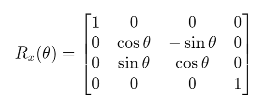

# 左手坐标系和右手坐标系

今天记录一下一些基本的数学知识，左手坐标系和右手坐标系。这些对于搞图像开发或者游戏开发的朋友来说，应该是很基础的东西，不过对于大部分人来说还是比较陌生的知识。之所以看这方面资料主要是因为在使用Android Camera使用[Matrix](https://so.csdn.net/so/search?q=Matrix&spm=1001.2101.3001.7020)的过程中，发现需要一些数学理论支持才能理解。这是为了后面使用Android Camera和Matrix的基础。

 

**1、空间直角坐标系**

　　下面摘录一段百科的解析，这些都是数学基础。过空间定点O作三条互相垂直的数轴,它们都以O为原点,具有相同的单位长度.这三条数轴分别称为X轴(横轴).Y轴(纵轴).Z轴(竖轴),统称为坐标轴。

　　各轴之间的顺序要求符合[右手法则](http://baike.baidu.com/view/343911.htm),即以右手握住Z轴,让右手的四指从X轴的正向以90度的直角转向Y轴的正向,这时大拇指所指的方向就是Z轴的正向.这样的三个[坐标轴](http://baike.baidu.com/view/547315.htm)构成的坐标系称为右手空间直角坐标系.与之相对应的是左手空间直角坐标系.一般在[数学](http://baike.baidu.com/view/1284.htm)中更常用右手空间直角坐标系，在其他学科方面因应用方便而异。三条[坐标轴](http://baike.baidu.com/view/547315.htm)中的任意两条都可以确定一个平面,称为坐标面.它们是:由X轴及Y轴所确定的XOY平面;由Y轴及Z轴所确定的YOZ平面；由X轴及Z轴所确定的XOZ平面．这三个相互垂直的坐标面把空间分成八个部分，每一部分称为一个[卦限](http://baike.baidu.com/view/683705.htm)．位于X，Y，Z轴的[正半轴](http://baike.baidu.com/view/1102709.htm)的卦限称为第一卦限，从第一卦限开始，在XOY平面上方的卦限，按逆时针方向依次称为第二，三，四卦限；第一，二，三，四卦限　下方的卦限依次称为第五，六，七，八卦限。

2、右手坐标系

　　右手坐标系在我们以前初中高中学几何的时候也经常用到。在三维坐标系中，Z轴的正轴方向是根据右手定则确定的。右手定则也决定三维空间中任一坐标轴的正旋转方向。要标注X、Y和Z轴的正轴方向，就将右手背对着屏幕放置，拇指即指向X轴的正方向。伸出食指和中指，如右图所示，食指指向Y轴的正方向，中指所指示的方向即是Z轴的正方向。要确定轴的正旋转方向，如下图所示，用右手的大拇指指向轴的正方向，弯曲手指。那么手指所指示的方向即是轴的正旋转方向。

3、左手坐标系

　　伸出左手，让拇指和食指成“L”形，大拇指向右，食指向上。其余的手指指向前方。这样就建立了一个左手坐标系。拇指、食指和其余手指分别代表x，y，z轴的正方向。判断方法：在空间直角坐标系中，让左手拇指指向x轴的正方向，食指指向y轴的正方向，如果中指能指向z轴的正方向，则称这个坐标系为左手直角坐标系．反之则是右手直角坐标系。

4、左手坐标系和右手坐标系比较

　　手坐标系和右手坐标系，左手坐标系是X轴向右，Y轴向上，Z轴向前，右手坐标系的Z轴正好相反，是指向“自己”的，在计算机中通常使用的是左手坐标系，而数学中则通常使用右手坐标系。计算机里面其实很多也有用右手坐标系，这个只是根据实际应用不同，没有说哪个比较好。

5、结语

　　今天主要是讲讲这两个坐标系和区分，因为后面我会讲解有关Android Camera使用Matrix进行滑动特效变换。里面就好应用到很多坐标系的转换，所以脑袋里面要先有这方面的概念，否则有关Matrix的转换和图像操作就不好理解了。

左手系坐标和右手系坐标

关于右手坐标系与右手法则：
如果不明白这两个概念，可以参考右手坐标系与右手定则。

右手坐标系是用来指定X、Y、Z轴的正方向，并不能随意指定X、Y、Z轴的正方向；
右手定则是用来规定绕某轴旋转的正方向。
右手法则的四指旋转方向为正。
三维空间下，逆时针旋转不一定是正方向，它只是用来描述旋转方向：

比如你右手握成拳头，大拇指指向下，那么你四个手指的指向就是顺时针，即正方向，那么逆时针就不是正方向了，你就不能说逆时针是正方向。

所谓的逆时针方向为正，是由于人们平时的习惯，约定俗成的。如，打牌时是逆时针出牌、坐标系象限是逆时针命名一二三四象限，角度也是。

我们平时在三维空间的旋转，也习惯称呼顺时针旋转与逆时针旋转，是因为，右手定则的绕某轴旋转的旋转方向不好描述(例如，你说，“右手握住Z轴，大拇指指向Z轴正方向，绕着四指指向的方向旋转30度”，这样描述太麻烦，不如一句，“绕Z轴逆(或顺)时针旋转30度”，描述的简洁清晰)，所以使用顺时针逆时针旋转来描述更容易让人明白是怎样旋转的，和顺时针逆时针旋转的正反无关。

# 计算机图形学 – 三维空间中的左、右手坐标系旋转矩阵与旋转变换

## **二维空间** 

在二维空间中，旋转可以用一个单一的角 [θ](http://baike.so.com/doc/737267.html) 定义。作为约定，正角表示逆时针旋转。把笛卡尔坐标的列向量关于原点逆时针旋转θ 的矩阵是:

### X 轴逆时针旋转

逆时针旋转

在平面直角坐标系下的单位圆上的点的坐标为(cos⁡θ,sin⁡θ)，由于平面直角坐标系下的夹角θ为逆时针，则直接做向量使其作为新的基的"x 轴"，那么对应的"y轴"则为"x轴"逆时针旋转90∘。因此最终得到的旋转矩阵为

在线性变换中j冒比 i冒多90° 所以 可以推导出 

又因为两角差公式

sin（α＋β）＝sinα * cosβ＋cosα * sinβ

sin（α－β）＝sinα * cosβ－cosα * sinβ

cos（α＋β）＝cosα * cosβ－sinα * sinβ

cos（α－β）＝cosα * cosβ＋sinα * sinβ

tan（α＋β）＝（tanα+tanβ）／（1-tanαtanβ）

tan（α－β）＝（tanα－tanβ）／（1＋tanα·tanβ）

可推导出

顺时针旋转:

表示较原来反方向旋转θ ，也即逆时针旋转 -θ

类似地，认为θ是逆时针旋转，那么如果需要顺时针旋转，只需将夹角取相反数，即写为−θ。因此顺时针旋转矩阵为

- 特点

可以发现，顺时针旋转矩阵与逆时针旋转矩阵是反对称矩阵(skew-symmetric matrix)。即

在[三维](https://www.stubbornhuang.com/tag/%e4%b8%89%e7%bb%b4/ "浏览关于"三维"的文章")空间中，绕着X轴，Y轴，Z轴的旋转可以使用4*4的矩阵表示,而根据左右手坐标系的不同，又可分为左手坐标系下的三维[旋转矩阵](https://www.stubbornhuang.com/tag/%e6%97%8b%e8%bd%ac%e7%9f%a9%e9%98%b5/ "浏览关于"旋转矩阵"的文章")和右手坐标系下的三维旋转矩阵。矩阵采用列主序。

## 1 逆时针旋转矩阵

设旋转角为θ角，

### 1.1 绕X轴逆时针旋转θ角的旋转矩阵

 

### 1.2 绕Y轴逆时针旋转θ角的旋转矩阵

 

### 1.3 绕Z轴逆时针旋转θ角的旋转矩阵

### 1.4 旋转矩阵组合

我们可以以上述三个绕轴旋转矩阵为基础，使用矩阵乘法组成不同旋转顺序的旋转矩阵，比如：

其中**α**、**β**、**γ** 分辨代表yaw、pitch、roll欧拉角。

* pitch：抬头
* yaw：向右偏
* roll：向右翻滚

类似的，公式：

代表欧拉角为**α**、**β** 、**γ**，变换顺序为y-x-z的[旋转变换](https://www.stubbornhuang.com/tag/%e6%97%8b%e8%bd%ac%e5%8f%98%e6%8d%a2/ "浏览关于"旋转变换"的文章")。

另外，假设当前为顺时针的左手坐标系，绕x轴旋转**ϕ** 角，绕y轴旋转**θ** 角，绕z轴旋转**ψ** 角，且按x-y-z的顺序进行旋转，那么最后的旋转矩阵为：

 

## 2 顺时针旋转矩阵

那么将上述绕X,Y，Z轴的旋转中的θ角全部改为−θ角，则：

### 2.1 绕X轴顺时针旋转θ角的旋转矩阵

以第一节中绕x轴的旋转矩阵为基础，将θ修改为-θ，则：

则根据三角函数计算公式可推导出：

### 2.2 绕Y轴顺时针旋转θ角的旋转矩阵

以第一节中绕y轴的旋转矩阵为基础，将θ修改为-θ，则：

则根据三角函数计算公式可推导出：

### 2.3 绕Z轴顺时针旋转θ角的旋转矩阵

以第一节中绕z轴的旋转矩阵为基础，将θ修改为-θ，则：

则根据三角函数计算公式可推导出：

查看页面

http://www.360doc.com/content/14/0909/11/358381_408120608.shtml

https://mathworld.wolfram.com/RotationMatrix.html

https://www.baidu.com/s?wd=%E9%80%86%E6%97%B6%E9%92%88%E6%97%8B%E8%BD%AC%E7%9F%A9%E9%98%B5&pn=10&oq=%E9%80%86%E6%97%B6%E9%92%88%E6%97%8B%E8%BD%AC%E7%9F%A9%E9%98%B5&tn=baiduhome_pg&ie=utf-8&rsv_idx=2&rsv_pq=a529b6fe000e84e4&rsv_t=4a56dPvKuZRA8SgGLIjazcfYXEPaXSKF1MsdV8ezXIYj4orpm2oUQDb0yRk4wt%2BFDBLp&rsv_page=1

https://www.guyuehome.com/33196

https://zhuanlan.zhihu.com/p/144323332

https://zhuanlan.zhihu.com/p/369402524

https://www.jianshu.com/p/69e855c0aa6b

https://www.stubbornhuang.com/714/

https://www.baidu.com/s?wd=%E6%97%8B%E8%BD%AC%E7%9F%A9%E9%98%B5%20%E5%B7%A6%E5%9D%90%E6%A0%87%20%E5%8F%B3%E6%89%8B%E5%9D%90%E6%A0%87&rsv_spt=1&rsv_iqid=0x957a5da90015dd0e&issp=1&f=8&rsv_bp=1&rsv_idx=2&ie=utf-8&rqlang=cn&tn=baiduhome_pg&rsv_enter=1&rsv_dl=tb&oq=webgl%25E6%2597%258B%25E8%25BD%25AC%2520%25E5%25B7%25A6%25E5%259D%2590%25E6%25A0%2587%2520%25E5%258F%25B3%25E6%2589%258B%25E5%259D%2590%25E6%25A0%2587&sug=%25E6%2597%258B%25E8%25BD%25AC%25E5%258F%25B3%25E6%2589%258B%25E5%25AE%259A%25E5%2588%2599&rsv_t=f3e3j2ansyrh1u%2FKBrV6U%2B5EpdxfKVyo3U3Fa6a8%2FYYl708gdcng9kvxk1qPsGCLcBTI&rsv_btype=t&inputT=3243&rsv_pq=b537cd270014a9f1&rsv_sug3=126&rsv_sug1=110&rsv_sug7=100&bs=webgl%E6%97%8B%E8%BD%AC%20%E5%B7%A6%E5%9D%90%E6%A0%87%20%E5%8F%B3%E6%89%8B%E5%9D%90%E6%A0%87

https://zhuanlan.zhihu.com/p/413224014

https://blog.csdn.net/weixin_43646128/article/details/124884609

https://zhuanlan.zhihu.com/p/413224014?utm_id=0

https://zhuanlan.zhihu.com/p/555283623

https://webglfundamentals.org/webgl/lessons/zh_cn/webgl-3d-orthographic.html

https://zhuanlan.zhihu.com/p/570452494

https://zhuanlan.zhihu.com/p/555283623

https://blog.csdn.net/u011754972/article/details/117129212

https://www.027art.com/gaokao/HTML/12786826.html

https://blog.csdn.net/u011754972/article/details/120329874

https://zhuanlan.zhihu.com/p/555283623