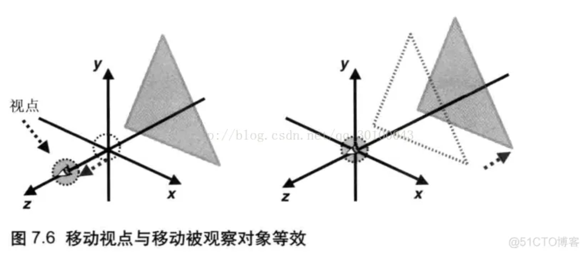
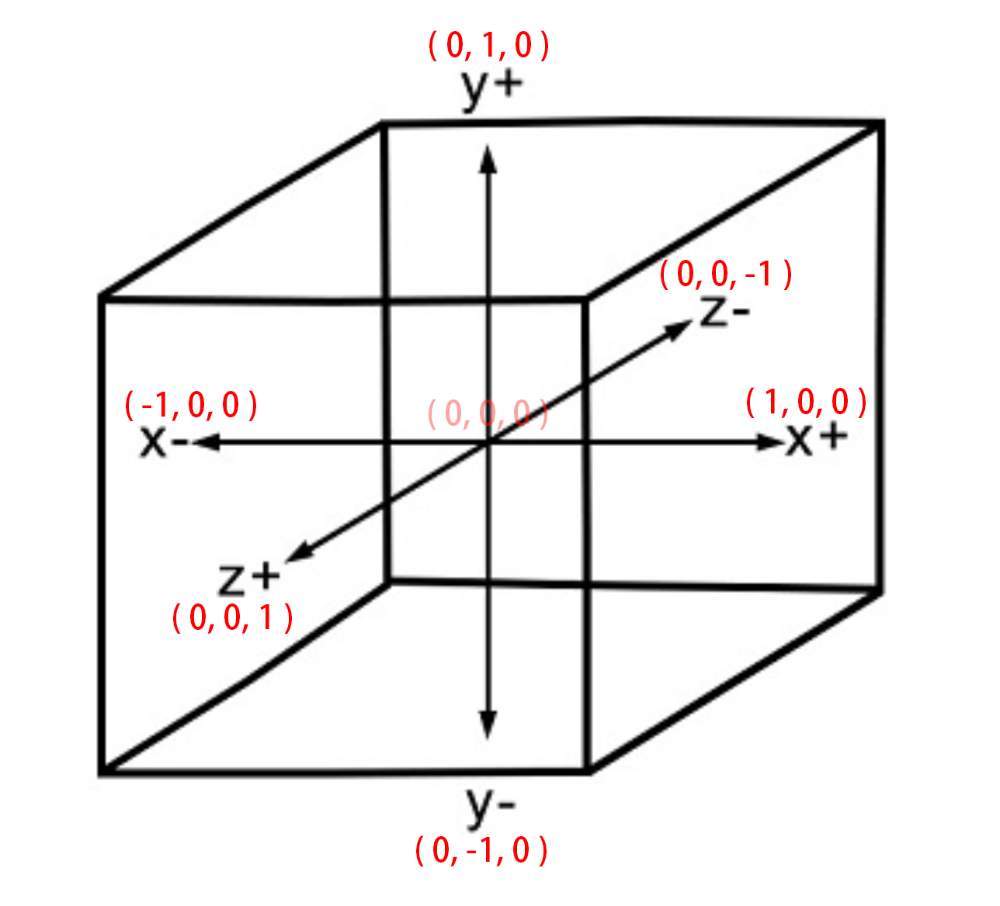

## WebGL - 坐标系

就像任何其他3D系统一样，您将在WebGL中具有x，y和z轴，其中**z**轴表示**深度**。WebGL中的坐标限于（1,1,1）和（-1，-1，-1）。这意味着 - 如果您将屏幕将WebGL图形投影为立方体，则立方体的一个角将为（1,1,1），相对的角将为（-1，-1，-1）。WebGL不会显示超出这些边界的任何东西。

下图描绘了WebGL坐标系。z轴表示深度。z的正值表示对象靠近屏幕/查看器，而z的负值表示对象远离屏幕。同样，x的正值表示物体在屏幕的右侧，负值表示物体在左侧。类似地，y的正值和负值表示物体是在屏幕的顶部还是在底部。

比如我们眼睛看屏的视角

WEBGL 在屏幕的可视空间

# 视点与视线 

#  摄像机视角、视线、上方向概念

2.视点，视线，观察点，上方向
视点 指的是摄像机所处位置
视线 指的是摄像机观察的方向
观察点 指的是被观察目标所在的点
上方向 由于在视点与视线确定的情况下，摄像机还是可以沿着视线旋转的，所以还缺少一种信息描述摄像机的状态，那就是像上的方向(上方向)

3.视图矩阵
我们可以用视点、观察点、上方向者三个矢量创建一个 视图矩阵 ，这个视图矩阵会影响显示在屏幕上的视图，也就是会影响观察者观察到的场景，接下来我们看一下cuon-matrix.js 提供的 Matrix4.setLookAt() 函数
 视点：观察者所处的位置称为视点。从视点出发沿着观察方向的射线称作视线。坐标用(eyeX,eyeY,eyeZ)表示。

观察目标点：被观察目标所在的点，它可以用来确定视线。坐标用(atX,atY,atZ)表示。

上方向：最终绘制在屏幕上的影像中的向上的方向。坐标用(upX,upY,upZ)表示。

眼睛看到距离是1 而画布中的坐标是从-1到1

### 在WebGL中，观察者的默认状态应该是这样的：

webGL中，观察者默认状态为：
* 视点（0，0，0）
* 视线为Z轴负方向，观察点为(0,0,-1)
* 上方向为Y轴负方向，(0,1,0)

如果将上方向改为X轴正半轴方向（1，0，0），你将看到场景旋转了90度。《WebGL编程指南》学习-第7章进入三维世界（1-视点和视线）

https://blog.csdn.net/weixin_40282619/article/details/78224931

推导

https://www.freesion.com/article/5321337849/
https://www.cnblogs.com/yiyezhai/archive/2012/09/12/2677902.html
https://blog.csdn.net/xufeng0991/article/details/75949931