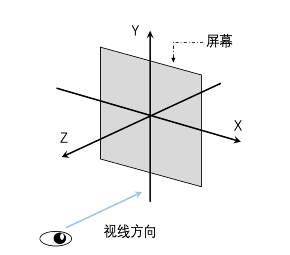
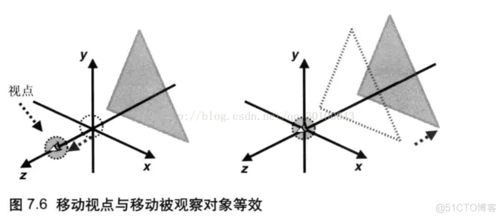
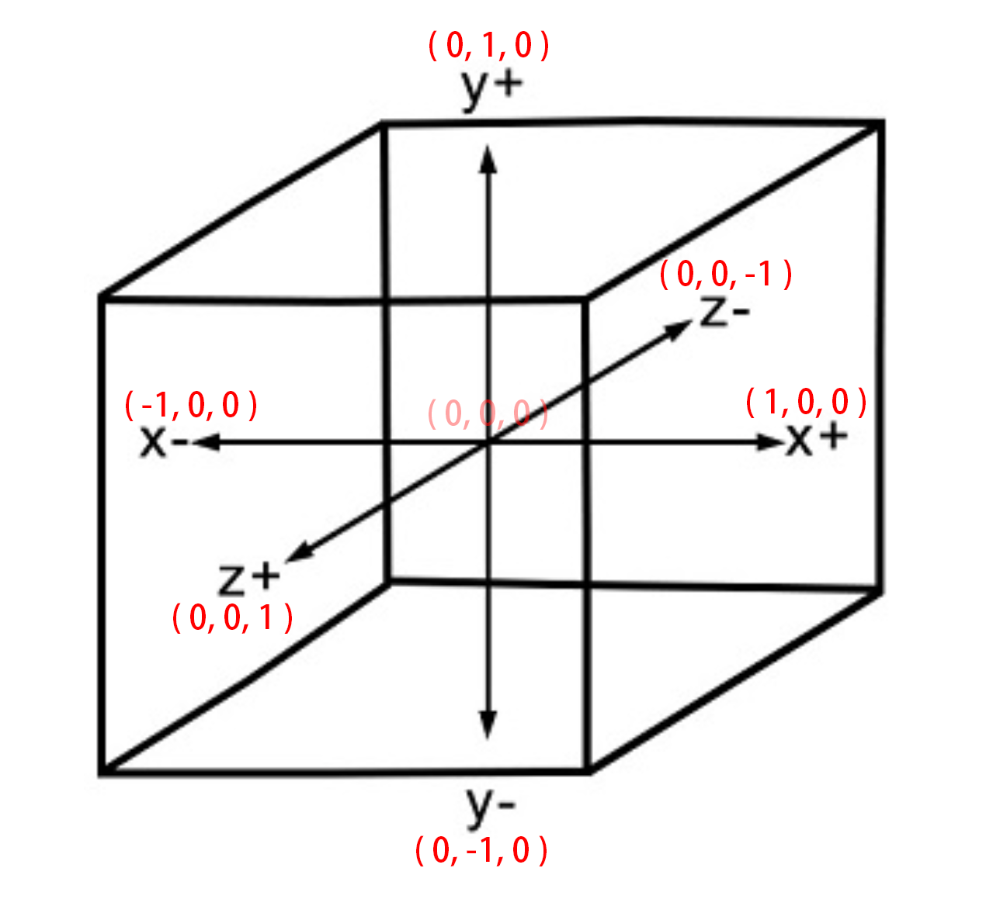
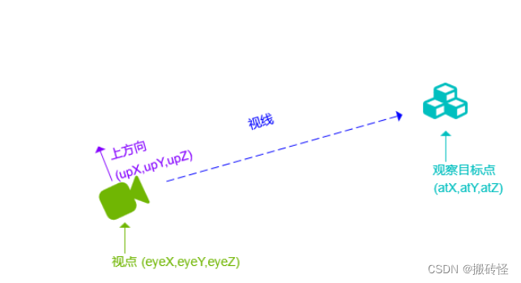
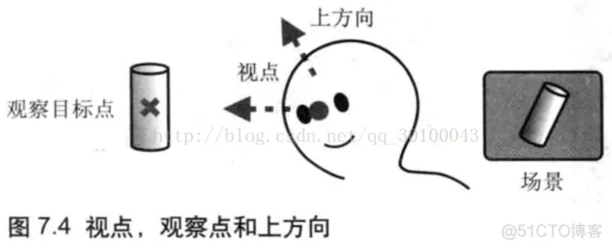
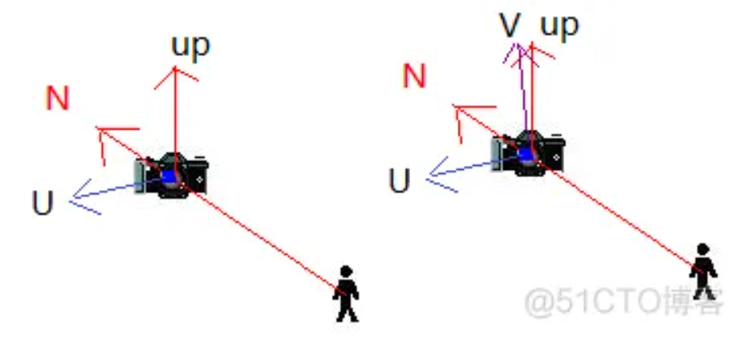
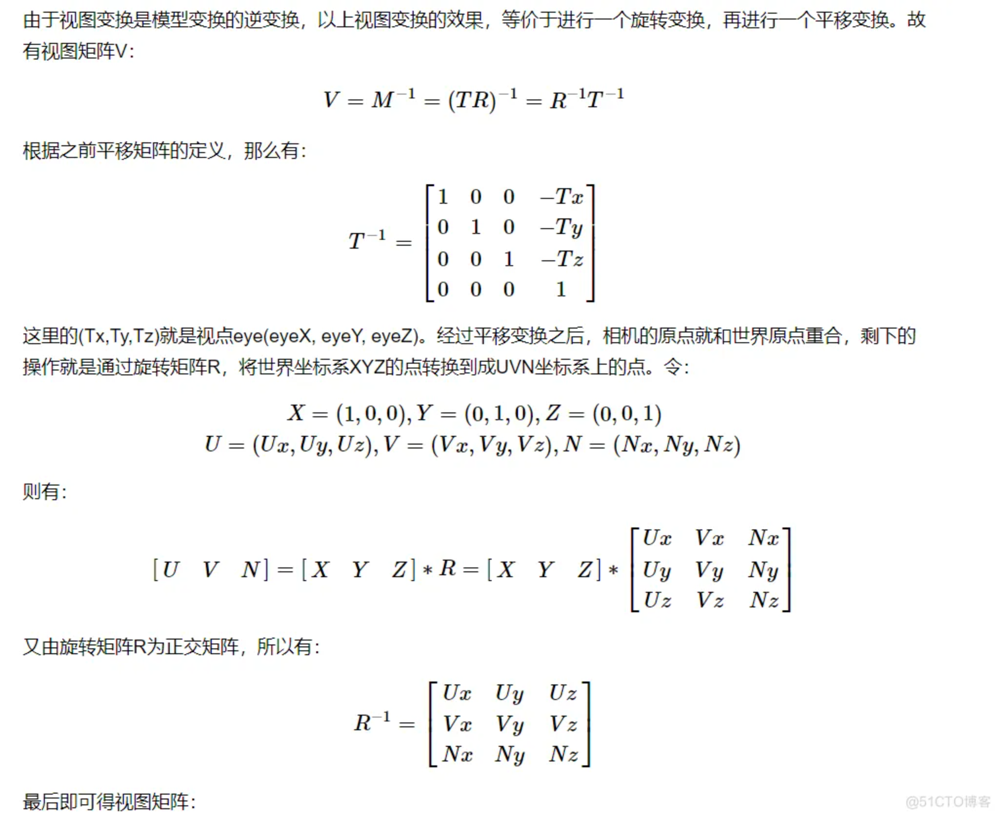
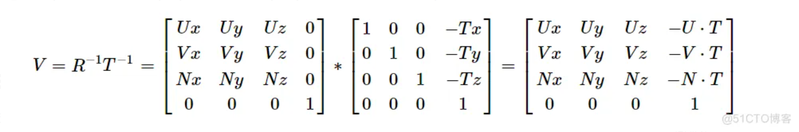

## WebGL - 坐标系

就像任何其他3D系统一样，您将在WebGL中具有x，y和z轴，其中**z**轴表示**深度**。WebGL中的坐标限于（1,1,1）和（-1，-1，-1）。这意味着 - 如果您将屏幕将WebGL图形投影为立方体，则立方体的一个角将为（1,1,1），相对的角将为（-1，-1，-1）。WebGL不会显示超出这些边界的任何东西。

下图描绘了WebGL坐标系。z轴表示深度。z的正值表示对象靠近屏幕/查看器，而z的负值表示对象远离屏幕。同样，x的正值表示物体在屏幕的右侧，负值表示物体在左侧。类似地，y的正值和负值表示物体是在屏幕的顶部还是在底部。

比如我们眼睛看屏的视角


## 一、认识坐标系

#### 1.面对屏幕向上为y轴的正方向，向左为正x轴的正方向，垂直于屏幕向外的为z轴的正方向。如下图所示：


#### 2.在[webgl](https://so.csdn.net/so/search?q=webgl&spm=1001.2101.3001.7020)和threejs中使用的是右手坐标系，入下图所示：


## 二、围绕某个轴旋转

左手大拇指，指向该轴的正方向，四指弯曲指向的方向，为该旋转方向的正方向。


## 三、世界坐标系与本地坐标系

#### 1.世界坐标系：是指在这个3D场景内,所有对象使用的是一个坐标系。

1.在这个场景内，该正方体的世界坐标为（0,0 ,0）;


2.在这个场景内，该球体的世界坐标为( -5,3,0 );


#### 2.本地坐标系：是指在这个物体内有自己的一个坐标系，这个坐标系在世界坐标系内是可以改变的，但是始终在物体内部。

例：物体坐标（0,0,0）转到（3,3,3），只是物体的世界坐标位置改变，本地坐标未改变。


#### 3.世界坐标系的旋转与本地坐标系的旋转

1. 世界坐标系的旋转，是围绕某一个轴，以一个向量长度为半径旋转。
2. 本地坐标系的旋转(rotations属性)，是围绕该物体的本地坐标轴旋转。
3. 围绕任意轴旋转







WEBGL 在屏幕的可视空间





# 视点与视线 

#  摄像机视角、视线、上方向概念

1.视点，视线，观察点，上方向
视点 指的是摄像机所处位置
视线 指的是摄像机观察的方向
观察点 指的是被观察目标所在的点
上方向 由于在视点与视线确定的情况下，摄像机还是可以沿着视线旋转的，所以还缺少一种信息描述摄像机的状态，那就是像上的方向(上方向)

2.视图矩阵
我们可以用视点、观察点、上方向者三个矢量创建一个 视图矩阵 ，这个视图矩阵会影响显示在屏幕上的视图，也就是会影响观察者观察到的场景，接下来我们看一下gl-matrix.js 库源码分析提供的 lookAt(out, eye, center, up)函数

out 是一个4*x4单位矩阵

 视点：观察者所处的位置称为视点。从视点出发沿着观察方向的射线称作视线。坐标用(eyee=[yeX,eyeY,eyeZ])表示。

观察目标点：被观察目标所在的点，它可以用来确定视线。坐标用center=[atX,atY,atZ]表示。

上方向：最终绘制在屏幕上的影像中的向上的方向。坐标用up=[upX,upY,upZ]表示。







推导：

opengl 本身是没有相机的，但是我们可以通过把场景中的所有物体往相反方向移动的方式来模拟相机。产生一种移动的感觉。这个感觉其实是一种错觉。

以相机位置为原点的，创建一个3个垂直单位轴的坐标系


二 相机坐标系
定义： 以视点为原点，以视线为z轴负方向，x轴与y轴与图像的x,y轴平行。


##  推导

由前文得知，视图变换构建了一个视空间/摄像机空间坐标系，为了对应于世界坐标系的XYZ，可以将其命名为UVN坐标系，它由之前提到的三个条件量构建而成：

选取视线的方向为N轴：N = eye–at；并归一化N。
选取up和N的叉积为U轴： U= up×N，并归一化U。
选取N和U叉积得到V轴：V = N×U，并归一化V。

如图所示[7]:









gl-matrix.js 库源码分析

```
  /**
   * Generates a look-at matrix with the given eye position, focal point, and up axis.
   * If you want a matrix that actually makes an object look at another object, you should use targetTo instead.
   *
   * @param {mat4} out mat4 frustum matrix will be written into
   * @param {ReadonlyVec3} eye Position of the viewer
   * @param {ReadonlyVec3} center Point the viewer is looking at
   * @param {ReadonlyVec3} up vec3 pointing up
   * @returns {mat4} out
   */

  function lookAt(out, eye, center, up) {
    var x0, x1, x2, y0, y1, y2, z0, z1, z2, len;

    /*

    eye=[xx,xx,xx]
    up=[xx,xx,xx]
    center=[xx,xx,xx]
    
    
    */

    var eyex = eye[0];
    var eyey = eye[1];
    var eyez = eye[2];

    var upx = up[0];
    var upy = up[1];
    var upz = up[2];

    // AT
    var centerx = center[0];
    var centery = center[1];
    var centerz = center[2];


    if (Math.abs(eyex - centerx) < EPSILON && Math.abs(eyey - centery) < EPSILON && Math.abs(eyez - centerz) < EPSILON) {
      return identity$3(out);
    }

    // N = eye–at  并归一化N。
    z0 = eyex - centerx;
    z1 = eyey - centery;
    z2 = eyez - centerz;

    len = 1 / Math.hypot(z0, z1, z2);
    z0 *= len;
    z1 *= len;
    z2 *= len;

    
    /*
      u = up x n    up 叉乘 n  并归一化U。
    


    eye=[xx,xx,xx]
    up=[xx,xx,xx]
    center=[xx,xx,xx]
    // 向量现相减
    n=[
      eyex - centerx,
      eyey - centery,
      eyez - centerz
     ]=Z(x,y,z)

    up=[xx,xx,xx]
    Z=[xx,xx,xx]
    
 
    
    */


    /*
     up(y,z) 与 Z(y,z) 叉乘 
     x0 = |upy , upz|
          |z1  , z2 | 
    */
    x0 = upy * z2 - upz * z1;

    /*
    up(z,x) 与 Z(z,x) 叉乘 
    x1 = |upz, upx|
         |z2 ,  z0| 
    
    */
    x1 = upz * z0 - upx * z2;

   /*
    up(x,y) 与 Z(x,y) 叉乘 
    x2 = |upx, upy|
         |z0 ,  z1| 
    
    */
    x2 = upx * z1 - upy * z0;

    len = Math.hypot(x0, x1, x2);

    if (!len) {
      x0 = 0;
      x1 = 0;
      x2 = 0;
    } else {
      len = 1 / len;
      x0 *= len;
      x1 *= len;
      x2 *= len;
    }

    // V = N×U，并归一化V
    /*
      y0 = |z1 , z2| 
           |x1 , x2|
    */
    y0 = z1 * x2 - z2 * x1;
    /*
      y1 = |z2 , z0| 
           |x2 , x0|
    */
    y1 = z2 * x0 - z0 * x2;
   /*
      y1 = |z0 , z1| 
           |x0 , x1|
    */
    y2 = z0 * x1 - z1 * x0;

    len = Math.hypot(y0, y1, y2);

    if (!len) {
      y0 = 0;
      y1 = 0;
      y2 = 0;
    } else {
      len = 1 / len;
      y0 *= len;
      y1 *= len;
      y2 *= len;
    }


  /*
   eye 就是等于移动矩阵
   -eyey = [xx,xx,xx]
   
  */

   let mat4_UVN = [
  // u  v   n
    x0, y0, z0, 0,
    x1, y1, z1, 0,
    x2, y2, z2, 0,
    -(x0 * eyex + x1 * eyey + x2 * eyez),-(y0 * eyex + y1 * eyey + y2 * eyez),-(z0 * eyex + z1 * eyey + z2 * eyez),1
    ];


    out[0] = x0;
    out[1] = y0;
    out[2] = z0;
    out[3] = 0;

    out[4] = x1;
    out[5] = y1;
    out[6] = z1;
    out[7] = 0;

    out[8] = x2;
    out[9] = y2;
    out[10] = z2;
    out[11] = 0;

    out[12] = -(x0 * eyex + x1 * eyey + x2 * eyez);
    out[13] = -(y0 * eyex + y1 * eyey + y2 * eyez);
    out[14] = -(z0 * eyex + z1 * eyey + z2 * eyez);
    out[15] = 1;

    return out;
  }
```

1 首先我们要求出 向量  N，

```
    // N = eye–at  并归一化N。
    z0 = eyex - centerx;
    z1 = eyey - centery;
    z2 = eyez - centerz;

```

​      U = up x n    up 叉乘 n  并归一化U。

```
 /*
      u = up x n    up 叉乘 n  并归一化U。
    


    eye=[xx,xx,xx]
    up=[xx,xx,xx]
    center=[xx,xx,xx]
    // 向量现相减
    n=[
      eyex - centerx,
      eyey - centery,
      eyez - centerz
     ]=Z(x,y,z)

    up=[xx,xx,xx]
    Z=[xx,xx,xx]
    
 
    
    */


    /*
     up(y,z) 与 Z(y,z) 叉乘 
     x0 = |upy , upz|
          |z1  , z2 | 
    */
    x0 = upy * z2 - upz * z1;

    /*
    up(z,x) 与 Z(z,x) 叉乘 
    x1 = |upz, upx|
         |z2 ,  z0| 
    
    */
    x1 = upz * z0 - upx * z2;

   /*
    up(x,y) 与 Z(x,y) 叉乘 
    x2 = |upx, upy|
         |z0 ,  z1| 
    
    */
    x2 = upx * z1 - upy * z0;
```

​    V = N×U，并归一化V

```
    // V = N×U，并归一化V
    /*
      y0 = |z1 , z2| 
           |x1 , x2|
    */
    y0 = z1 * x2 - z2 * x1;
    /*
      y1 = |z2 , z0| 
           |x2 , x0|
    */
    y1 = z2 * x0 - z0 * x2;
   /*
      y1 = |z0 , z1| 
           |x0 , x1|
    */
    y2 = z0 * x1 - z1 * x0;

```

得到UVN矩阵

```
   let mat4_UVN = [
    // u  v   n
    x0, y0, z0, 0,
    x1, y1, z1, 0,
    x2, y2, z2, 0,
    0,  0 , 0,  1  
    ];

```

然后再让平移矩阵T-1乘以UVN矩阵

eye 就是等于移动矩阵

因为我们眼睛和物体方向是刚好相反的所以得到一个逆矩阵 

```
 eyey(-1) = [
     1,    0,   0,  0,
     0,    1,   0,  0,
     0,    0,   1,  0,
     -eyex, -eyey, -eyez, 1,
   ]

```


然后让移动矩阵乘以u  v   n矩阵，所以最终的得到一个相机的矩阵

```
    [
     1,    0,   0,  0,
     0,    1,   0,  0,
     0,    0,   1,  0,
     -tx, -ty, -tz, 1,
    ]*[
   //u  v   n
    x0, y0, z0, 0,
    x1, y1, z1, 0,
    x2, y2, z2, 0,
    0,  0 , 0,  1  
    ] 

```


# 《WebGL编程指南》学习-第7章进入三维世界（1-视点和视线）

https://blog.csdn.net/weixin_40282619/article/details/78224931


推导

https://www.freesion.com/article/5321337849/
https://www.cnblogs.com/yiyezhai/archive/2012/09/12/2677902.html
https://blog.csdn.net/xufeng0991/article/details/75949931

https://blog.51cto.com/u_15414551/4413240