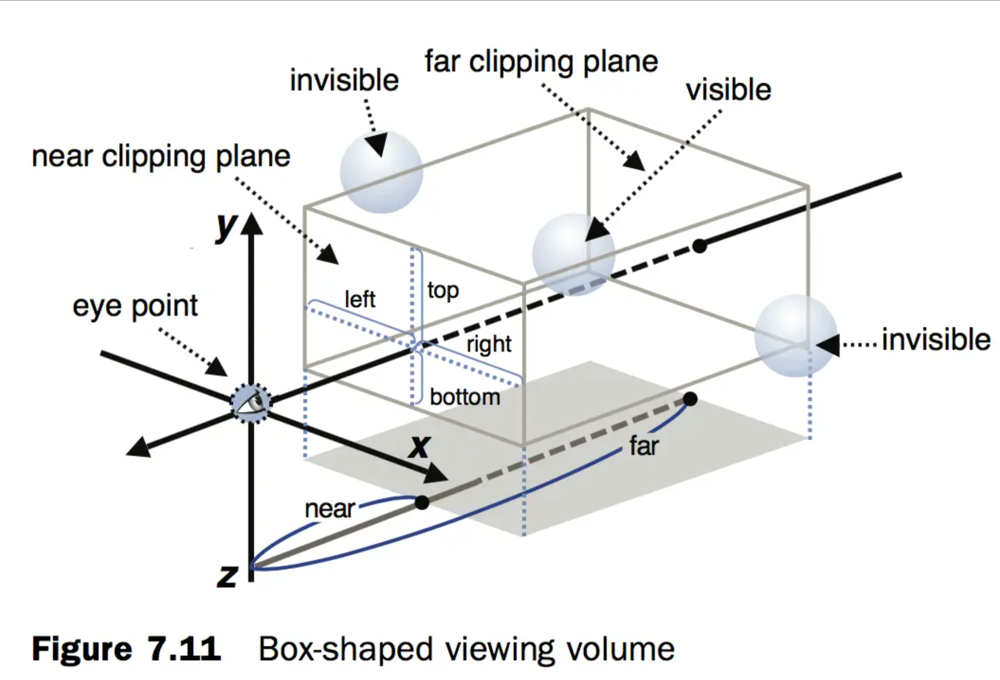
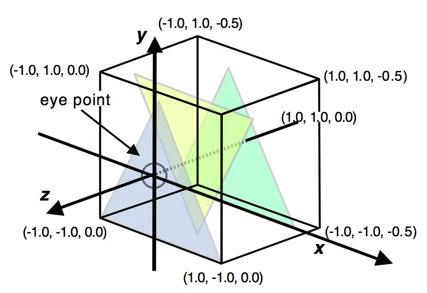

# 07章进入三维世界

视点和视线

观察方向：即观察者自己在什么位置。

可视距离：即观察者能看多远


我们将观察者的位置称为视点，从视点除法沿用观察者方向的射线称作为视线，


比如我们眼睛看屏的视角


WEBGL 在屏幕的可视空间


正交投影







## 可视空间

上面残缺的情况会在 z 变得比较大时出现。所谓视图矩阵，其实利用的是一种相对关系。

我们没有移动，坐标系的原点还是在画布的中心位置，但视图矩阵可以计算出模型新的位置，给一个更小的 z，其实就是这个模型的所有顶点在远离我们。

但是，**部分像素超出了某个范围，就被 WebGL 直接忽略掉了**。

这个范围是多少呢？是 `[-1, 1]` 区间（大于等于 -1，小于等于 1），x、y、z 维都是这个范围。**超出这个范围的像素，一律不画**。

利用这个性质，我们可以将一些不需要出现在画面中的物体删除。比如一些遥远的远景，或是跑到视口外的模型，不绘制它们能提高绘制效率。

## 正视投影

长方体可视空间是一种常用的可视空间，它由 **正射投影**（Orthographic Projection） 产生。此外还有更常用的 透视投影，我们后面再聊。

正视投影的作用是：将一个指定尺寸的盒子，映射压缩成 `[-1, 1]` 范围的盒子，使其中的像素点全部可以绘制出来，之外的像素点则被抛弃。

正射投影的矩阵公式为：


其中 r、l 等值，对应 left、right、top、bottom、near、far 的缩写。

JavaScript 代码实现为：

```text
function createOrthoMatrix(left, right, bottom, top, near, far) {
  const width = right - left;
  const height = top - bottom;
  const depth = far - near;

  // prettier-ignore
  return new Float32Array([
    2 / width, 0, 0, 0,
    0, 2 / height, 0, 0,
    0, 0, -2 / depth, 0,
    -(right + left) / width, -(top + bottom) / height, -(far + near) / depth, 1
  ]);
}
```


设置正交矩阵值

```
  /*
  left 左边 
  right 右边， 
  bottom 下边， 
  top 上边
  near 近截面
  far  远截面
  */
  let [
    left, right, bottom, top
  ]=[
    -1.0, 1.0, -1.0, 1.0,
  ];


  glMatrix.mat4.ortho(projMatrix, left, right, bottom, top, g_near, g_far);

```


如果设置   left, right, bottom, top 值为0.5  那么图形将会变大，这个就像 我们把一张宽高2米的桌子放在一个30平米的方将的时候，这个时候不会现在桌子大，如果我们把这个宽高2米的桌子放在一间10平米的房子，就会显得房间很大。类似这种感觉。